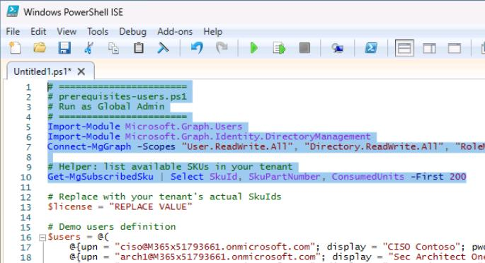
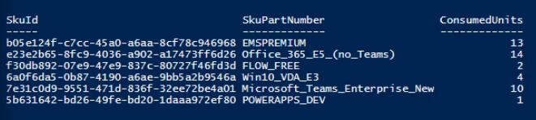
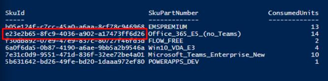
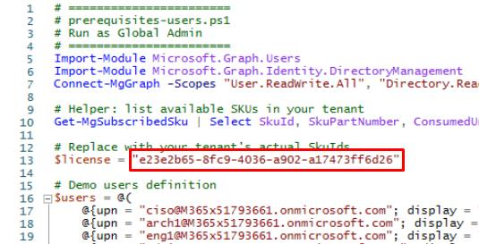
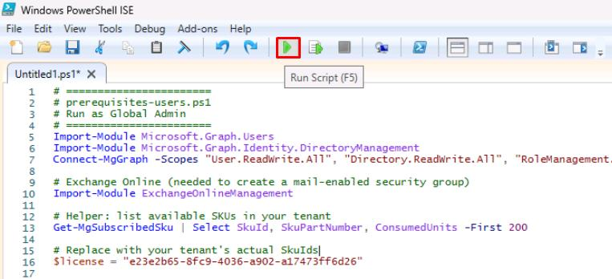
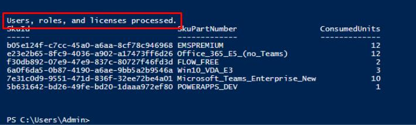

# Task 01: Deploy demo user accounts with RBAC

1. On the lab VM's taskbar, open Windows PowerShell ISE.

1. Save your Azure tenant's **domain** in a notepad for later use (that is, **contoso.com** or **contoso.onmicrosoft.com**):


    {: .warning }
    > This value will be used through the lab instructions and scripts.

1. Select **File** > **New**.

1. In the top pane, enter the following script, but do not run it. The domain you entered above will be used to set up the various user accounts.

    {: .highlight }
    > Select **Copy** on the code block, then paste with **Ctrl+V**. Do not select **Type**.

    ```
    # =======================
    # prerequisites-users.ps1
    # Run as Global Admin
    # =======================
    Import-Module Microsoft.Graph.Users
    Import-Module Microsoft.Graph.Identity.DirectoryManagement
    Connect-MgGraph -Scopes "User.ReadWrite.All", "Directory.ReadWrite.All", "RoleManagement.ReadWrite.Directory", "Organization.Read.All"

    # Helper: list available SKUs in your tenant
    Get-MgSubscribedSku | Select SkuId, SkuPartNumber, ConsumedUnits -First 200

    # Replace with your tenant's actual SkuIds
    $license = "REPLACE VALUE"

    # Demo users definition
    $users = @(
        @{upn = "ciso@@lab.Variable(userDomain)"; display = "CISO Contoso"; pwd = "P@ssw0rd!2025"; roles = @("Global Reader")                                   ; licenses = @() },
        @{upn = "arch1@@lab.Variable(userDomain)"; display = "Sec Architect One"; pwd = "P@ssw0rd!2025"; roles = @("Security Administrator", "Exchange Administrator"); licenses = @() },
        @{upn = "eng1@@lab.Variable(userDomain)"; display = "Sec Engineer One"; pwd = "P@ssw0rd!2025"; roles = @("Security Administrator", "Intune Administrator")  ; licenses = @() },
        @{upn = "admin1@@lab.Variable(userDomain)"; display = "Sec Admin One"; pwd = "P@ssw0rd!2025"; roles = @("Security Operator", "Exchange Administrator")     ; licenses = @() },
        @{upn = "soclead@@lab.Variable(userDomain)"; display = "SOC Lead"; pwd = "P@ssw0rd!2025"; roles = @("Security Operator", "Security Reader")            ; licenses = @() },
        @{upn = "analyst1@@lab.Variable(userDomain)"; display = "SOC Analyst One"; pwd = "P@ssw0rd!2025"; roles = @("Security Reader")                                ; licenses = @() },
        @{upn = "user1@@lab.Variable(userDomain)"; display = "Lab User One"; pwd = "P@ssw0rd!2025"; roles = @()                                                 ; licenses = @($license) },
        @{upn = "user2@@lab.Variable(userDomain)"; display = "Lab User Two"; pwd = "P@ssw0rd!2025"; roles = @()                                                 ; licenses = @($license) }
    )

    # -----------------------------
    # Enable roles if not present
    # -----------------------------
    $allRoles = Get-MgDirectoryRole | Select-Object DisplayName, Id
    if (-not $allRoles) {
        $templates = Get-MgDirectoryRoleTemplate
        foreach ($t in $templates) { try { Enable-MgDirectoryRole -DirectoryRoleTemplateId $t.Id | Out-Null } catch {} }
        $allRoles = Get-MgDirectoryRole | Select-Object DisplayName, Id
    }

    # -----------------------------
    # Helper functions
    # -----------------------------
    function Ensure-User {
        param($upn, $display, $pwd)
        $u = Get-MgUser -Filter "userPrincipalName eq '$upn'" -ErrorAction SilentlyContinue
        if (-not $u) {
            New-MgUser -AccountEnabled:$true -DisplayName $display -MailNickname ($upn.Split("@")[0]) `
                -PasswordProfile @{ Password = $pwd; ForceChangePasswordNextSignIn = $false } `
                -UserPrincipalName $upn | Out-Null
        }
    }

    function Assign-Roles {
        param($upn, $roles)
        if (-not $roles) { return }
        $user = Get-MgUser -Filter "userPrincipalName eq '$upn'"
        foreach ($r in $roles) {
            $role = $allRoles | Where-Object { $_.DisplayName -eq $r }
            if ($role) {
                try {
                    New-MgDirectoryRoleMemberByRef `
                        -DirectoryRoleId $role.Id `
                        -OdataId "https://graph.microsoft.com/v1.0/directoryObjects/$($user.Id)" `
                        -ErrorAction SilentlyContinue | Out-Null
                } catch {}
            }
        }
    }

    function Assign-Licenses {
        param($upn, $skus)
        if (-not $skus) { return }
        $user = Get-MgUser -Filter "userPrincipalName eq '$upn'"
        $adds = @()
        foreach ($s in $skus) { if ($s -and $s -ne "<GUID>") { $adds += @{SkuId = $s } } }

        # Ensure usage location before licensing
        if (-not $user.UsageLocation) {
            Update-MgUser -UserId $user.Id -UsageLocation "US"
            $user = Get-MgUser -Filter "userPrincipalName eq '$upn'"  # refresh
        }

        if ($adds.Count -gt 0) {
            Set-MgUserLicense -UserId $user.Id -AddLicenses $adds -RemoveLicenses @() | Out-Null
        }
    }

    # -----------------------------
    # Main Execution
    # -----------------------------
    foreach ($u in $users) {
        Ensure-User -upn $u.upn -display $u.display -pwd $u.pwd
        Assign-Roles -upn $u.upn -roles $u.roles
        Assign-Licenses -upn $u.upn -skus $u.licenses
    }

    Write-Host "Users, roles, and licenses processed."

    Disconnect-MgGraph 
    Disconnect-ExchangeOnline -Confirm:$false 
    ```

1. Highlight **lines 1-10**, then select **Run Selection** () from the top bar.

    

1. Sign in with your global admin account. 

    

1. On the **Permissions requested** dialog, select **Consent on behalf of your organization**, then select **Accept**.

    {: .note }
    > The bottom console pane will display your tenant's licenses and **SkuId**.

1. Copy the **SkuId** for any one of these **SkuPartNumbers**, if you have at least **two (2)** available:

    - **SPE_E5** (Microsoft 365 E5)
    - **ENTERPRISEPREMIUM** (Office 365 E5)
    - **Office_365_E5_(no_Teams)**

    

1. On **line 13**, replace the value between the quotes with the **SkuId**.

    

    {: .note }
    > If you're unable to license, delete the value between the quotes.

1. On the top bar, select **Run Script** ().

    

    

{: .note }
> This will create user accounts and set various admin roles: **ciso**, **arch1**, **eng1**, **admin1**, **soclead**, **analyst1**, **user1**, **user2**.