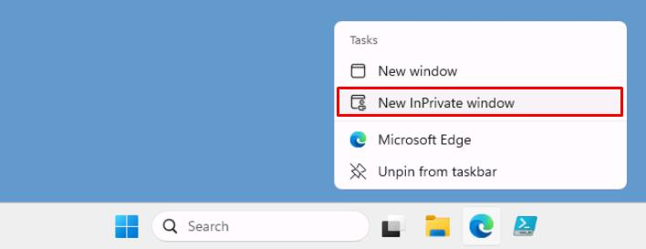

# Task 02: Deploy Azure infrastructure

You'll need be signing in as user1@@lab.Variable(userDomain) a couple times throughout the lab, so should setup MFA on the account in advance.

1. On VM's taskbar, right-click Microsoft Edge, then select **New InPrivate window**.

    

1. Go to `portal.azure.com`.

1. Sign in with **Lab User One**:

    | Item | Value |
    |:---------|:---------|
    | Username   | `user1@@lab.Variable(userDomain)`  |
    | Password  | `P@ssw0rd!2025`  |

1. Configure MFA on the account.

1. Once configured, close the InPrivate browser window.