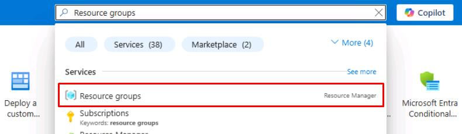
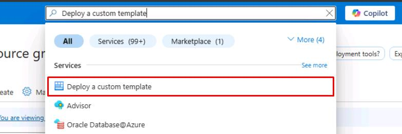
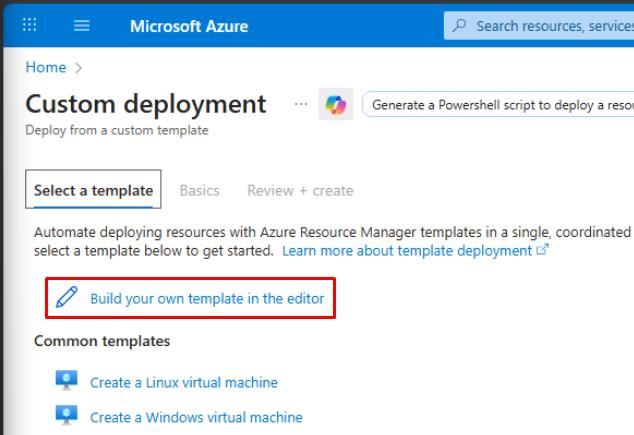
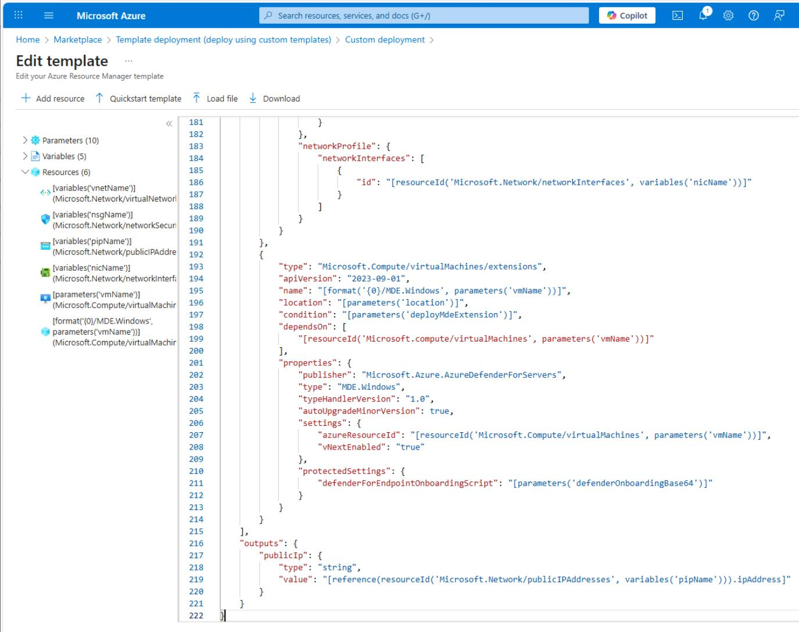
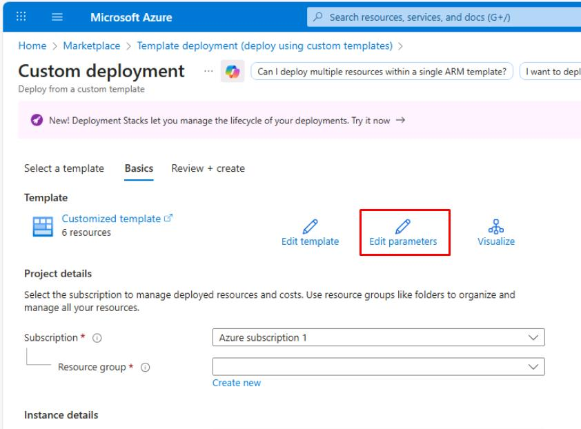
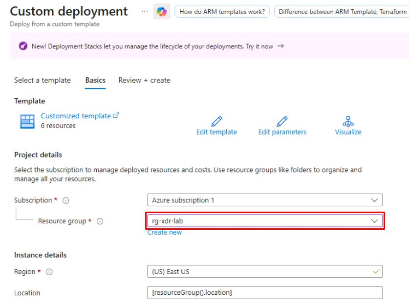
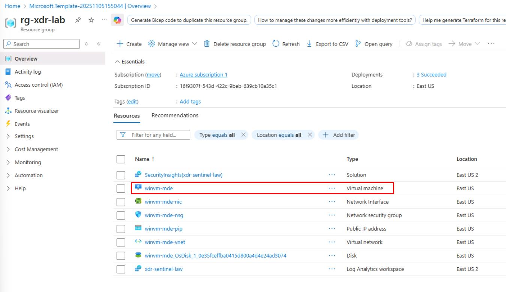

# Task 03: Defender for Endpoint (MDE) - onboard the VM & generate safe alerts

You'll deploy a small Windows VM you can onboard to Defender for Endpoint to use for safe simulations (EICAR, browsing to generate Cloud Discovery via MDE integration).

1. Open Microsoft Edge, then go to `portal.azure.com`.

1. Sign in with your global admin account.

1. In Azure's search box, enter and select `Resource groups`.

    

1. On the top bar, select **Create**.

1. For **Resource group name**, enter `rg-xdr-lab`.

1. At the bottom of the page, select **Review + create**, then select **Create**.

1. In Azure's search box, enter and select `Deploy a custom template`.

    

1. Select **Build your own template in the editor**.

    

1. On the **Edit template** page, replace the existing JSON text with the following:

    {: .highlight }
    > Select **Copy** on the code block, then paste with **Ctrl+V**. Do not select **Type**.

    ```
    {
        "$schema": "https://schema.management.azure.com/schemas/2019-04-01/deploymentTemplate.json#",
        "contentVersion": "1.0.0.0",
        "parameters": {
            "location": {
                "type": "string",
                "defaultValue": "[resourceGroup().location]"
            },
            "vmName": {
                "type": "string",
                "defaultValue": "winvm-mde"
            },
            "adminUsername": {
                "type": "string",
                "defaultValue": "azureadmin"
            },
            "adminPassword": {
                "type": "secureString"
            },
            "vmSize": {
                "type": "string",
                "defaultValue": "Standard_D2s_v4"
            },
            "addressPrefix": {
                "type": "string",
                "defaultValue": "10.0.0.0/16"
            },
            "subnetPrefix": {
                "type": "string",
                "defaultValue": "10.0.0.0/24"
            },
            "deployMdeExtension": {
                "type": "bool",
                "defaultValue": false,
                "metadata": {
                    "description": "Set true to deploy MDE.Windows extension during VM provisioning."
                }
            },
            "defenderOnboardingBase64": {
                "type": "secureString",
                "defaultValue": "",
                "metadata": {
                    "description": "Base64-encoded MDE onboarding package (protected settings). Leave empty if using Defender for Cloud auto-provisioning."
                }
            }
        },
        "variables": {
            "vnetName": "[format('{0}-vnet', parameters('vmName'))]",
            "subnetName": "default",
            "bastionSubnetName": "AzureBastionSubnet",
            "nsgName": "[format('{0}-nsg', parameters('vmName'))]",
            "pipName": "[format('{0}-pip', parameters('vmName'))]",
            "nicName": "[format('{0}-nic', parameters('vmName'))]",
            "bastionPipName": "[format('{0}-bastion-pip', parameters('vmName'))]",
            "bastionHostName": "[format('{0}-bastion', parameters('vmName'))]"
        },
        "resources": [
            {
                "type": "Microsoft.Network/virtualNetworks",
                "apiVersion": "2023-09-01",
                "name": "[variables('vnetName')]",
                "location": "[parameters('location')]",
                "properties": {
                    "addressSpace": {
                        "addressPrefixes": [
                            "[parameters('addressPrefix')]"
                        ]
                    },
                    "subnets": [
                        {
                            "name": "[variables('subnetName')]",
                            "properties": {
                                "addressPrefix": "[parameters('subnetPrefix')]"
                            }
                        },
                        {
                            "name": "[variables('bastionSubnetName')]",
                            "properties": {
                                "addressPrefix": "10.0.1.0/27"
                            }
                        }
                    ]
                }
            },
            {
                "type": "Microsoft.Network/networkSecurityGroups",
                "apiVersion": "2023-09-01",
                "name": "[variables('nsgName')]",
                "location": "[parameters('location')]",
                "properties": {
                    "securityRules": []
                }
            },
            {
                "type": "Microsoft.Network/publicIPAddresses",
                "apiVersion": "2023-09-01",
                "name": "[variables('pipName')]",
                "location": "[parameters('location')]",
                "sku": {
                    "name": "Standard"
                },
                "properties": {
                    "publicIPAllocationMethod": "Static"
                }
            },
            {
                "type": "Microsoft.Network/networkInterfaces",
                "apiVersion": "2023-09-01",
                "name": "[variables('nicName')]",
                "location": "[parameters('location')]",
                "dependsOn": [
                    "[resourceId('Microsoft.Network/virtualNetworks', variables('vnetName'))]",
                    "[resourceId('Microsoft.Network/publicIPAddresses', variables('pipName'))]",
                    "[resourceId('Microsoft.Network/networkSecurityGroups', variables('nsgName'))]"
                ],
                "properties": {
                    "ipConfigurations": [
                        {
                            "name": "ipconfig1",
                            "properties": {
                                "subnet": {
                                    "id": "[resourceId('Microsoft.Network/virtualNetworks/subnets', variables('vnetName'), variables('subnetName'))]"
                                },
                                "publicIPAddress": {
                                    "id": "[resourceId('Microsoft.Network/publicIPAddresses', variables('pipName'))]"
                                }
                            }
                        }
                    ],
                    "networkSecurityGroup": {
                        "id": "[resourceId('Microsoft.Network/networkSecurityGroups', variables('nsgName'))]"
                    }
                }
            },
            {
                "type": "Microsoft.Compute/virtualMachines",
                "apiVersion": "2023-09-01",
                "name": "[parameters('vmName')]",
                "location": "[parameters('location')]",
                "dependsOn": [
                    "[resourceId('Microsoft.Network/networkInterfaces', variables('nicName'))]"
                ],
                "properties": {
                    "hardwareProfile": {
                        "vmSize": "[parameters('vmSize')]"
                    },
                    "osProfile": {
                        "computerName": "[parameters('vmName')]",
                        "adminUsername": "[parameters('adminUsername')]",
                        "adminPassword": "[parameters('adminPassword')]",
                        "windowsConfiguration": {
                            "provisionVMAgent": true,
                            "enableAutomaticUpdates": true
                        }
                    },
                    "storageProfile": {
                        "imageReference": {
                            "publisher": "MicrosoftWindowsServer",
                            "offer": "WindowsServer",
                            "sku": "2022-datacenter-azure-edition",
                            "version": "latest"
                        },
                        "osDisk": {
                            "createOption": "FromImage",
                            "managedDisk": {
                                "storageAccountType": "Premium_LRS"
                            }
                        }
                    },
                    "networkProfile": {
                        "networkInterfaces": [
                            {
                                "id": "[resourceId('Microsoft.Network/networkInterfaces', variables('nicName'))]"
                            }
                        ]
                    }
                }
            },
            {
                "type": "Microsoft.Network/publicIPAddresses",
                "apiVersion": "2023-09-01",
                "name": "[variables('bastionPipName')]",
                "location": "[parameters('location')]",
                "sku": {
                    "name": "Standard"
                },
                "properties": {
                    "publicIPAllocationMethod": "Static"
                }
            },
            {
                "type": "Microsoft.Network/bastionHosts",
                "apiVersion": "2023-09-01",
                "name": "[variables('bastionHostName')]",
                "location": "[parameters('location')]",
                "dependsOn": [
                    "[resourceId('Microsoft.Network/virtualNetworks', variables('vnetName'))]",
                    "[resourceId('Microsoft.Network/publicIPAddresses', variables('bastionPipName'))]"
                ],
                "properties": {
                    "ipConfigurations": [
                        {
                            "name": "bastionHostIpConfig",
                            "properties": {
                                "subnet": {
                                    "id": "[resourceId('Microsoft.Network/virtualNetworks/subnets', variables('vnetName'), variables('bastionSubnetName'))]"
                                },
                                "publicIPAddress": {
                                    "id": "[resourceId('Microsoft.Network/publicIPAddresses', variables('bastionPipName'))]"
                                }
                            }
                        }
                    ]
                }
            },
            {
                "type": "Microsoft.Compute/virtualMachines/extensions",
                "apiVersion": "2023-09-01",
                "name": "[format('{0}/MDE.Windows', parameters('vmName'))]",
                "location": "[parameters('location')]",
                "condition": "[parameters('deployMdeExtension')]",
                "dependsOn": [
                    "[resourceId('Microsoft.compute/virtualMachines', parameters('vmName'))]"
                ],
                "properties": {
                    "publisher": "Microsoft.Azure.AzureDefenderForServers",
                    "type": "MDE.Windows",
                    "typeHandlerVersion": "1.0",
                    "autoUpgradeMinorVersion": true,
                    "settings": {
                        "azureResourceId": "[resourceId('Microsoft.Compute/virtualMachines', parameters('vmName'))]",
                        "vNextEnabled": "true"
                    },
                    "protectedSettings": {
                        "defenderForEndpointOnboardingScript": "[parameters('defenderOnboardingBase64')]"
                    }
                }
            }
        ],
        "outputs": {
            "publicIp": {
                "type": "string",
                "value": "[reference(resourceId('Microsoft.Network/publicIPAddresses', variables('pipName'))).ipAddress]"
            }
        }
    }
    ```

    

1. In the lower-left corner of the page, select **Save**.

    {: .warning }
    > In the template above, the **Standard_D2s_v4** VM SKU was used. If this is unavailable in your tenant, replace the **Vm Size** with any available **General Purpose** VM SKU.

1. Near the top of the page, select **Edit parameters**.

    

1. In **Edit parameters**, replace the existing JSON text with the following:

    {: .warning }
    > Again, the **Standard_D2s_v4** VM SKU is used. If this is unavailable in your tenant, replace it with any **General Purpose** VM SKU.

    ```
    {
        "$schema": "https://schema.management.azure.com/schemas/2019-04-01/deploymentParameters.json#",
        "contentVersion": "1.0.0.0",
        "parameters": {
            "location": {
                "value": "[resourceGroup().location]"
            },
            "vmName": {
                "value": "winvm-mde"
            },
            "adminUsername": {
                "value": "azureadmin"
            },
            "adminPassword": {
                "value": "P@ssword123!"
            },
            "vmSize": {
                "value": "Standard_D2s_v4"
            },
            "addressPrefix": {
                "value": "10.0.0.0/16"
            },
            "subnetPrefix": {
                "value": "10.0.0.0/24"
            },
            "deployMdeExtension": {
                "value": false
            },
            "defenderOnboardingBase64": {
                "value": null
            }
        }
    }
    ```

1. In the lower-left corner of the page, select **Save**.

1. Back on the **Custom deployment** page, for **Resource group**, select **rg-xdr-lab**.

    

1. Select **Review + Create**, then select **Create**.

    {: .note }
    > This deploys a Windows 11 VM, virtual network, network security group, and related resources.

    {: .warning }
    > The deployment will take around 10 minutes.

1. Once finished, select **Go to resource group**, then verify the **winvm-mde** VM deployed.

    
