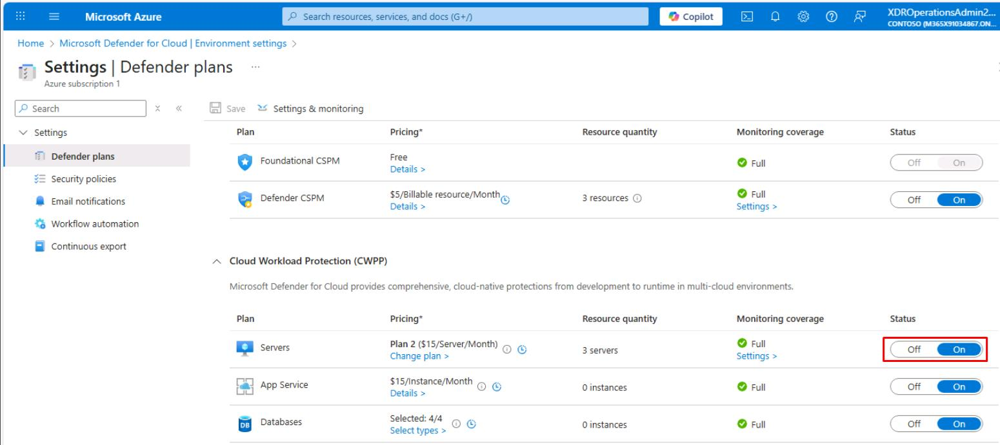
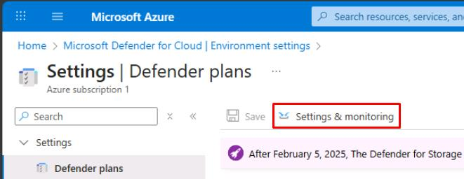
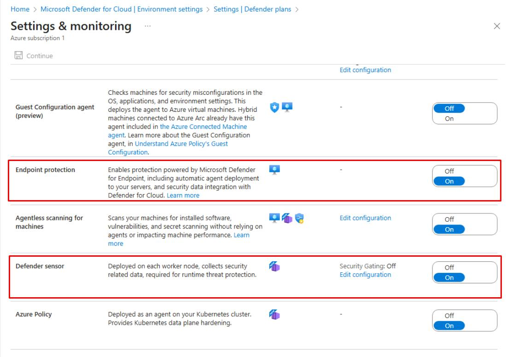
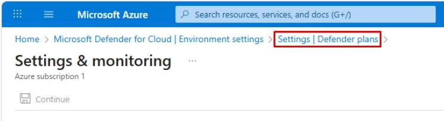
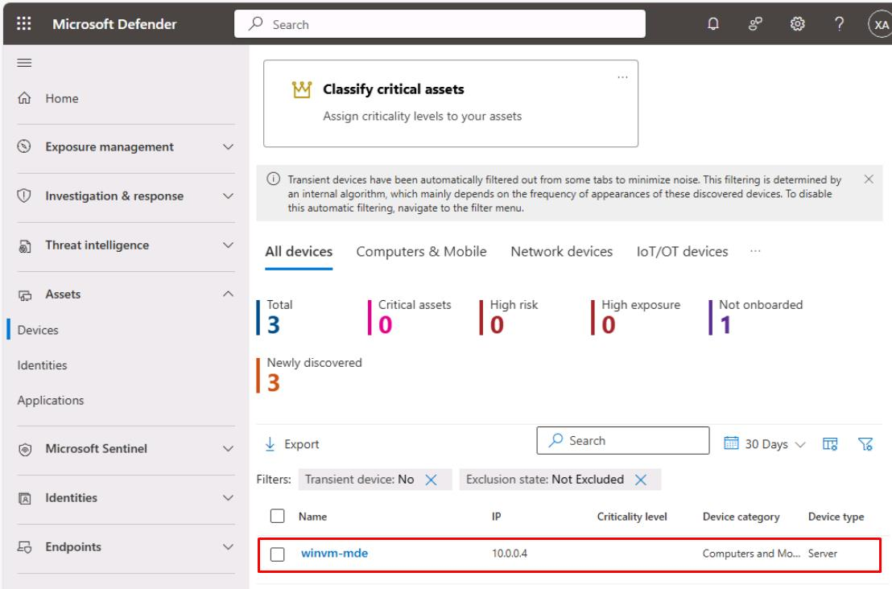

# Task 04: Generate safe alerts

{: .important }
> In a real-world scenario, this would be run by the Security Engineering team, with the Security Administrator role.

1. In Azure's search box, enter and select `Microsoft Defender for Cloud`.

1. In the leftmost pane, select **Management**, then **Environment settings**.

1. Move through the page to the table, expand the tree, then select your subscription.

    

1. Under the **Cloud Workload Protection (CWPP)** section, ensure **Servers** is **On**.

    

    {: .highlight }
    > If settings have changed, on the top bar, select **Save**.

1. On the top bar, select **Settings & monitoring**.

    

1. Ensure the following settings are **On**:

    - **Endpoint protection**
    - **Defender sensor**

    

    {: .highlight }
    > If settings have changed, at the top of the page, select **Continue**.

    {: .warning }
    > If prompted when enabling **Defender sensor**, set **Security Gating** to **Off**.

1. Near the upper-left corner of the page, select the **Settings | Defender plans** breadcrumb link.

    

1. On the top bar of the **Settings | Defender plans** page, select **Save**. 

    {: .note }
    > This will automatically deploy the MDE sensor/extension to supported Windows machines in the subscription.

    {: .warning }
    > The deployment may take an hour to complete.

1. Open a new browser tab, then go to `security.microsoft.com` to go to the Microsoft Defender XDR portal.

1. In the leftmost menu, go to **Assets**, then select **Devices**.

1. Ensure the new **winvm-mde** is listed on the table before proceeding.

    