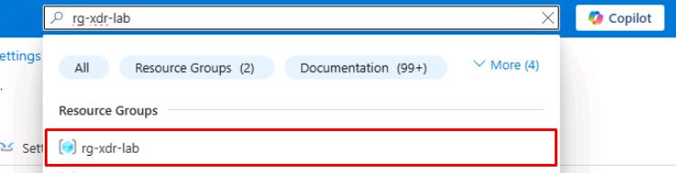
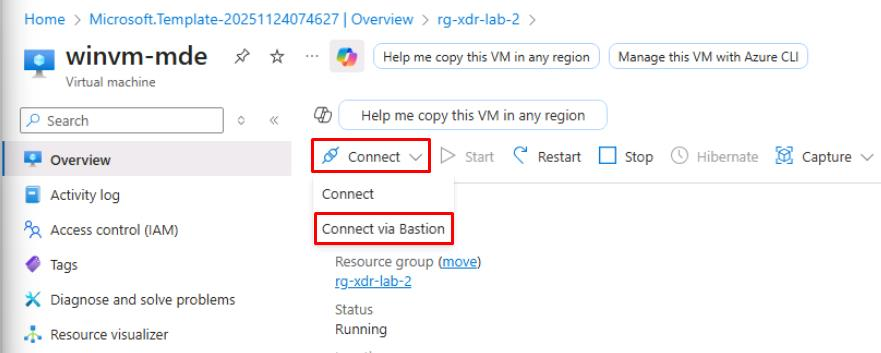
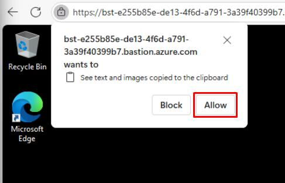
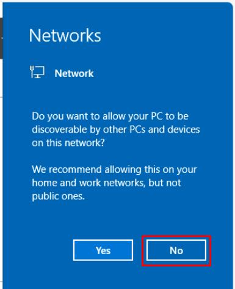
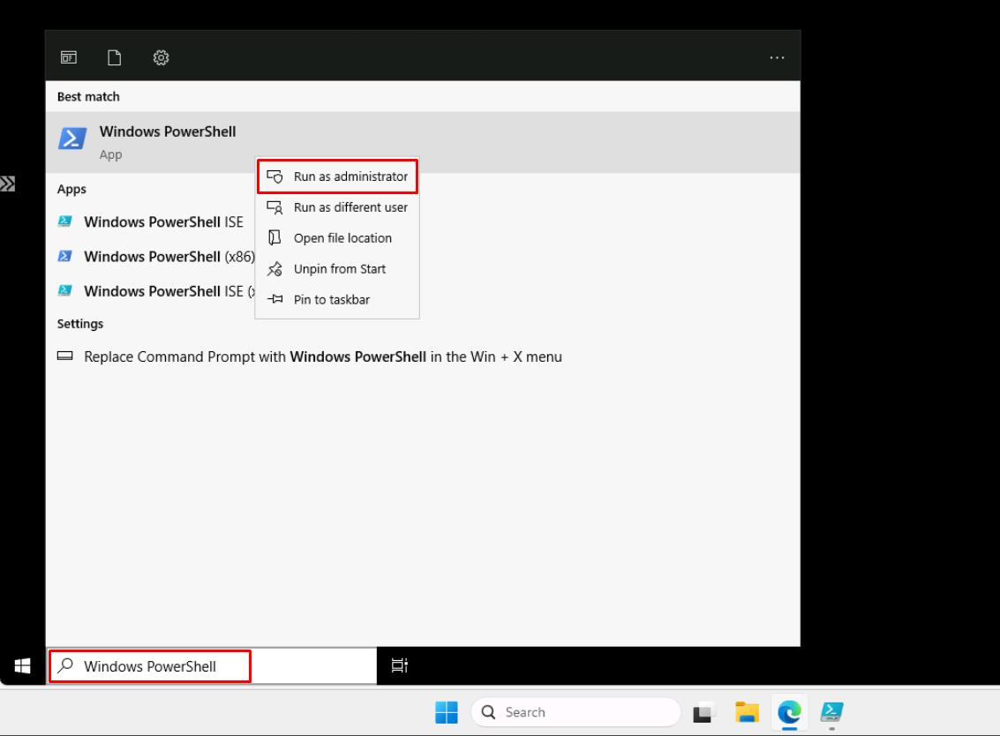
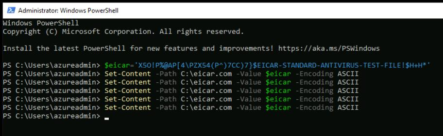
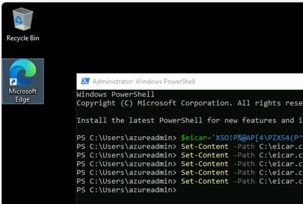

# Task 05: Generate safe alerts


1. Go back to your Azure portal tab.

1. In Azure's search box, enter and select your `rg-xdr-lab` resource group.

    

1. Select the **winvm-mde** VM.

1. On the top bar, select **Connect** > **Connect via Bastion**.

    

1. On the **Bastion** page, enter the following credentials:

    | Item | Value |
    |:---------|:---------|
    | Username   | `azureadmin`  |
    | Password  | `P@ssword123!`  |

1. Select **Connect**.

    {: .note }
    > This will open the **winwm-mde** VM in a new browser tab.

1. In the **See text and images copied...** dialog, select **Allow**.

    

1. In the **Networks** flyout pane, select **No**. 

    

1. Close all other windows that load in the VM. 

1. In **winwm-mde**'s taskbar search box, enter **Windows PowerShell**, right-click **Windows PowerShell** > **Run as administrator**.

    

    {: .warning }
    > The Bastion VM tab for **winwm-mde** in the browser tab. Not the Skillable VM's taskbar.

1. Enter the following:

    ```
    $eicar='X5O!P%@AP[4\PZX54(P^)7CC)7}$EICAR-STANDARD-ANTIVIRUS-TEST-FILE!$H+H*'
    ```

1. Run the following **five times**:

    ```
    Set-Content -Path C:\eicar.com -Value $eicar -Encoding ASCII
    ```

    {: .highlight }
    > Select the up arrow on your keyboard to quickly load and rerun the same line.

    
    
    {: .note }
    > Windows Defender AV should quarantine it and MDE should raise an alert/incident.

    {: .warning }
    > Wait 5-10 minutes after running.

1. Still in the **winwm-mde** VM, open Microsoft Edge and close any dialogs without signing in.

    

1. Open a few well-known SaaS sites like the following to seed Cloud Discovery via MDE integration. You do not need to sign in.

    - **outlook.com**
    - **onedrive.com**
    - **salesforce.com**
    - **monday.com**
    - **docusign.com**

1. Close the **winwm-mde** Bastion browser tab.