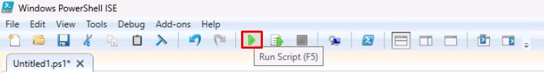
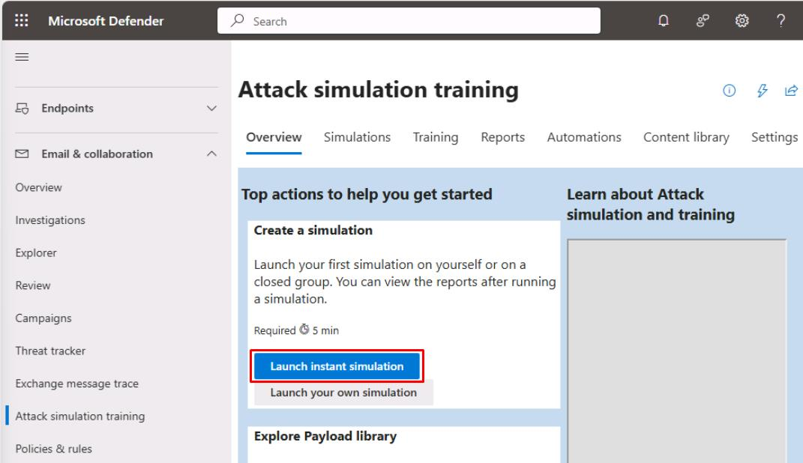
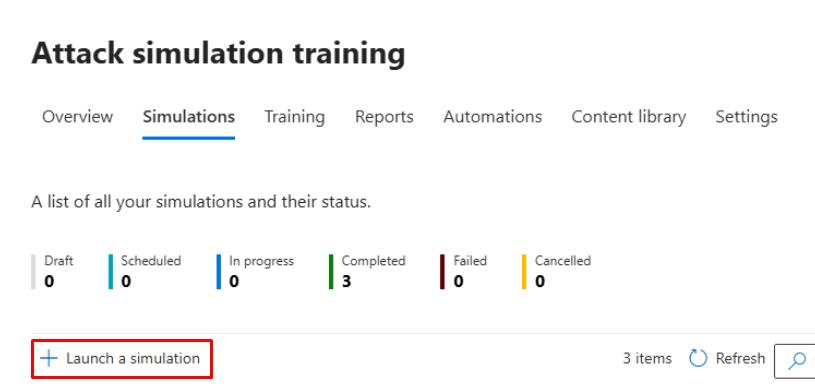
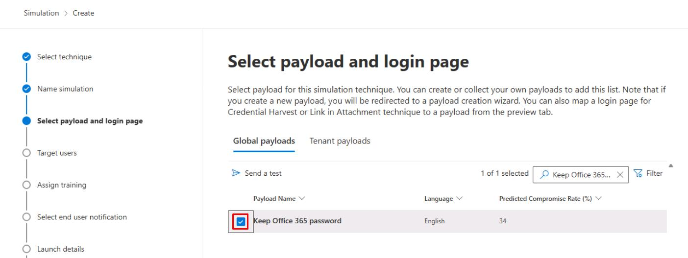
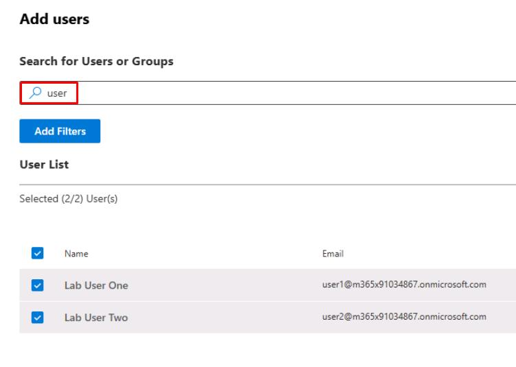
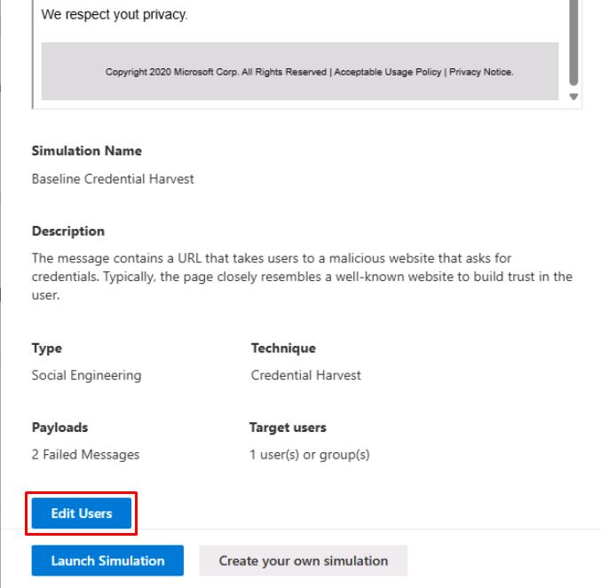

# Task 06: Defender for Office 365 (MDO) - Baseline policies and Safe simulations

#### 01: Create core policies (Exchange Online PowerShell)

1. Go back to your **Windows PowerShell ISE** window.

1. In the top pane, replace the existing script with the following:

    ```
    # Run as global admin
    Connect-ExchangeOnline
    Enable-OrganizationCustomization -ErrorAction Continue 

    # Safe Attachments: Dynamic Delivery with blocking
    New-SafeAttachmentPolicy -Name "LAB-SafeAttachments" -Enable $true -Redirect $false -Action Block
    New-SafeAttachmentRule -Name "LAB-SA-Default" -SafeAttachmentPolicy "LAB-SafeAttachments" -RecipientDomainIs @("@lab.Variable(userDomain)")

    # Safe Links: time-of-click scanning and URL rewrite
    New-SafeLinksPolicy -Name "LAB-SafeLinks" -EnableSafeLinksForEmail $true -EnableForInternalSenders $true -DoNotRewriteUrls $false -TrackClicks $true
    New-SafeLinksRule -Name "LAB-SL-Default" -SafeLinksPolicy "LAB-SafeLinks" -RecipientDomainIs @("@lab.Variable(userDomain)")

    # Anti-Phish: enable impersonation protection
    New-AntiPhishPolicy -Name "LAB-AntiPhish" -EnableMailboxIntelligence $true -EnableTargetedUserProtection $true -EnableOrganizationDomainsProtection $true
    New-AntiPhishRule -Name "LAB-AP-Default" -AntiPhishPolicy "LAB-AntiPhish" -RecipientDomainIs @("@lab.Variable(userDomain)")

    Disconnect-ExchangeOnline -Confirm:$false
    ```

    {: .note }
    > This script enables organization customization, then creates Safe Attachments, Safe Links, and Anti-Phish policies and applies them to the specified domain.

1. On the top bar, select **Run Script**.

    

1. When prompted, sign in with your global admin account.

    {: .important }
    > In a real-world scenario, a Security Architect would design, while a Security Admin could implement.

---

#### 02: Launch attack simulation training

1. In Microsoft Edge, go back to your Microsoft Defender XDR portal tab, or reopen `security.microsoft.com`.

1. In the leftmost pane, select **Email & collaboration** > **Attack simulation training**.

1. Under the **Create a simulation** section, select **Launch instant simulation**.

    

    {: .warning }
    > If you don't see this option, follow these instructions instead:
    >
    > 1. At the top of the page, select the **Simulations** tab.
    >
    > 1. Select **Launch a simulation**.
    >
    > 1. Keep the default **Credential Harvest**, then select **Next**.
    >
    >    
    >
    > 1. For **Simulation Name**, enter `Baseline Credential Harvest`, then select **Next**.
    >
    > 1. On the **Select payload and login** page, search for and select `Keep Office 365 password`.
    >
    >    
    >
    > 1. Select **Next**.
    >
    > 1. Select **Add users**.
    >
    > 1. In the search box, enter `user`, then select both:
    >
    >    - **user1@@lab.Variable(userDomain)**
    >    - **user2@@lab.Variable(userDomain)**
    >
    >     
    >
    >    > Users must be licensed to appear on this list for attack simulations. If you were unable to license, please observe these steps.
    >
    > 1. At the bottom of the pane, select **Add 2 User(s)**.
    >
    > 1. Select **Next** until the **Phish landing page** step.
    >
    > 1. Select **Microsoft Landing Page Template 1**, then select **Next**.
    >
    > 1. On the **Select end user notification** step, select **Do not deliver notifications**, then select **Next**.
    >
    > 1. Select **Next** until the **Review simulation** step, select **Submit**, then select **Done**.
    >
    >    > This produces alerts in Defender and unified **Incidents** suitable for future exercises.
    >
    > 1. Select **Next** in the instructions to proceed.

1. In the flyout pane, select **Continue**.

1. At the bottom of the pane, select **Edit Users**.

    

1. In the search box, enter `user`, then select both:

    - **user1@@lab.Variable(userDomain)**
    - **user2@@lab.Variable(userDomain)**

    

    {: .warning }
    > Users must be licensed to appear on this list for attack simulations. If you were unable to license, please observe these steps.

1. At the bottom of the pane, select **Add 2 User(s)**.

1. At the bottom of the pane, select **Launch Simulation**.

    {: .note }
    > This produces alerts in Defender and unified **Incidents** suitable for future exercises.
