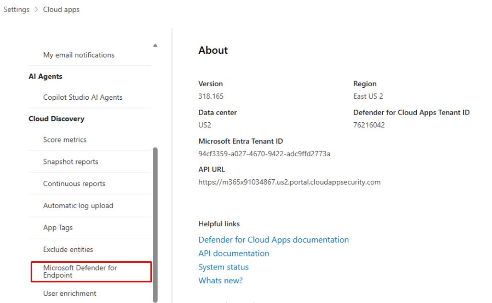

# Task 07: Defender for Cloud Apps (MDCA) - Enable MDE integration & (optional) sample logs

1. In the leftmost pane, go to **System**, then **Settings**.

1. Select **Cloud Apps**.

1. In the **Cloud apps** page menu, under the **Cloud Discovery** section, if you see **Microsoft Defender for Endpoint**, then the integration of MDE with Defender XDR is already in place.

    

    {: .important }
    > This lets MDE endpoint signals (from your VM) populate Cloud Discovery - no on-prem or proxies required.

1. **(OPTIONAL)** Manual log upload: You can upload sample firewall/proxy logs in the Cloud Discovery blade to quickly populate SaaS usage if you want richer data upfront:

    1. On the same page, under **Cloud Discovery**, select **Snapshot reports**.

    1. Select **Create snapshot report** and use the wizard to upload your log files for immediate analysis.