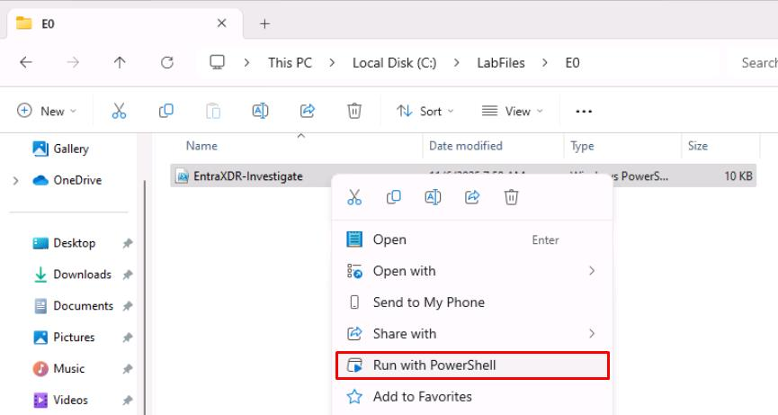

# Task 08: Entra Identity Signals in Defender XDR (cloud-only prerequisites)

Identity investigations on Entra signals visible in Defender XDR (sign-in risk, token anomalies, OAuth app governance) rather than MDI sensors. Let's demonstrate:

 - Risky sign-ins & conditional access blocks
 - Risky OAuth consent (create a test multi-tenant app and flag it via App Governance)
 - Identity Secure Score improvements (enforce MFA, block legacy auth)

The output will provide evidence-based insight into how Entra risk telemetry flows into your unified XDR environment, and a baseline for later posture-hardening exercises.

{: .important }
> In a real-world scenario, Security Architecture would design, while a Security Admin could implement.

1. Open Windows File Explorer, then go to `‌‌‌C:\LabFiles\E0`.

1. Right-click **EntraXDR-Investigate**, then select **Run with PowerShell**.

    

1. Sign in with your global admin account.

1. On the **Permissions requested** dialog, select **Consent on behalf of your organization**, then select **Accept**.

    {: .note }
    > Collects Entra ID risk telemetry (risky sign-ins, OAuth consent events, Identity Secure Score) and exports it to ./out for Defender XDR-style investigations, optionally generating report-only Conditional Access policy JSON and creating a harmless multi-tenant app stub when explicitly enabled.

1. Observe the outputs in `C:\LabFiles\E0\out`.

    {: .note }
    > You may not see all files, depending on your environment.
    >
    > - **risky-signins.json** - Lists recent user sign-ins flagged as risky by Entra ID Protection (risk level, detail, IP, and user info).
    > - **oauth-consent-audit.json** - Captures recent OAuth "Consent to application" audit events showing who granted access to which app.
    > - **secure-score.json** - Contains the tenant's current Identity Secure Score metrics and enabled security services.