### Task 01: Capture Secure Score and Exposure Baseline in Defender XDR  

## Security Architecture Team  

1. In Microsoft Edge, go back to your Microsoft Defender XDR portal tab, or reopen [security.microsoft.com](security.microsoft.com).

1. In the leftmost pane, go to **Exposure management** > **Secure score**.

1. Observe the overall **Microsoft Secure Score** and **Top recommended actions**.

    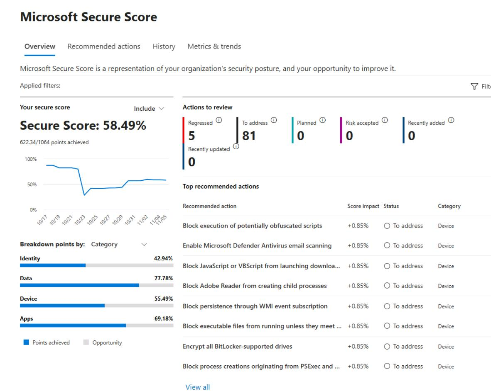

1. In the leftmost pane, go to **Exposure management** > **Overview** and observe the results.

1. In the leftmost pane, go to **Exposure management** > **Vulnerability Management** > **Overview**.

    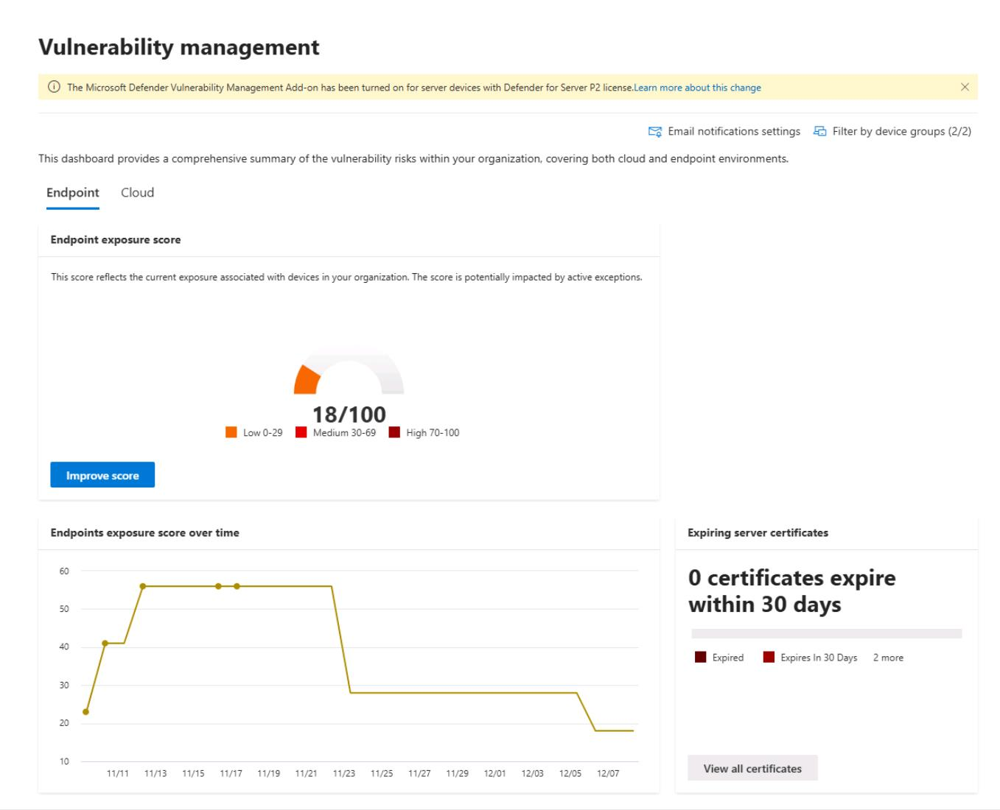

    {: .note }
    > Observe the **Endpoint exposure score** for the organization, which breaks it down by device impact, top software vulnerabilities, misconfigurations and exposed devices.

1. In the leftmost pane, go to **Investigation & response** > **Incidents & alerts** > **Incidents**.

1. Near the upper-right corner of the table, set the **Time range** filter to **1 Week**.

    

1. Remove any filters at the top of the table to see the **EICAR_Test_File** incident from the test you ran from the **winvm-mde** VM.

    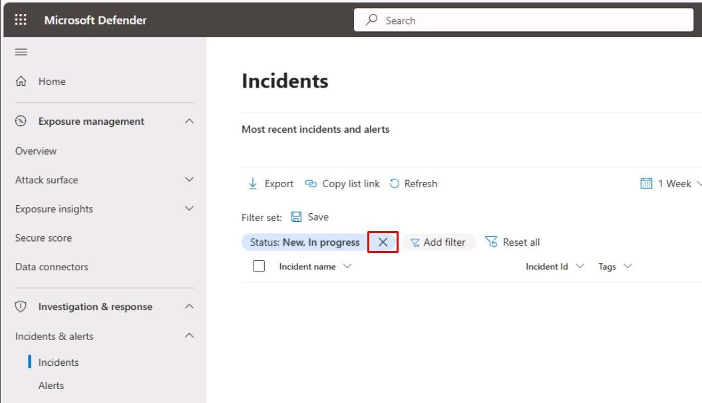
    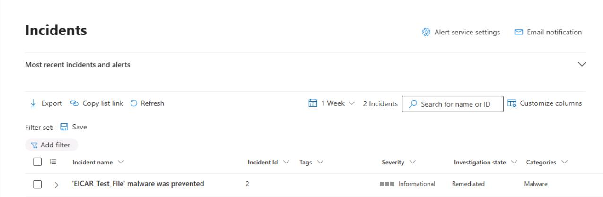

1. In the leftmost pane, go to **Investigation & response** > **Incidents & alerts** > **Alerts**.

1. Near the upper-right corner of the table, set the **Time range** filter to **1 Week**, and remove any filters.

    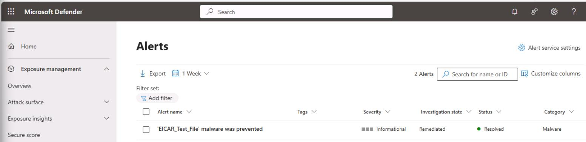

---

## Security Engineering and Administration  


#### 01: Export Microsoft Secure Score & Improvement action

1. Go to `C:\LabFiles\E1`.

1. Right-click **ScriptA** > **Run with PowerShell**.

1. Sign in with your global admin account.

1. On the **Permissions requested** dialog, select **Consent on behalf of your organization**, then select **Accept**.

    {: .note }
    > Exports Microsoft Secure Score and Secure Score control profiles from Graph to timestamped JSON files for offline review.

1. Observe the files it creates in `C:\LabFiles\E1`:

    {: .note }
    > - **SecureScore-[timestamp].json** - Contains the current overall Microsoft Secure Score snapshot - total score, maximum possible score, trend history, and contributing control categories. 
    > - **SecureScoreControls-[timestamp].json** - Lists all Secure Score control profiles with detailed metadata (control ID, title, description, category, weighting, implementation status, and remediation guidance). 

---

#### 02: Create an app registration for future scripts

1. Go back to `C:\LabFiles\E1`.

1. Right-click **CreateAppRegistration** > **Show more options** > **Edit**.

1. Go back to your Windows PowerShell ISE window and select the **CreateAppRegistration.ps1** tab.

    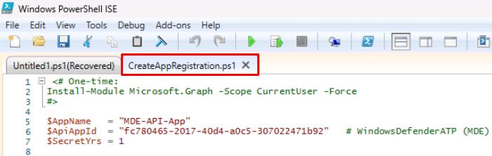

1. On the top bar, select **Run Script**.

    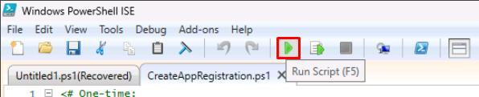

1. If needed, reauthenticate with your global admin account.

    {: .note }
    > This will create an app registration called **MDE-API-App** that will be used for various scripts.

1. In the bottom console pane, it will output the app registration details. Fill out the following text boxes with those values.

    | Item | Value |
    |:---------|:---------|
    | TenantId   | @lab.TextBox(tenantId)  |
    | ClientId  | @lab.TextBox(clientId)  |
    | ClientSecret  | @lab.TextBox(clientSecret)  |

    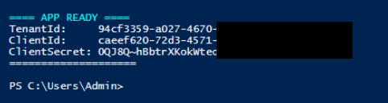

    {: .warning }
    > The values entered will be used for reference in future steps. 
    >
    > There will be white spaces on either side of the pasted values in the text box. The script in the next subtask should run fine even without deleting these.


#### 03: Export endpoint exposure using Defender for Endpoint API

1. In PowerShell ISE's bottom console pane, enter the following to change directories to the required folder:

    ```
    cd C:\LabFiles\E1
    ```

    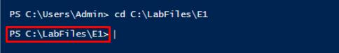

1. In the bottom pane, enter the following to run **ScriptB.ps1** with your app registration:

    ```
    .\ScriptB.ps1 -TenantId "@lab.Variable(tenantId)" -ClientId "@lab.Variable(clientId)" -ClientSecret "@lab.Variable(clientSecret)"
    ```

    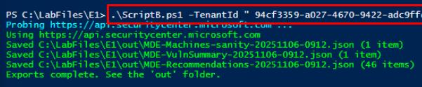

    {: .highlight }
    > This uses the values you provided from the app registration.

    {: .note }
    > Exports MDE TVM data (machine vulnerabilities, security recommendations, and a machines sanity sample) and optionally bootstraps an app registration with the correct MDE permissions and regional API host discovery.

1. Observe the files it creates in `C:\LabFiles\E1\out`:

    {: .note }
    > - **MDE-Machines-sanity-[timestamp].json** - Verifies API connectivity by returning a sample of onboarded devices from Microsoft Defender for Endpoint. 
    > - **MDE-Recommendations-[timestamp].json** - Contains Threat & Vulnerability Management (TVM) security recommendations for remediation and hardening. 
    > - **MDE-VulnSummary-[timestamp].json** - Lists device-specific vulnerabilities (CVE IDs, affected software, exposure level, remediation state). 

---

## SOC Analyst  

1. In Microsoft Edge, go back to your Microsoft Defender XDR portal tab, or reopen `security.microsoft.com`.

1. In the leftmost pane, go to **Investigation & response** > **Hunting** > **Advanced hunting**.  

1. In the **Query** pane, enter the following KQL, then select **Run query** at the top:  

    ```kql1.1.txt
    // Incidents by service in last 7 days
    let since = ago(7d);
    AlertInfo
    | where Timestamp >= since
    | summarize Alerts=dcount(AlertId) by ServiceSource
    | order by Alerts desc;
    ```

    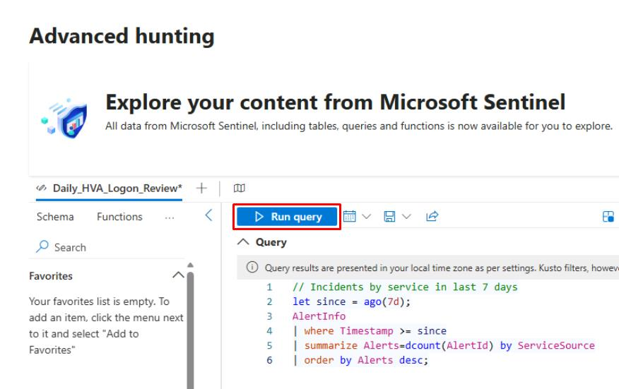

1. Under the **Query** editor, select the **Results** tab.

    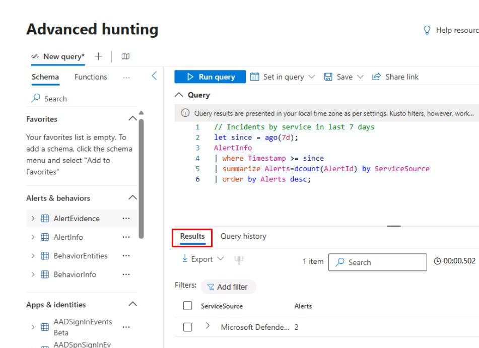

1. Under the tab, select **Export**, then select **Download to CSV**.

    {: .important }
    > This would be part of the package you could provide to the CISO.

1. In the **Query** pane, replace the query with the following, then select **Run query**:  

    ```kql1.2.txt
    // Endpoint exposure sample (installed vulnerable software)
    DeviceTvmSoftwareVulnerabilities
    | summarize VulnFindings=count(), AffectedDevices=dcount(DeviceId) by CveId
    | top 10 by VulnFindings desc;
    ```

    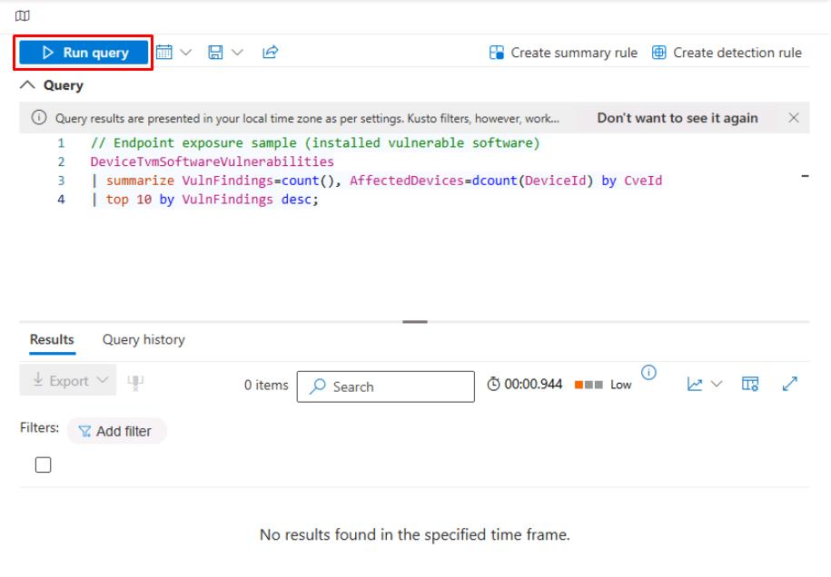

    {: .note }
    > You may not see any results.
