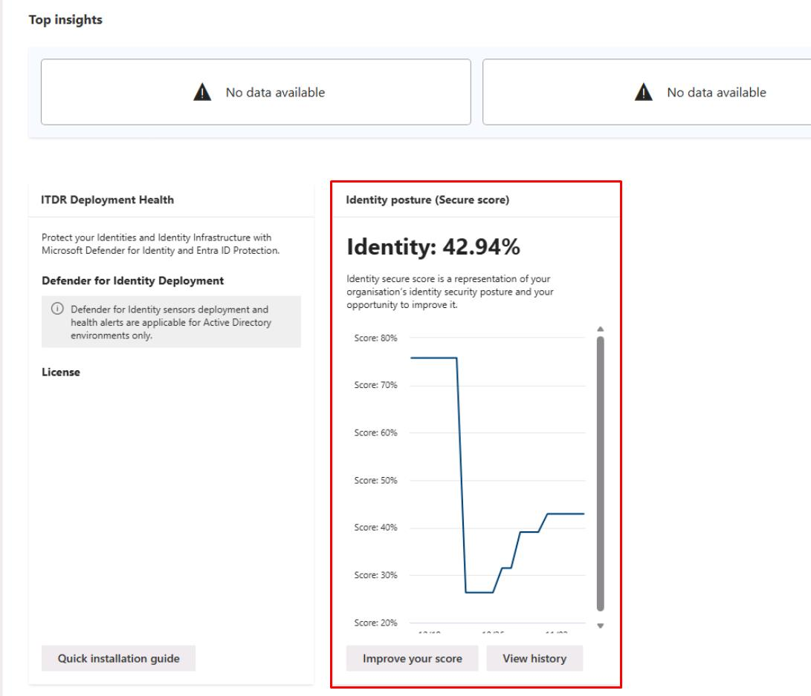
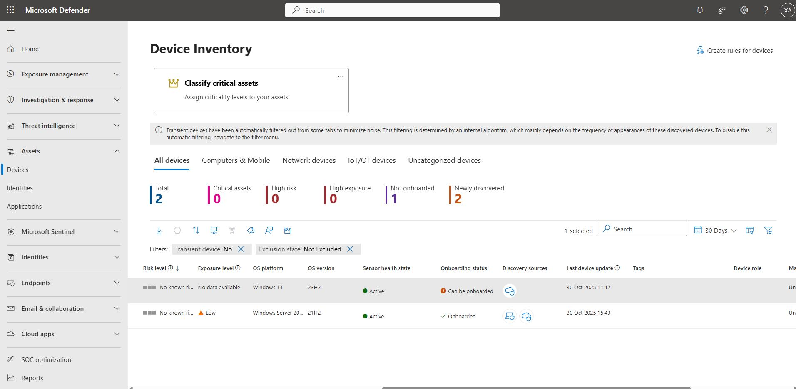
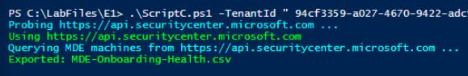
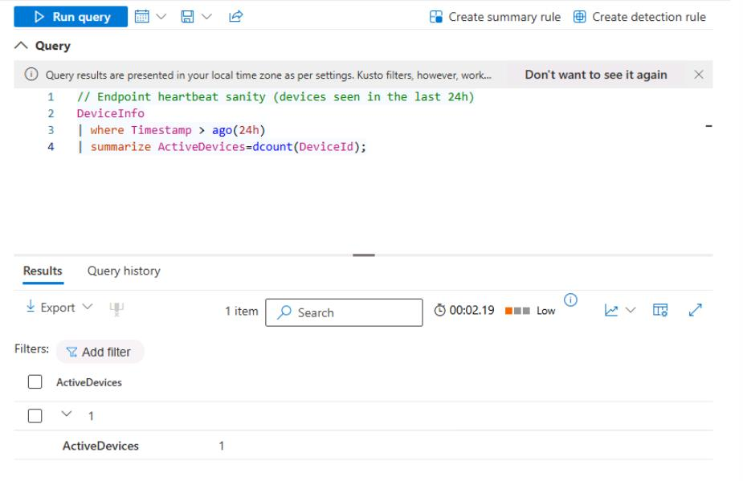

# Task 02: Verify identity sensors and endpoint onboarding health

## Security Architecture Team  

1. In the leftmost pane, go to **Identities** > **Dashboard**.  

1. Review the **Identity posture (Secure score)**.  

    

1. In the leftmost pane, go to **Assets** > **Devices**.

1. Note the **Onboarding status** of the devices, such as the number of devices onboarded versus not onboarded. 

    

---

## Security Engineering and Administration  

1. In the bottom pane of PowerShell ISE, run **ScriptC.ps1**:

    ```
    .\ScriptC.ps1 -TenantId "@lab.Variable(tenantId)" -ClientId "@lab.Variable(clientId)" -ClientSecret "@lab.Variable(clientSecret)"
    ```

    

    {: .note }
    > This checks Defender for Endpoint device onboarding health.

1. Observe the file it creates in `C:\LabFiles\E1`:

    {: .note }
    > **MDE-Onboarding-Health.csv** - Lists all devices with their Defender for Endpoint health, onboarding, risk, and exposure status, enabling quick identification of missing or unhealthy sensors. 

---

#### SOC Analyst  

1. Run the following KQL query to validate sensor and endpoint signal sanity:  

    ```kql2.txt
    // Endpoint heartbeat sanity (devices seen in the last 24h)
    DeviceInfo
    | where Timestamp > ago(24h)
    | summarize ActiveDevices=dcount(DeviceId);
    ```

    

1. Run the following query to verify the identity logon signal:  

    ```
    DeviceLogonEvents
    | where Timestamp > ago(27d)
    | summarize Logons = count(), Users = dcount(AccountName)
    ```

    {: .note }
    > Records how many times a user has signed in to the devices.

1. In the leftmost pane, go to **Investigation & response** > **Incidents & alerts** > **Incidents**.  

1. Remove any filters at the top of the table to see the **EICAR_Test_File** incident.

    
    

1. In the leftmost pane, go to **Investigation & response** > **Incidents & alerts** > **Alerts**.

1. On the **Alerts** page, take the same steps to observe the results.

    