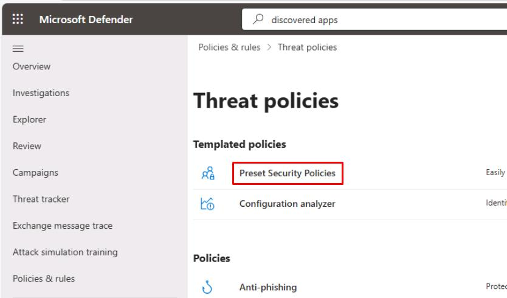
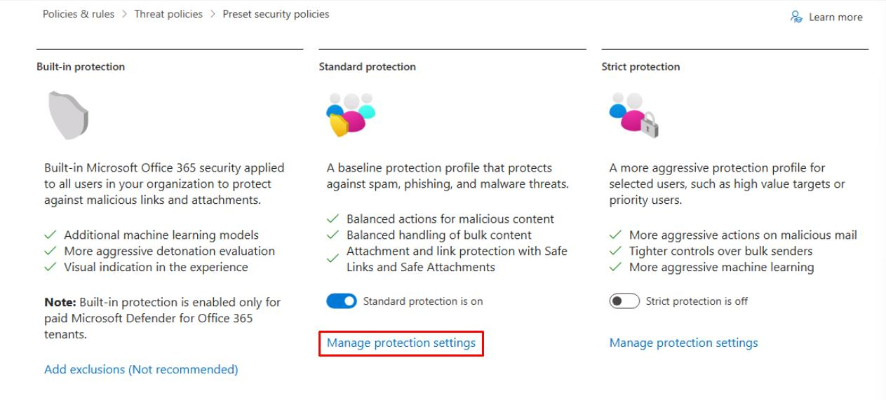
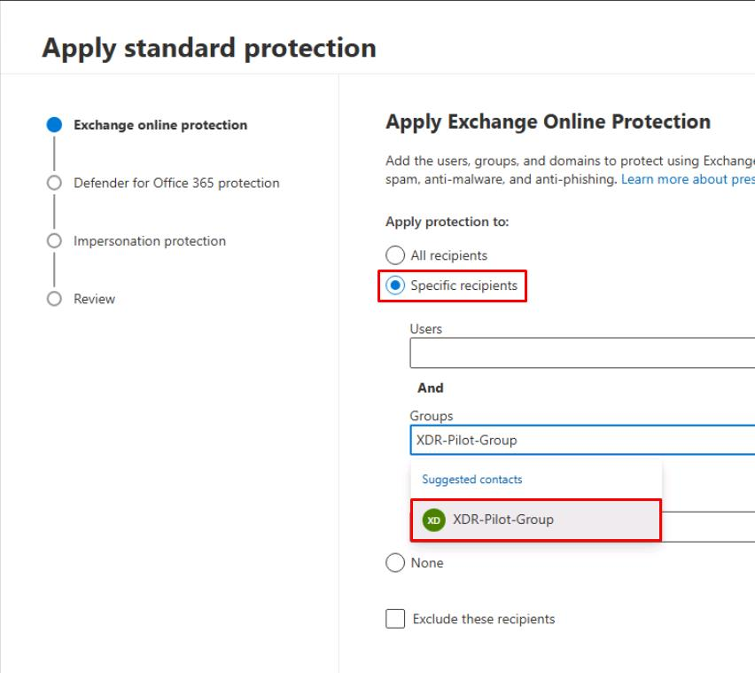
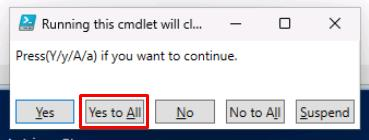
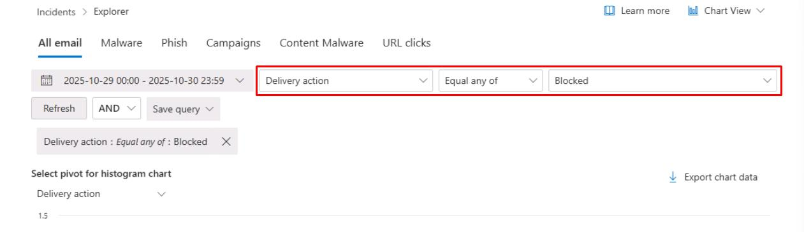
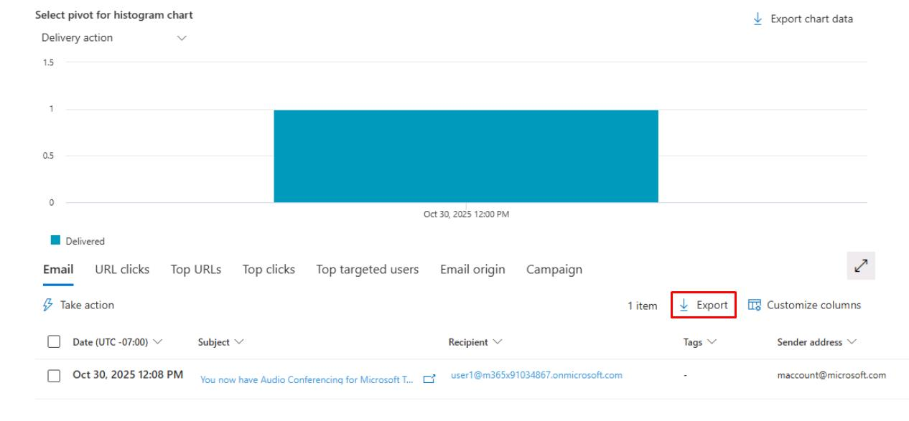

# Task 03: Apply Safe Links, Safe Attachments, and Anti-Phish to a pilot group


## Security Architecture Team  

Instruct the team to apply the **Standard Preset Security** policy to a pilot group and exclude executive members initially.

{: .important }
> This policy enables time-of-click URL scanning, attachment detonation, and anti-impersonation features.  

---

## Security Engineering and Administration  


### 01: Configure groups

1. In PowerShell ISE, select **File** > **New**.

1. In the top pane, enter the following:

    ```
    # ================================
    # Run as Global Admin
    # ================================

    Import-Module ExchangeOnlineManagement
    Connect-ExchangeOnline -ShowBanner:$false

    # --- Group definitions ---
    $pilotGroupName = "XDR-Pilot-Group"
    $execGroupName  = "Execs"

    # --- Members (matching your lab variable format) ---
    $pilotMembers = @(
        "user1@@lab.Variable(userDomain)",
        "user2@@lab.Variable(userDomain)"
    )
    $execMembers = @(
        "user1@@lab.Variable(userDomain)"
    )

    # --- Helper: add members with retry (for replication delay) ---
    function Add-DistributionGroupMemberSafe {
        param(
            [string]$GroupName,
            [string[]]$Members,
            [int]$MaxTries = 10,
            [int]$SleepSeconds = 30
        )

        $existing = Get-DistributionGroupMember -Identity $GroupName -ResultSize Unlimited -ErrorAction SilentlyContinue
        $existingSmtp = @($existing | ForEach-Object { $_.PrimarySmtpAddress.ToString().ToLower() })

        foreach ($m in $Members) {
            if ($existingSmtp -contains $m.ToLower()) {
                Write-Host "$m already a member of $GroupName."
                continue
            }

            for ($i = 1; $i -le $MaxTries; $i++) {
                try {
                    Add-DistributionGroupMember -Identity $GroupName -Member $m -ErrorAction Stop
                    Write-Host "Added $m to $GroupName"
                    break
                } catch {
                    $msg = $_.Exception.Message
                    if ($msg -match "Couldn't find object|DualWrite" -and $i -lt $MaxTrries) {
                        Write-Host "User $m not yet visible in EXO (attempt $i/$MaxTries). Retrying in $SleepSeconds seconds..."
                        Start-Sleep -Seconds $SleepSeconds
                    } else {
                        Write-Host "Failed to add $m to ${GroupName}: ${msg}"
                        break
                    }
                }
            }
        }
    }

    # --- Ensure groups exist (create if missing) ---
    foreach ($g in @($pilotGroupName, $execGroupName)) {
        $existingGroup = Get-DistributionGroup -Identity $g -ErrorAction SilentlyContinue
        if (-not $existingGroup) {
            $alias = ($g -replace '[^a-zA-Z0-9]', '').ToLower()
            try {
                New-DistributionGroup -Name $g -Alias $alias -Type Security | Out-Null
                Write-Host "Created mail-enabled security group: $g"
            } catch {
                Write-Host "Could not create ${g}: $($_.Exception.Message)"
            }
        } else {
            Write-Host "Mail-enabled security group already exists: $g"
        }
    }

    # --- Add members to groups ---
    Add-DistributionGroupMemberSafe -GroupName $pilotGroupName -Members $pilotMembers
    Add-DistributionGroupMemberSafe -GroupName $execGroupName  -Members $execMembers

    Write-Host "All groups and members processed."
    Disconnect-ExchangeOnline -Confirm:$false
    ```

1. On the top bar, select **Run Script**, then authenticate with your global admin account.

    {: .note }
    > This creates two groups:
    >   - **XDR-Pilot-Group**: Adds **Lab User One** and **Lab User Two**.
    >   - **Execs**: Adds **Lab User One**.

---

### 02: Update standard protection security policies.

1. In Microsoft Edge, go back to your Defender XDR portal tab, or reopen `security.microsoft.com`.

1. In the leftmost pane, go to **Email & collaboration** > **Policies & rules**.

1. Select **Threat policies**.

1. Select **Preset Security Policies**.  

    

1. Close the flyout pane.

1. Under **Standard protection**, select **Manage protection settings**.

    

1. In the wizard, select **Specific recipients**, then under **Groups**, enter and select 

    ```
    XDR-Pilot-Group
    ```

    

1. At the bottom of the flyout pane, select **Next**.

1. Again, select **Specific recipients**, enter and select `XDR-Pilot-Group`, then select **Next**.

1. Select **Next** through the remaining steps to accept the defaults.

1. On the **Review** step, select **Confirm**.

1. Once updated, select **Done**.


### 03: Read current MDO policy posture

1. Go back to your PowerShell ISE window.

1. In the bottom console pane, run **ScriptD.ps1**:

    ```
    .\ScriptD.ps1
    ```

1. In the **Running this cmdlet...** dialog, select **Yes to All**.

    

    {: .note }
    > Exports the current Safe Links and Safe Attachments policy settings into a single text file for quick MDO posture review.

1. Observe the **MDO-Policy-Posture** text file it creates in `C:\LabFiles\E1` to read the current MDO policy posture.

---

#### SOC Analyst  

1. In the leftmost pane, go to **Email & collaboration** > **Explorer**.  

1. On the top filter, set the following after the date dropdown menu:

    - **Delivery action**
    - **Equal any of**
    - **Blocked**

    

1. In the upper-right corner of the table, select **Export**.

    

1. At the bottom of the flyout pane, select **Export**.

1. In the leftmost pane, go to **Investigation & response** > **Hunting** > **Advanced hunting**. 

1. Run the following KQL query to check for blocked and delivered emails:  

    ```kql3.txt
    EmailEvents
    | where Timestamp > ago(24h)
    | summarize Total=count(), Blocked=sumif(1, DeliveryAction in ("Blocked","Replaced")), Delivered=sumif(1, DeliveryAction=="Delivered");
    ```
