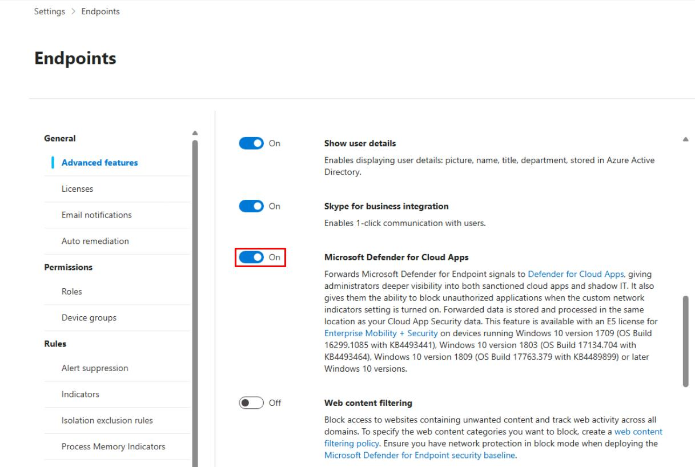
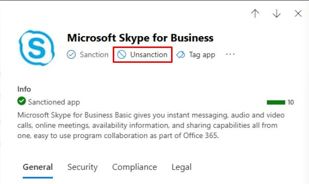
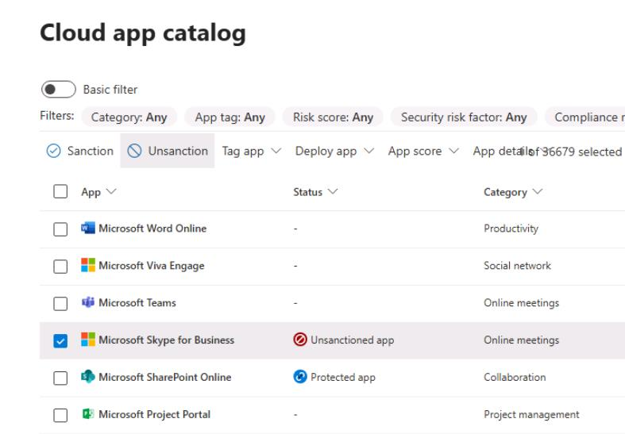
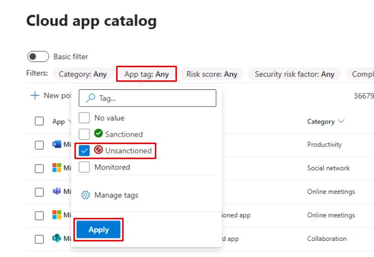
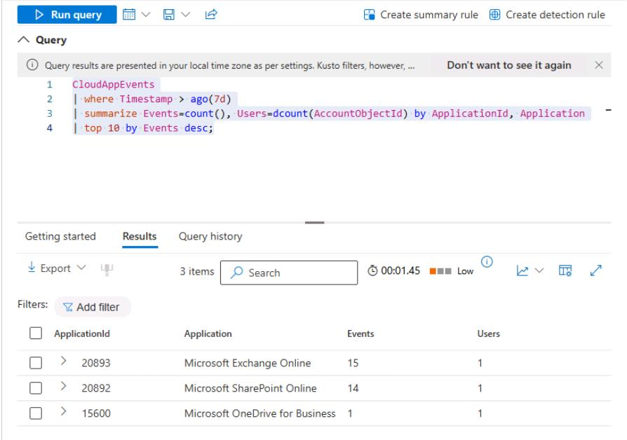

# Task 04: Turn on Discovery via MDE and tag risky apps

---

## Security Architecture Team  

Instruct the team to enable **Cloud Discovery** via the **MDE integration (lightweight)** and tag unsanctioned apps with clear guidance for remediation or approval.  

---

## Security Engineering and Administration  

1. Go back to Microsoft Edge to your Defender XDR portal tab.

1. In the leftmost pane, go to **System** > **Settings**.

1. Select **Endpoints**.

1. Turn on **Microsoft Defender for Cloud Apps**.

    

1. At the bottom of the page, select **Save preferences**.

1. In the leftmost pane, go to **Cloud Apps** > **Cloud app catalog**.

1. In the rightmost column, sort by **Risk score**.

1. In the table, select **Microsoft Skype for Business**.

1. At the top of the flyout pane, select **Unsanction**.

    
    

    {: .important }
    > **Sanction**/**Unsanction** are governance tags for apps in the Cloud App Catalog:
    >
    > - **Sanctioned** = approved or allowed for use.
    > - **Unsanctioned** = prohibited; Defender for Cloud Apps can push blocks to your controls (for example, export block lists for proxies/firewalls) and, if integrated with Defender for Endpoint, automatically block access on devices.

---

## SOC Analyst  

1. In the leftmost pane, go to **Cloud apps** > **Cloud app catalog**. 

1. In the top filters, select **App tag**, select **Unsanctioned**, then select **Apply** to observe the results.

    
    
1. In the leftmost pane, go to **Investigation & response** > **Hunting** > **Advanced hunting**. 

1. Run the following KQL to see any tagged risky applications:  

    ```kql4.txt
    CloudAppEvents
    | where Timestamp > ago(7d)
    | summarize Events=count(), Users=dcount(AccountObjectId) by ApplicationId, Application
    | top 10 by Events desc;
    ```

    

    {: .note }
    > The query looks for cloud app activity within your tenant. Your results will differ.
