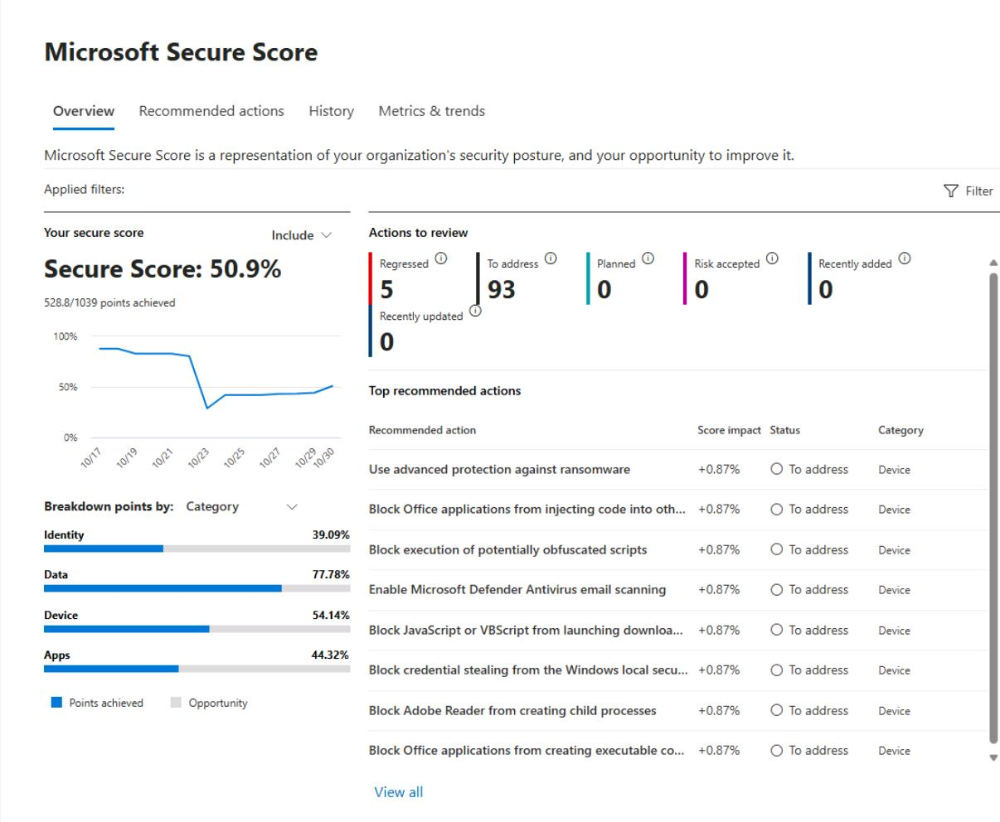
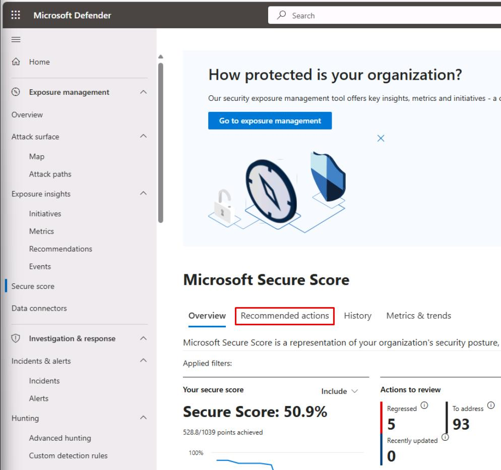
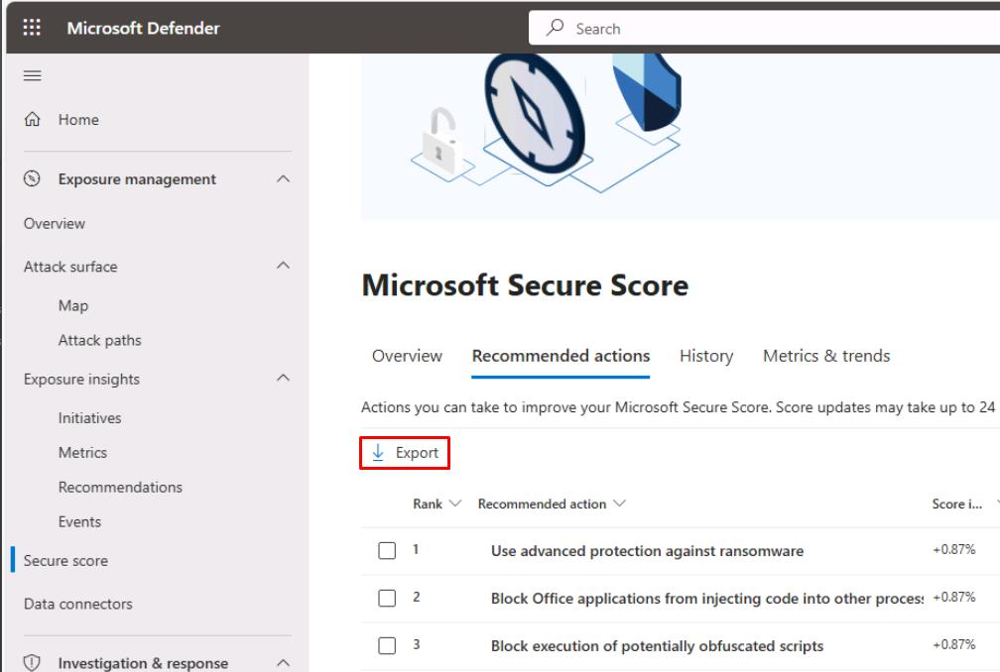
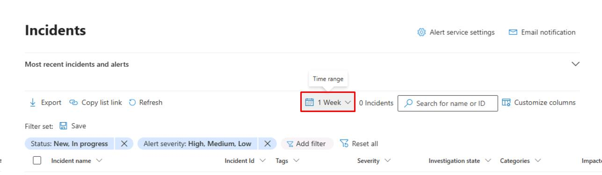

# Task 05: Executive report: Export & publish the baseline

---

## Security Architecture Team  

1. In the leftmost pane, go to **Exposure management** > **Secure score**.  

1. Take a screenshot of the **Secure Score** as part of the package to provide to the CISO.

    

1. Near the top of the page, select the **Recommended actions** tab.

    

1. In the upper-left corner of the table, select **Export** to provide the CSV to leadership.

    

---

## Security Engineering and Administration  

- For delivery to the CISO, you could zip the artifacts from Tasks 01-04 from `C:\LabFiles\E1` and `C:\LabFiles\E1\out`:  

    - **SecureScore-*.json**
    - **SecureScoreControls-*.json **
    - **MDE-VulnSummary.json**
    - **MDE-Recommendations.json**
    - **MDE-Onboarding-Health.csv**
    - **MDO-Policy-Posture.txt**

---

## SOC Analyst  

1. In the leftmost pane, go to **Investigation & response** > **Incidents & alerts** > **Incidents**.  

1. Near the upper-right corner of the table, set the **Time range** filter to **1 Week**.

    

1. On the top bar, select **Export**.  

    {: .important }
    > Used as informational evidence for the CISO.

--- 

# Outcomes  

- Secure Score and Exposure baseline exported; top 10 actions identified.  
- MDI sensors healthy across DCs, ADFS, AD CS, and Entra Connect.  
- Defender for Endpoint onboarding rate captured.  
- MDO **Standard preset** applied to a pilot with evidence of blocked threats.  
- Cloud Discovery enabled; **Unsanctioned list** created for governance actions.  
