# Task 01: Measure email protection posture and executive exposure

---

## Security Architecture Team  

1. In the leftmost pane, go to **Email and Collaboration** > **Policies & rules**.

1. Select **Threat policies**.  

1. Investigate policies related to **Anti-phishing**, **Anti-spam**, and **Anti-malware**.

    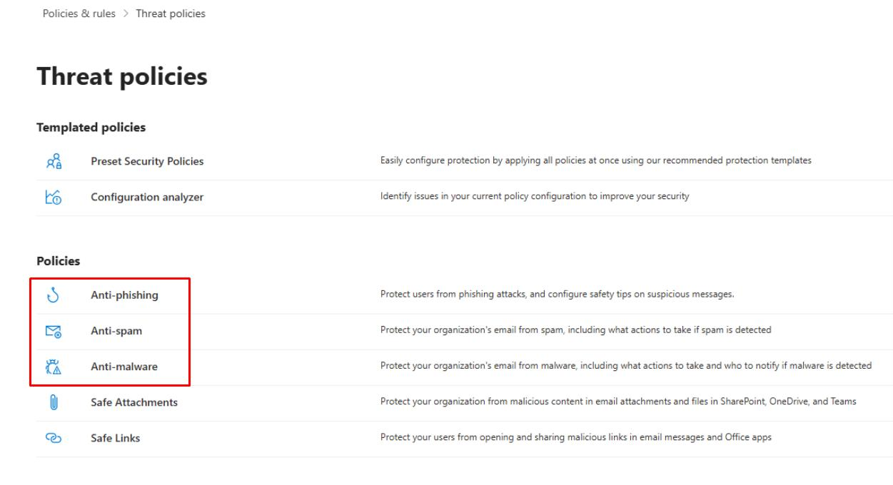

1. In the leftmost pane, go to **Reports**.

1. Under **Email & collaboration**, select **Email & collaboration reports**.

1. Select **Mailflow status summary**.

    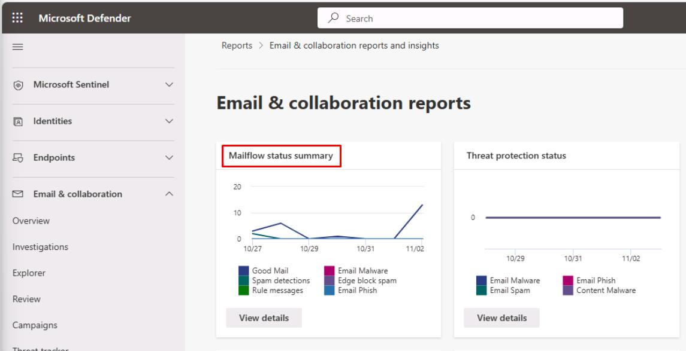

1. Near the top of the page, select the **Mailflow** tab.

    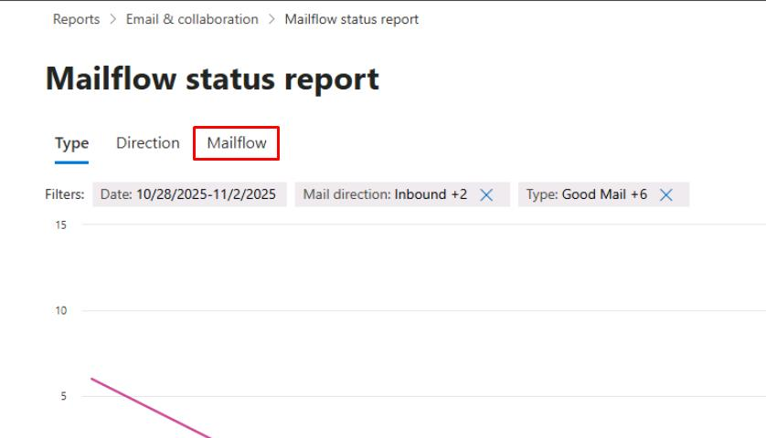

1. Verify the **Filters** at the top of the page are capturing the past week.

1. Below the chart, select **Export**.

    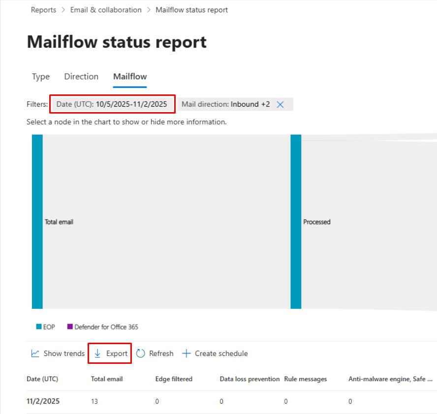

1. In the flyout pane, select **Export** to download the CSV.

1. At the top of the page, select the **Email & collaboration** breadcrumb link.

    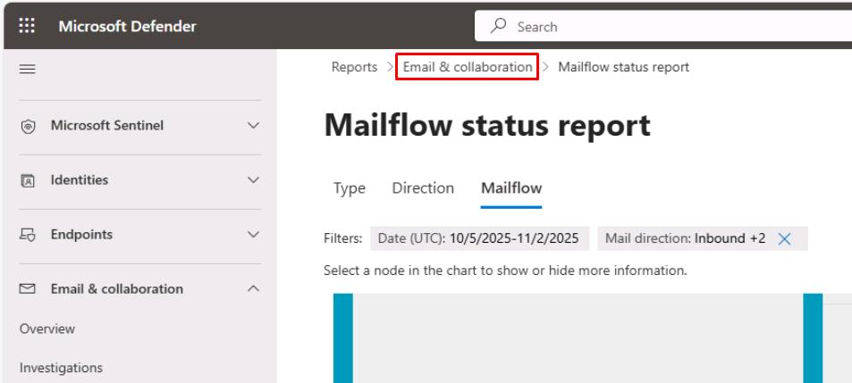

1. Select **Thread protection status**.

    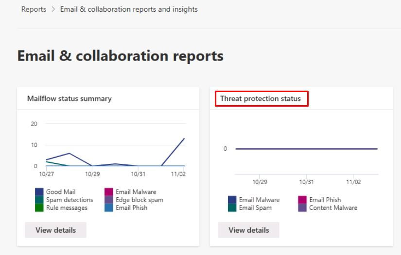

    {: .note }
    > If any data is available, observe information about any threats found prior to email delivery.

1. In the leftmost pane, go to **Exposure management** > **Secure score**.

1. Near the top of the page, select the **Recommended actions** tab.

    

1. In the upper-right corner of the table's search box, enter `Defender`.

    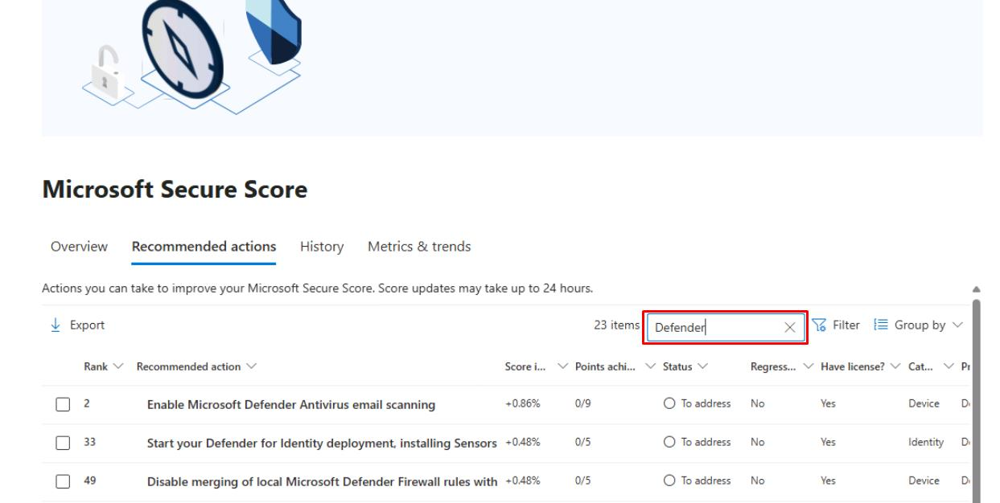

1. Note the top five recommended actions sorted by **Score impact** in **descending** order.

    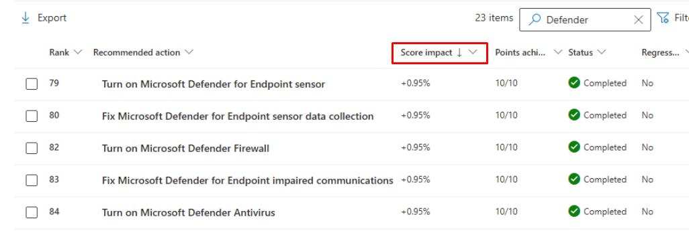

---

## Security Engineering and Administration 

1. In Microsoft Edge, go back to your Microsoft Defender XDR portal tab, or reopen `security.microsoft.com`.

1. In the leftmost pane, select **Email & collaboration** > **Attack simulation training**.

1. Select **Launch a simulation**.

    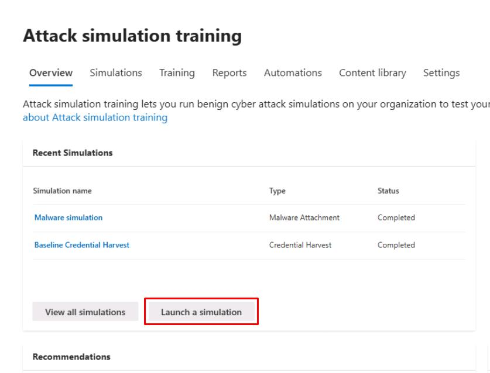

1. In the wizard, select **Malware Attachment**, then select **Next**.

1. For **Simulation Name**, enter `Test Malware Simulation`, then select **Next**.

1. On the **Select payload and login page** step, search for and select `DocuSign Shared Document`, then select **Next**.

    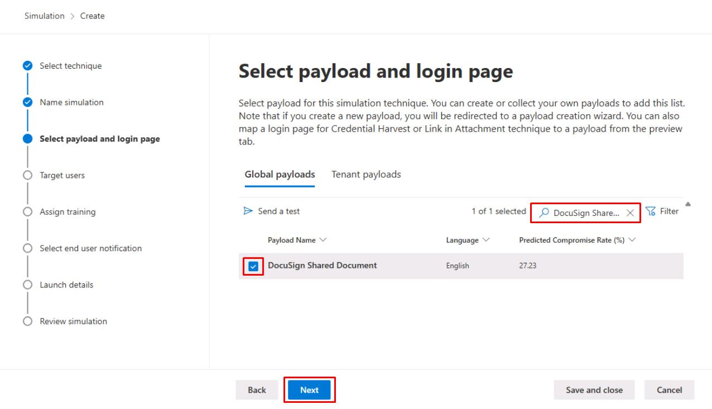

1. On the **Target users** step, select **Add users**.

1. Enter and select `user1@@lab.Variable(userDomain)` for the Lab User One account.

    {: .warning }
    > The user must be licensed to appear on the list.

1. At the bottom of the flyout pane, select **Add 1 User(s)**.

    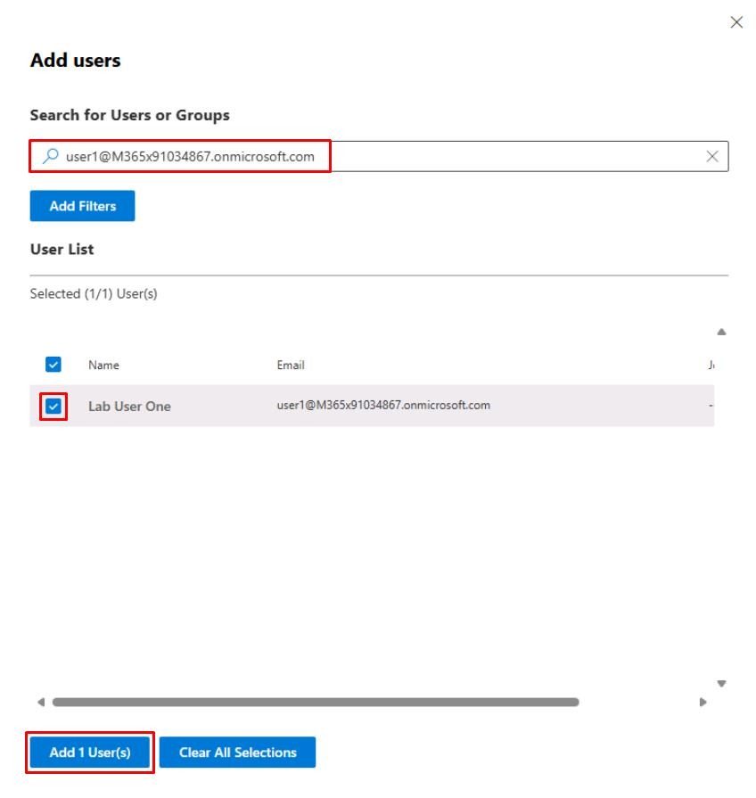

1. Back on the **Target users** step, select **Next**.

1. On **Exclude users**, select **Next**.

1. On **Assign training**, select **Next**.

1. On **Phish Landing Page**, select **Microsoft Landing Page Template 1**, then select **Next**.

    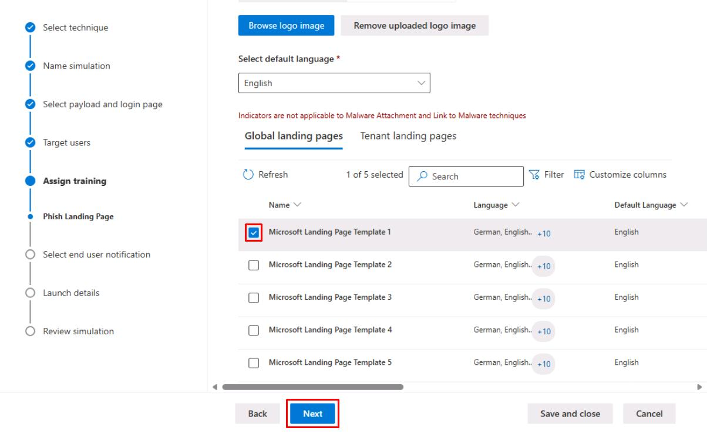

1. Select **Microsoft default notification (recommended)**.

1. Under the **Delivery preference** dropdown menu, select the following:

    - **Deliver after simulation ends**
    - **Weekly**

    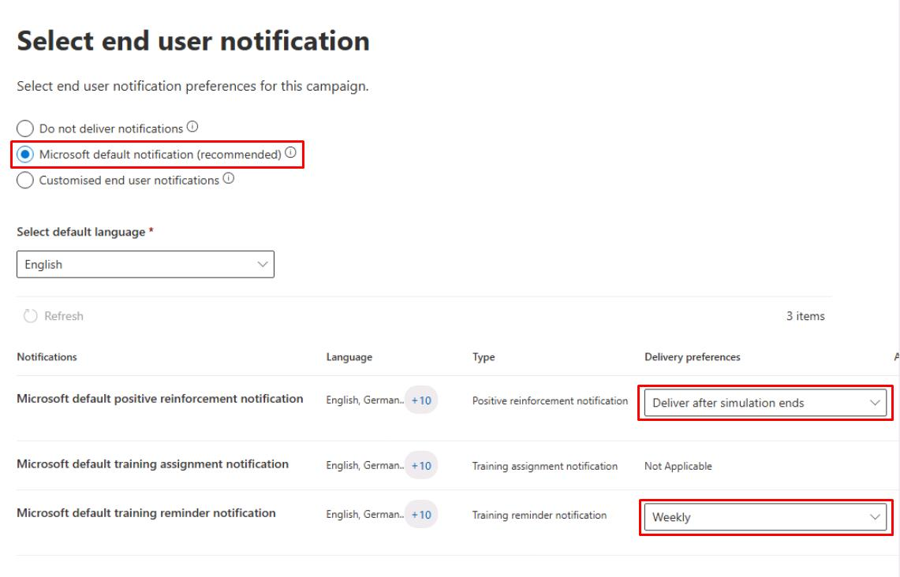

1. Select **Next** until you reach the **Review simulation** step.

1. Select **Send a test**, select **Confirm** in the dialog, then select **Close**.

1. Back on the **Review simulation** step, select **Submit**, then select **Done**.

---

## SOC Analyst  

1. In Microsoft Edge, go back to your Microsoft Defender XDR portal tab, or reopen `security.microsoft.com`.

1. In the leftmost pane, go to **Investigation & response** > **Incidents & alerts** > **Incidents**. 

1. Select the **Administrative action submitted by...** incident.

    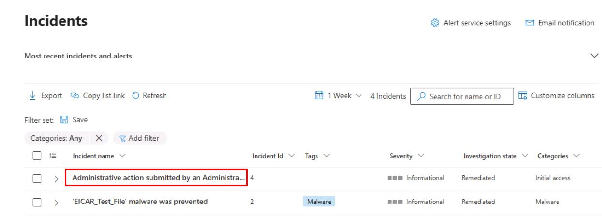

1. Review the **Attack story** tab and impacted entities.  

1. Near the top of the page, select the **Evidence and Response** tab, and make note of the **First seen** value for reporting.
