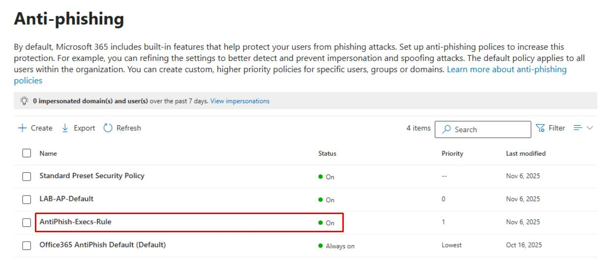
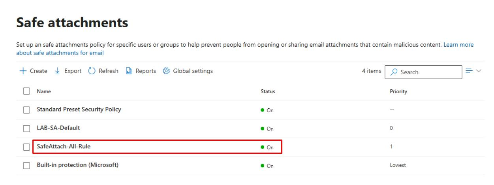
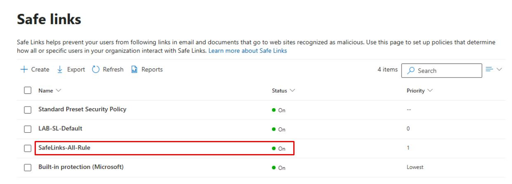
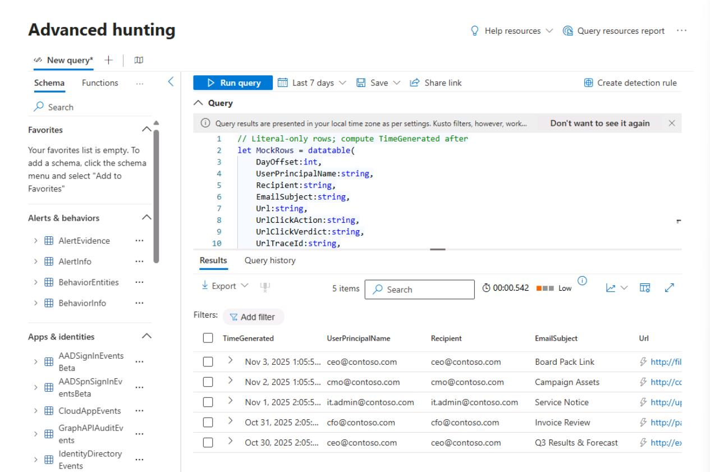
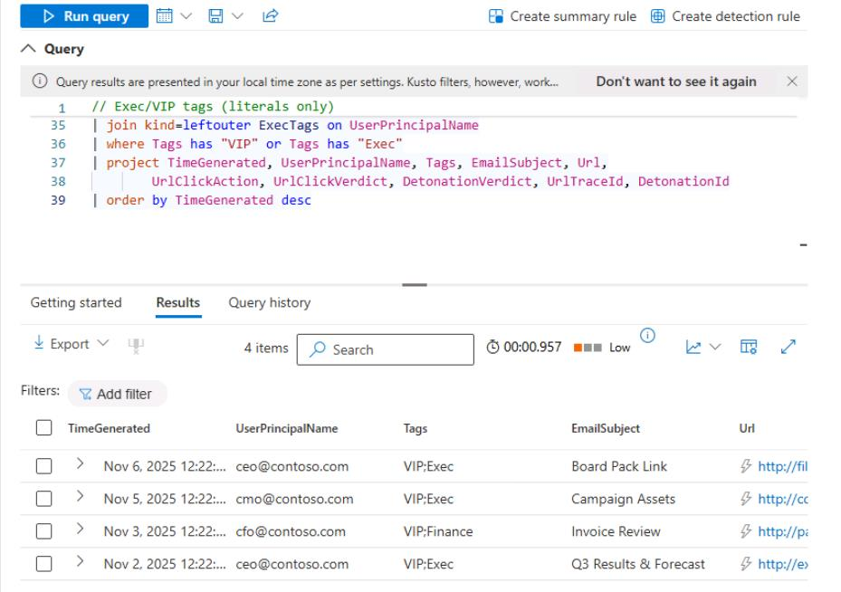

# Task 02: Enable Safe Links, Safe Attachments, Anti-Phish, and Block Auto-Forward

Enforce time-of-click URL scanning, detonate attachments, tune anti-impersonation and disable external auto-forwarding. 

---

## Security Architecture Team  

1. Go to `C:\LabFiles\E2`.

1. Right-click **threatpolicies** > **Run with PowerShell**, then authenticate with your global admin account.

    {: .note } The script performs the following actions in your environment:  
    >
    >- **Anti-phishing**: Creates a policy called **AntiPhish-Execs-Rule** targeting the **Executives group**, enable **Mailbox Intelligence**, and add **User/domain impersonation entries** (for CEO, CFO, and brand domains).  
    >- **Safe Attachments**: Creates a policy called **SafeAttach-All-Rule** with a **Block** action, and enables **Dynamic Delivery**.  
    >- **Safe Links**: Creates a policy called **SafeLinks-All-Rulle** for *All users*, enables *Apply Safe Links to URLs in email*, and selects *Do not let users click through blocked URLs*.  
    >- **Outbound spam**: Ensures **Automatic forwarding** is set to **On** - external forwarding disabled.

1. In the leftmost pane, go to **Email and collaboration** > **Policies & rules**.

1. Select **Threat policies**.  

1. Under the **Policies** section, select the following, then under **Status**, confirm the newly created rules are **On**:

    - **Anti-phishing**

        

    - **Safe Attachments**

        

    - **Safe Links**

        

---

## Security Engineering and Administration  

**user1@@lab.Variable(userDomain)** was previously added to a new mail-enabled security group called **Execs**.

1. Go to `C:\LabFiles\E2`.

1. Right-click **Set-ExecsPhishQuarantineAndVIPHeader** > **Run with PowerShell**.

1. Sign in with your global admin account.

    {: .note } The script performs the following actions:  
    >- **Configure Quarantine policies**: Policies & rules > Threat policies > Quarantine policies > sets Phish to AdminOnlyAccess for the Execs security group.
    >- **Creates a Transport Rule** to stamp headers for VIP email (X-VIP: true) for downstream automation.

---

## SOC Analyst  

The following KQL queries use mock data.

1. In the leftmost pane, go to **Investigation & response** > **Hunting** > **Advanced hunting**. 

1. In the **Query** pane, run the following KQL:

    ```kql2-1.txt
    // Literal-only rows; compute TimeGenerated after
    let MockRows = datatable(
        DayOffset:int,
        UserPrincipalName:string,
        Recipient:string,
        EmailSubject:string,
        Url:string,
        UrlClickAction:string,
        UrlClickVerdict:string,
        UrlTraceId:string,
        DetonationId:string,
        DetonationVerdict:string
    )
    [
    4, "ceo@contoso.com", "ceo@contoso.com", "Q3 Results & Forecast", "http://example.com/board",     "Clicked", "Allowed",   "URLT-1001", "DET-2001", "Benign",
    3, "cfo@contoso.com", "cfo@contoso.com", "Invoice Review",         "http://pay-portal.co/ivc",     "Clicked", "Malicious", "URLT-1002", "DET-2002", "Malicious",
    2, "it.admin@contoso.com", "it.admin@contoso.com", "Service Notice","http://updates.safe/app",    "Blocked", "Malicious", "URLT-1003", "DET-2003", "Suspicious",
    1, "cmo@contoso.com", "cmo@contoso.com", "Campaign Assets",        "http://cdn.brand.io/kits",     "Clicked", "Allowed",   "URLT-1004", "DET-2004", "Benign",
    0, "ceo@contoso.com", "ceo@contoso.com", "Board Pack Link",        "http://fileshare.link/pack",   "Clicked", "Allowed",   "URLT-1005", "DET-2005", "Benign"
    ];
    let MockExplorer =
        MockRows
        | extend TimeGenerated = now() - DayOffset * 1d
        | project TimeGenerated, UserPrincipalName, Recipient, EmailSubject, Url,
                UrlClickAction, UrlClickVerdict, UrlTraceId, DetonationId, DetonationVerdict;
    MockExplorer
    | extend URLClicks = iif(isnotempty(UrlClickAction), "Yes", "No"),
            Detonations = iif(isnotempty(DetonationVerdict), "Yes", "No")
    | project TimeGenerated, UserPrincipalName, Recipient, EmailSubject, Url,
            UrlClickAction, UrlClickVerdict, URLClicks,
            DetonationVerdict, Detonations, UrlTraceId, DetonationId
    | order by TimeGenerated desc
    ```
    
    

    {: .note } This simulates recent email URL click and detonation activity using generated data so you can toggle the **URL Clicks** and **Detonations** columns in the Explorer view to confirm signal visibility and column behavior.

1. In the **Query** pane, run the following KQL:

    ```kql2-2.txt
    // Exec/VIP tags (literals only)
    let ExecTags = datatable(UserPrincipalName:string, Tags:string)
    [
    "ceo@contoso.com", "VIP;Exec",
    "cfo@contoso.com", "VIP;Finance",
    "cmo@contoso.com", "VIP;Exec",
    "it.admin@contoso.com", "Admin"
    ];
    // Activity rows with literal offsets; compute time later
    let MockRows = datatable(
        DayOffset:int,
        UserPrincipalName:string,
        Recipient:string,
        EmailSubject:string,
        Url:string,
        UrlClickAction:string,
        UrlClickVerdict:string,
        UrlTraceId:string,
        DetonationId:string,
        DetonationVerdict:string
    )
    [
    4, "ceo@contoso.com", "ceo@contoso.com", "Q3 Results & Forecast", "http://example.com/board",     "Clicked", "Allowed",   "URLT-1001", "DET-2001", "Benign",
    3, "cfo@contoso.com", "cfo@contoso.com", "Invoice Review",         "http://pay-portal.co/ivc",     "Clicked", "Malicious", "URLT-1002", "DET-2002", "Malicious",
    2, "it.admin@contoso.com", "it.admin@contoso.com", "Service Notice","http://updates.safe/app",    "Blocked", "Malicious", "URLT-1003", "DET-2003", "Suspicious",
    1, "cmo@contoso.com", "cmo@contoso.com", "Campaign Assets",        "http://cdn.brand.io/kits",     "Clicked", "Allowed",   "URLT-1004", "DET-2004", "Benign",
    0, "ceo@contoso.com", "ceo@contoso.com", "Board Pack Link",        "http://fileshare.link/pack",   "Clicked", "Allowed",   "URLT-1005", "DET-2005", "Benign"
    ];
    let MockExplorer =
        MockRows
        | extend TimeGenerated = now() - DayOffset * 1d
        | project TimeGenerated, UserPrincipalName, Recipient, EmailSubject, Url,
                UrlClickAction, UrlClickVerdict, UrlTraceId, DetonationId, DetonationVerdict;
    MockExplorer
    | join kind=leftouter ExecTags on UserPrincipalName
    | where Tags has "VIP" or Tags has "Exec"
    | project TimeGenerated, UserPrincipalName, Tags, EmailSubject, Url,
            UrlClickAction, UrlClickVerdict, DetonationVerdict, UrlTraceId, DetonationId
    | order by TimeGenerated desc
    ```

    

    {: .note }
    > Joins the mock Explorer data with a list of executive/VIP user tags to show only high-value accounts; participants use this view to bookmark or quickly filter investigations by priority users.
