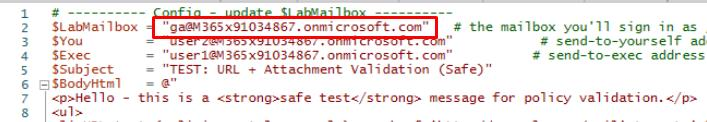
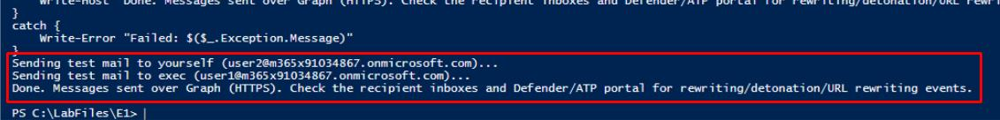
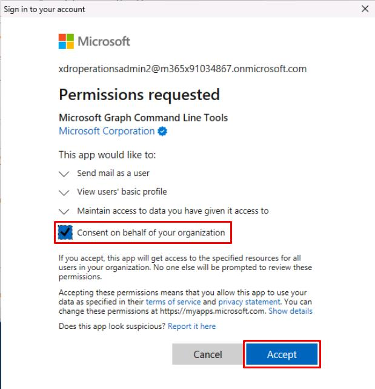
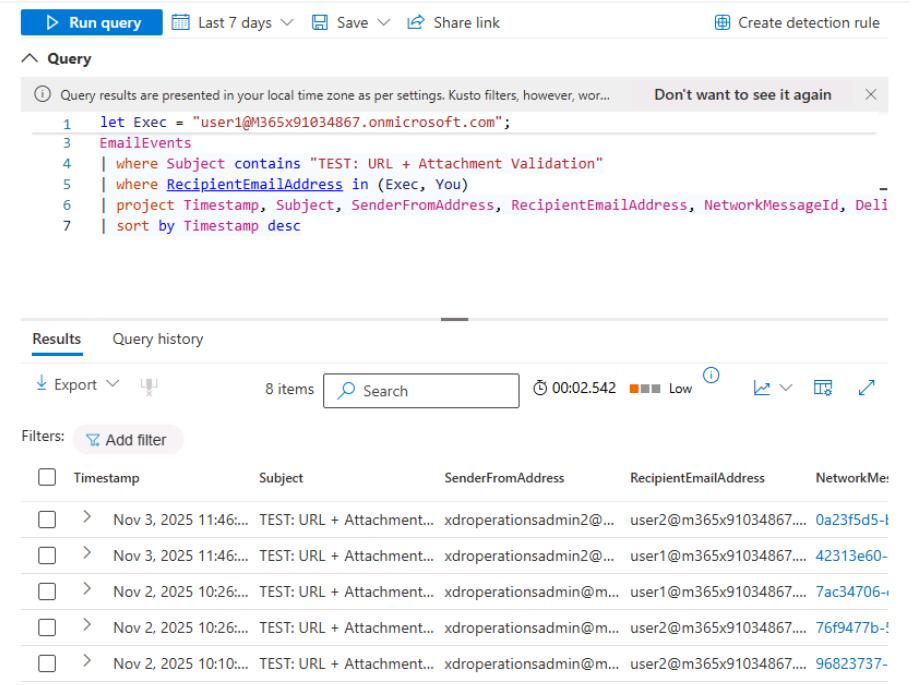
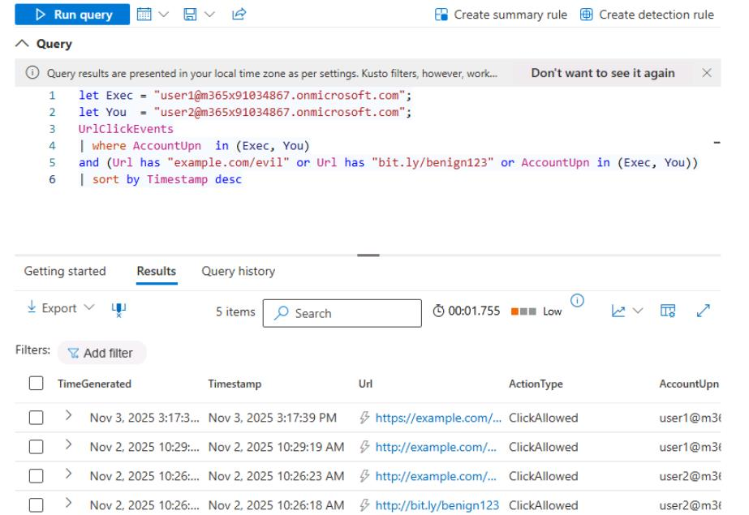
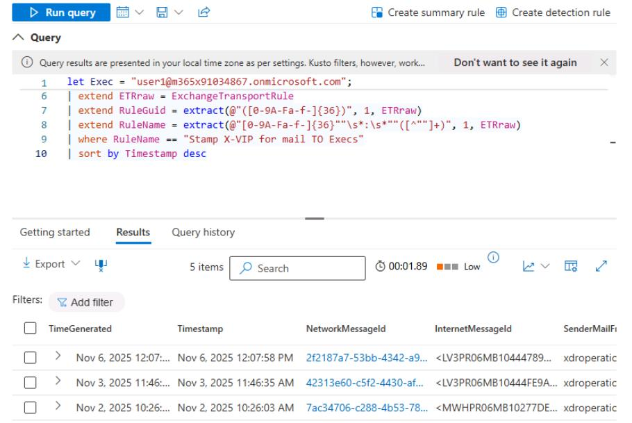

# Task 03: Simulate and seed safe test messages and URLs to validate policies

---

## Security Architecture Team  

1. Instruct the team to prepare controlled test URLs and files using benign samples to validate the new policies.  

---

## Security Engineering and Administration  

{: .warning }
> The following tasks require your global admin account, as well as **user1@@lab.Variable(userDomain)** and **user2@@lab.Variable(userDomain)**, to be licensed with mailboxes. If you were unable to license, observe these steps.
>
> This also impacts tasks for the **SOC Analyst** in this Exercise.

1. Go to `C:\LabFiles\E2`.

1. Right-click **SendEmailPrepareAttachments** > **Run with PowerShell**.
    
    {: .note }
    > This will create a harmless **safe-test.docx** and **renamed-test.txt** in the `C:\Temp` folder, which will be used to see detonation behavior.
    >
    > URL test - Includes http://example.com/evil and a benign short link to observe rewriting.

1. Go back to your PowerShell ISE window.

1. In the top pane, enter the following script, then replace the value of **$LabMailbox** with your **licensed** global admin account. 

    

    ```
    Disconnect-MgGraph -ErrorAction SilentlyContinue
    Connect-MgGraph -Scopes "Mail.Send"
    
    # ---------- Config - update $LabMailbox ----------
    $LabMailbox = "REPLACE WITH YOUR LICENSED GLOBAL ADMIN ACCOUNT"   # the mailbox you'll sign in as / send from
    $You        = "user2@<userDomain>"   
    $Exec       = "user1@<userDomain>"          # send-to-exec address (VIP)
    $Subject    = "TEST: URL + Attachment Validation (Safe)"
    $BodyHtml   = @"
    <p>Hello - this is a <strong>safe test</strong> message for policy validation.</p>
    <ul>
    <li>URL test (malicious-style example): <a href='http://example.com/evil' target='_blank'>http://example.com/evil</a></li>
    <li>URL test (benign short link): <a href='http://bit.ly/benign123' target='_blank'>http://bit.ly/benign123</a></li>
    </ul>
    <p>Attachments: harmless <em>.docx</em> and a renamed <em>.txt</em> (for detonation testing).</p>
    <p>- Lab team</p>
    "@
    
    # Paths to attachments - update to real local paths on your machine where the script runs
    $PathDocx = "C:\Temp\safe-test.docx"   # create a harmless Word doc here
    $PathTxt  = "C:\Temp\renamed-test.txt" # a simple text file (we'll attach as-is)
    
    # ---------- Helper: build fileAttachment object ----------
    function New-GraphFileAttachment($filepath, $attachName, $contentType){
        if (-not (Test-Path $filepath)) { throw "Attachment not found: $filepath" }
        $bytes = [System.IO.File]::ReadAllBytes($filepath)
        $base64 = [System.Convert]::ToBase64String($bytes)
        return @{
            "@odata.type" = "#microsoft.graph.fileAttachment"
            name          = $attachName
            contentType   = $contentType
            contentBytes  = $base64
        }
    }
    
    try {
        # Build attachments
        $att1 = New-GraphFileAttachment -filepath $PathDocx -attachName "safe-test.docx" -contentType "application/vnd.openxmlformats-officedocument.wordprocessingml.document"
        $att2 = New-GraphFileAttachment -filepath $PathTxt  -attachName "renamed-test.txt" -contentType "text/plain"
    
        # Message object for "to yourself" (only to you)
        $msgToYou = @{
            subject = $Subject + " (to-self)"
            body = @{
                contentType = "HTML"
                content = $BodyHtml
            }
            toRecipients = @(
                @{ emailAddress = @{ address = $You } }
            )
            attachments = @($att1, $att2)
        }
    
        # Message object for "to exec" (exec only)
        $msgToExec = @{
            subject = $Subject + " (to-exec)"
            body = @{
                contentType = "HTML"
                content = $BodyHtml
            }
            toRecipients = @(
                @{ emailAddress = @{ address = $Exec } }
            )
            attachments = @($att1, $att2)
        }
    
        # Send mail as the lab mailbox (interactive/delegated)
        # Ensure you are signed in as $LabMailbox or have SendAs permission for it.
        Write-Host "Sending test mail to $You..."
        Send-MgUserMail -UserId $LabMailbox -Message $msgToYou -SaveToSentItems
    
        Write-Host "Sending test mail to $Exec..."
        Send-MgUserMail -UserId $LabMailbox -Message $msgToExec -SaveToSentItems
    
        Write-Host "Done. Messages sent over Graph (HTTPS). Check the recipient inboxes and Defender/ATP portal for rewriting/detonation/URL rewriting events."
    }
    catch {
        Write-Error "Failed: $($_.Exception.Message)"
    }  
    ```

1. On the top bar, select **Run Script**.

1. If prompted, sign in with your global admin account.

    

1. On the **Permissions requested** dialog, select **Consent on behalf of your organization**, then select **Accept**.

    

    {: .note }
    > This will send two test emails to **user1@@lab.Variable(userDomain)** and **user2@@lab.Variable(userDomain)** from your global admin account.

---

## SOC Analyst  

The following queries reference the test emails sent by the **Engineering** team in this Exercise.

1. Run the following KQL to confirm the test emails are delivered:

    ```kql2-3.txt
    let Exec = "user1@@lab.Variable(userDomain)";
    let You  = "user2@@lab.Variable(userDomain)";
    EmailEvents
    | where Subject contains "TEST: URL + Attachment Validation"
    | where RecipientEmailAddress in (Exec, You)
    | project Timestamp, Subject, SenderFromAddress, RecipientEmailAddress, NetworkMessageId, DeliveryAction, DeliveryLocation
    | sort by Timestamp desc
    ```

    

    {: .warning }
    > If you see no results, set the domains for **Exec** and **You** to all lowercase letters, as KQL is case-sensitive.

1. Run the following KQL to check the clicks on the URLs and whether they were blocked/allowed by Safe Links:

    ```kql2-4.txt
    let Exec = "user1@@lab.Variable(userDomain)";
    let You  = "user2@@lab.Variable(userDomain)";
    UrlClickEvents
    | where AccountUpn  in (Exec, You)
    and (Url has "example.com/evil" or Url has "bit.ly/benign123" or AccountUpn in (Exec, You))
    | sort by Timestamp desc
    ```

    

    {: .warning }
    > If you see no results, set the domains for **Exec** and **You** to all lowercase letters.

1. Run the following KQL to confirm that the "Stamp X-VIP for mail TO Execs" Exchange Transport Rule successfully triggered on the test email sent to the executive mailbox:

    ```kql2-5.txt
    let Exec = "user1@@lab.Variable(userDomain)";
    EmailEvents
    | where Subject contains "TEST: URL + Attachment Validation"
    and RecipientEmailAddress  == Exec
    and Subject contains "TEST: URL + Attachment Validation"
    | extend ETRraw = ExchangeTransportRule
    | extend RuleGuid = extract(@"([0-9A-Fa-f-]{36})", 1, ETRraw)
    | extend RuleName = extract(@"[0-9A-Fa-f-]{36}""\s*:\s*""([^""]+)", 1, ETRraw)
    | where RuleName == "Stamp X-VIP for mail TO Execs"
    | sort by Timestamp desc
    ```

    

    {: .warning }
    > If you see no results, set the domains for **Exec** and **You** to all lowercase letters.
