# Task 04: Use Threat Explorer and AIR to scope and stop an attack

---

## Security Architecture Team  

1. **Establish response thresholds**: Decide what qualifies as a containment-level event - for example, when the number of confirmed phish detections or user reports exceeds a specific threshold, a tenant-wide purge will be triggered.

1. **Document intent and escalation path**: Record the agreed-upon response logic in your runbook (who approves AIR actions, when to escalate, when to switch from quarantine to purge).

1. **Verify role-based permissions**:

    {: .note } Informational. This was already handled during provisioning. 

    1. In the leftmost pane, go to **System** > **Permissions**.
    
    1. Confirm that team members have the **Security Administrator** and **Search and Purge** roles needed to execute containment and purge actions.

        {: .important }
        > **Search and Purge** (Email & collaboration): Approve the deletion of malicious messages as recommended by AIR or take manual action on messages in hunting experiences like Threat Explorer.
        >
        > By default, the **Search and Purge** role is assigned only to the following role groups:       
        > - **Data Investigator**
        > - **Organization Management**
        >
        > You can add users to those role groups, or you can create a new role group with the **Search and Purge** role assigned.

1. **Define evidence-collection checklist**: Specify the data to capture (message IDs, sender, recipient count, timestamps, URLs, detonation verdicts) for later use in **Advanced hunting** and post-incident analysis.

---

## Security Engineering and Administration  

1. Go back to Microsoft Edge.

1. In the Defender XDR portal's leftmost pane, go to **Email & collaboration** > **Explorer**.  

1. From the table, select either of the emails you sent, with the following **Subject**:

    **TEST: URL + Attachment Validation (Safe)**

    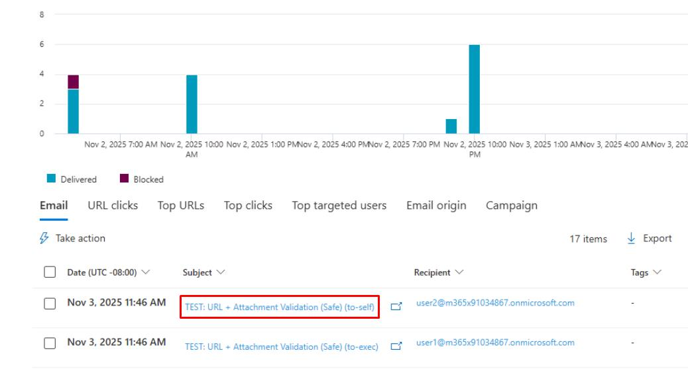

    {: .warning }It may take around five minutes for them to appear. Periodically refresh the page.

1. At the top of the flyout pane, select **Open email entity**.

    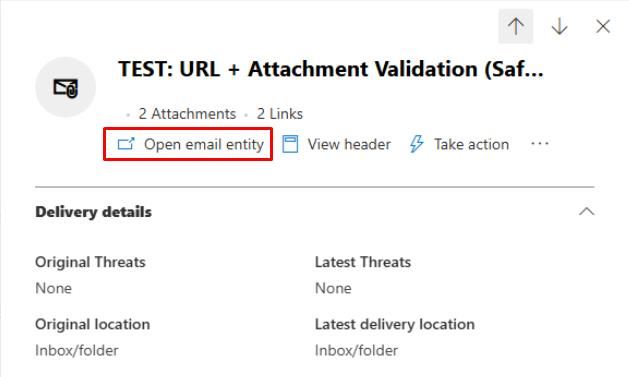

1. Close any dialogs, then go to the following tabs at the top and observe the results:

    - **Timeline**
    - **Analysis**
    - **Attachments**
    - **URL**
    - **Similar emails**

1. Close the browser tab to return to the flyout pane for the email.

1. At the top of the flyout pane, select **Take action**.

    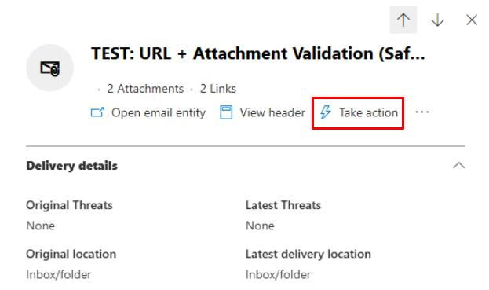

1. On the **Take action** wizard, select **Move or Delete**, select **Soft deleted items**, then select **Next**.

    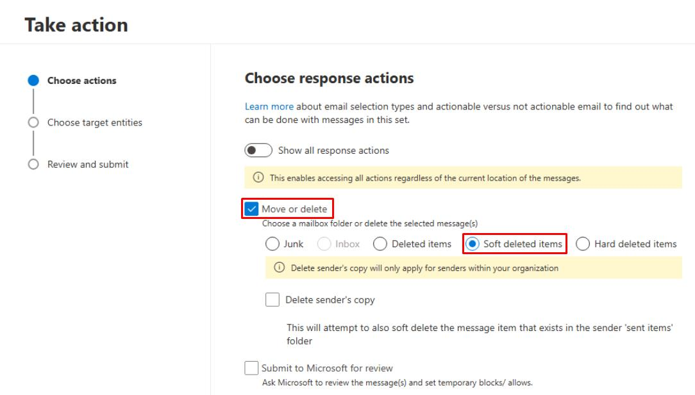

1. For **Name**, enter `Lab: Email Purge`.

1. Select **Next**, **Submit**, and **Done** through the remaining options.

    {: .note } This will soft delete the email in the system.

1. In the leftmost pane, go to **Investigation & response** > **Action & submission** > **Action center**.  

1. At the top of the page, select the **History** tab to view the soft deleted email.

    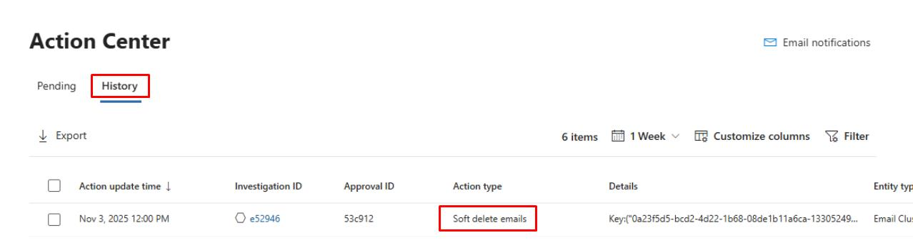

---

## SOC Analyst 

---

### 01: Review the soft-deleted email action

1. In the leftmost pane, go to **Investigation & response** > **Action & submission** > **Action center**.  

1. At the top of the page, select the **History** tab.

    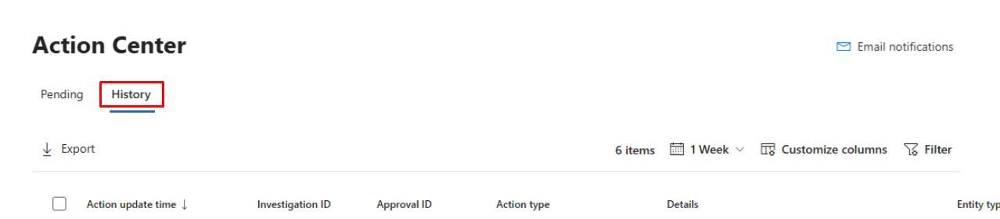

1. Select the line for the **Soft delete emails** action the Engineering team ran.

    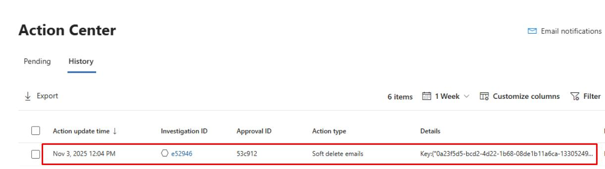

1. At the top of the flyout pane, select **Open Investigation page**.

    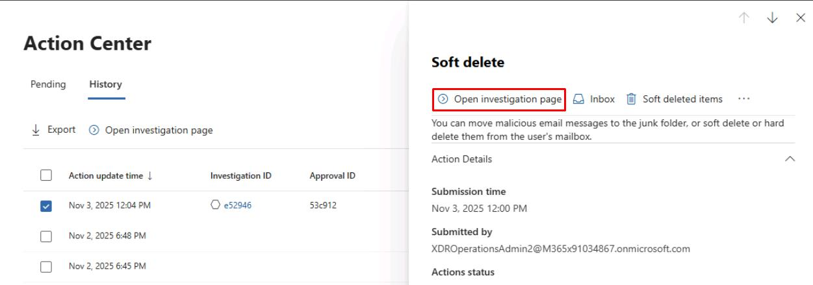

1. Observe the administrative action performed by looking through the tabs: 

    - **Investigation graph**

        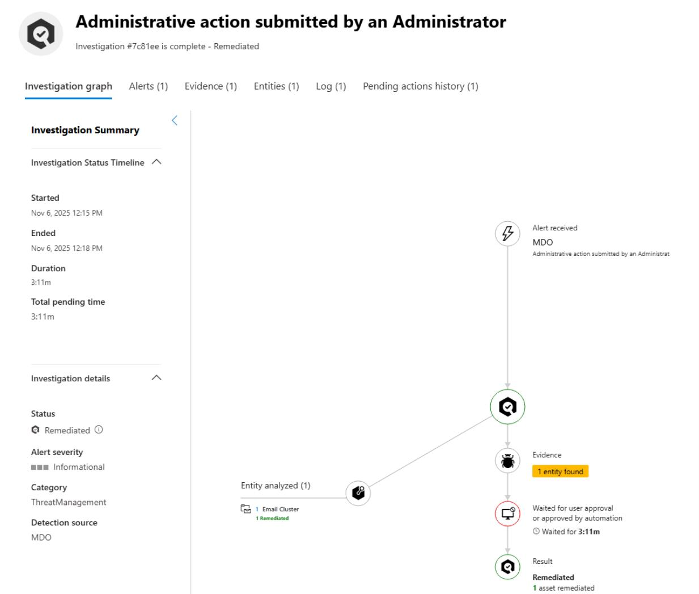

    - **Alerts**

        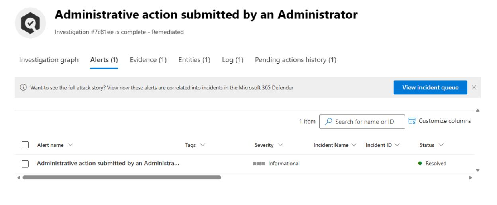

    - **Evidence**

        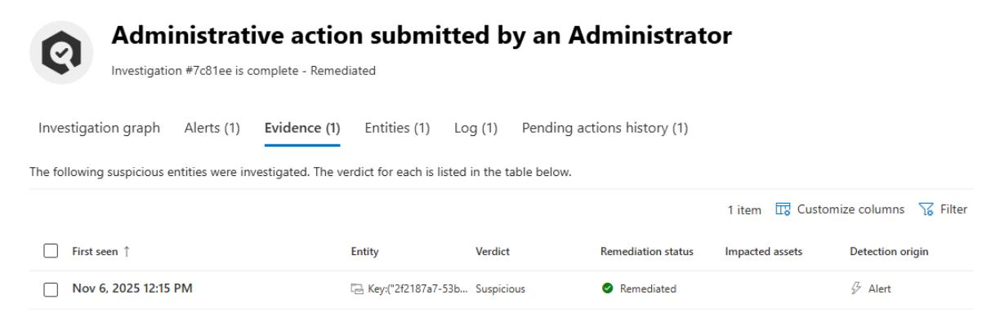

    - **Entities**

        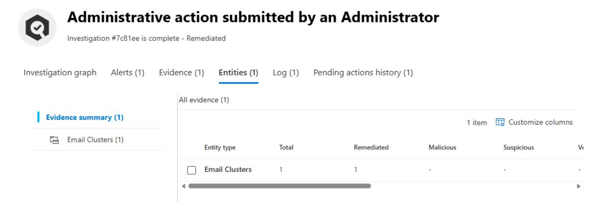

    - **Log**

        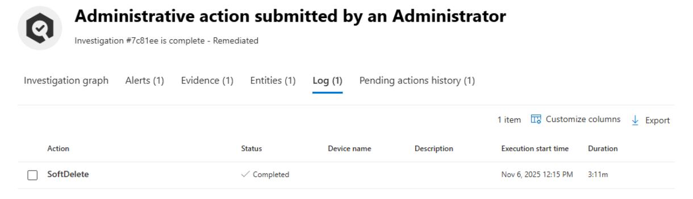


### 02: Identify which emails were soft-deleted

1. In the leftmost pane, go to **Investigation & response** > **Hunting** > **Advanced hunting**. 

1. Run the following KQL to confirm that the "Stamp X-VIP for mail TO Execs" Exchange Transport Rule successfully triggered on the test email sent to the executive mailbox:

    ```kql2-6.txt
    EmailPostDeliveryEvents
    | where Action == "Soft delete"
    | project
        Timestamp,
        NetworkMessageId,
        RecipientEmailAddress,
        SenderFromAddress,
        ActionType,
        ActionTrigger,
        ActionResult,
        DeliveryLocation,
        EmailDirection
    | order by Timestamp desc
    ```

    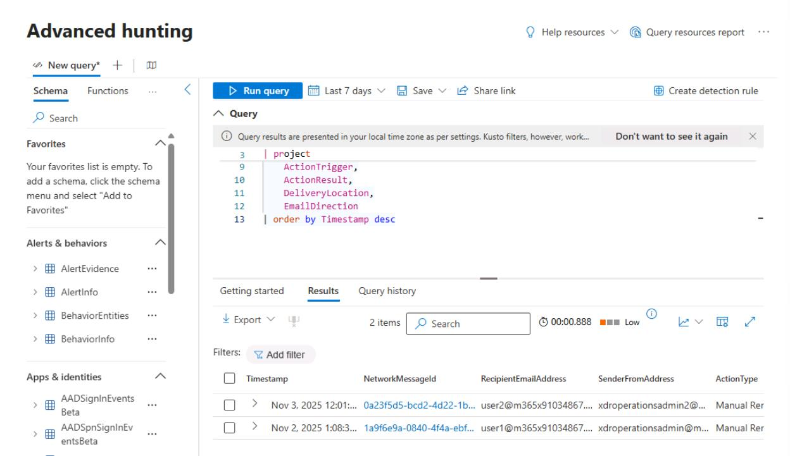

    {: .note }
    > Identifies which emails were soft-deleted (manually or via Automated Investigation & Response) after delivery, including who triggered the action, which messages were affected, and when.