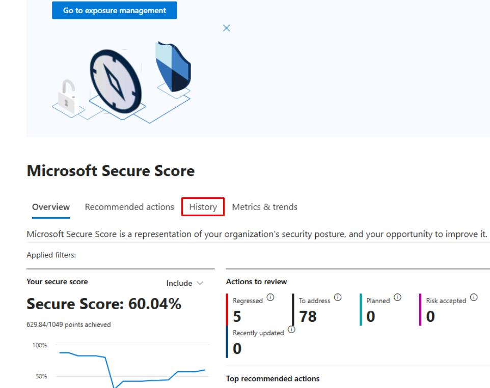
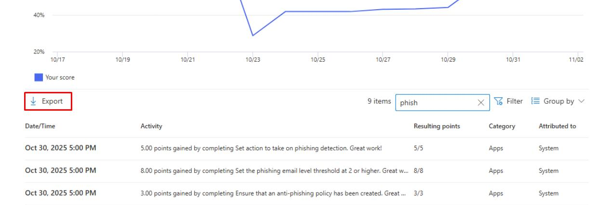
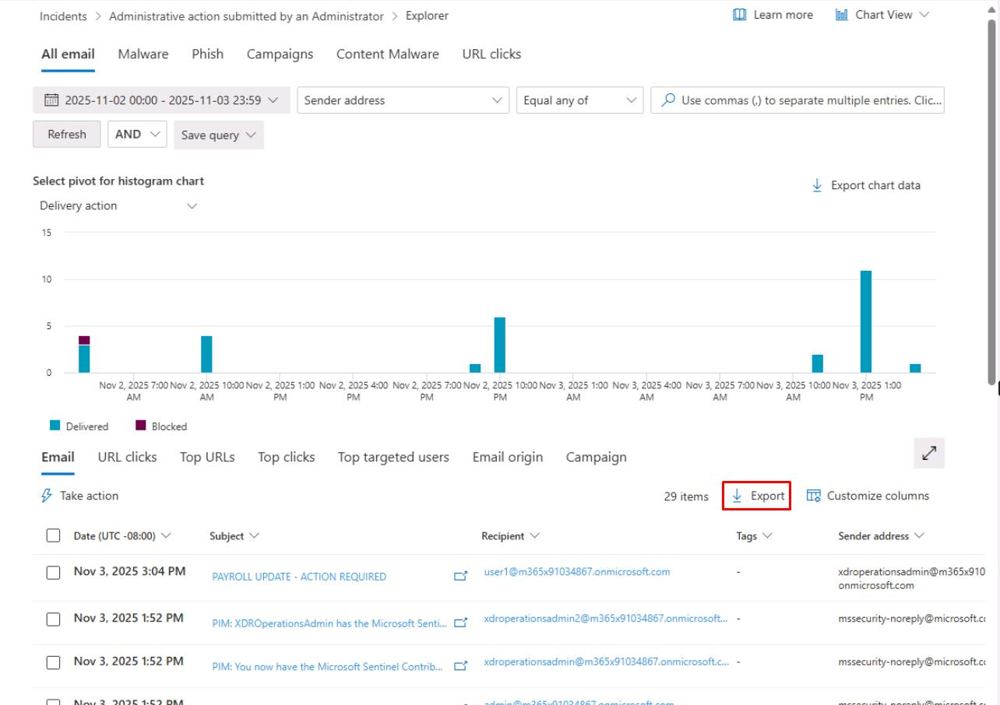
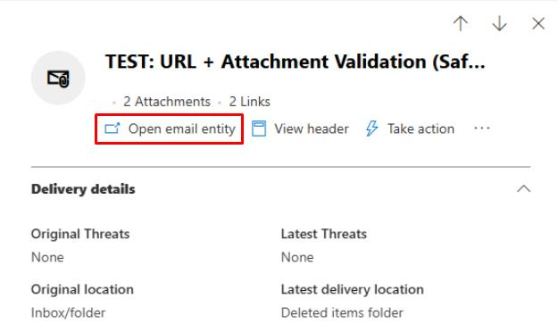
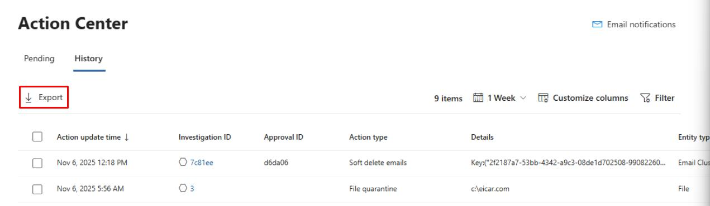

### Task 05: Capture before/after metrics and assign owners/SLAs

---

## Security Architecture Team  

1. In the leftmost pane, go to **Exposure management** > **Secure score**.  

1. Near the top of the page, select the **History** tab.

    

1. In the upper-right corner of the table's search box, enter `phish`.

1. In the upper-left corner of the table, select **Export**.

    

1. Define the **Owners** and **SLAs** for keeping these controls enforced.

---

## Security Engineering and Administration  

1. In the leftmost pane, go to **Email & collaboration** > **Explorer**.  

1. In the upper-right corner of the table, select **Export**.

    

1. At the bottom of the flyout pane, select **Export**.

1. In the table, select one of the **TEST: URL + Attachment...**. emails that were quarantined.

1. At the top of the flyout pane, select **Open email entity**.

    

1. You can take screenshots of required information for the package to the CISO.

1. Close the browser tab to return to the Defender XDR portal.

---

## SOC Analyst  

1. In the leftmost pane, go to **Investigation & response** > **Actions & submissions** > **Action center**.

1. At the top of the page, select the **History** tab.

1. In the upper-left corner of the table, select **Export**. 

    

    {: .important }
    > This would be attached with your report.