# Task 01: Turn on tamper protection, EDR in block mode, and PUA (pilot scope)

---

## Security Architecture Team  

1. In the leftmost pane, go to **System** > **Settings**.  

1. Select **Endpoints**.

    {: .note }
    > On the Endpoints page, this will default to the **General** > **Advanced features** menu item.

1. Enable the following settings:

    - **Enable EDR in block mode**
    - **Allow or block file**
    - **Tamper protection**
    - **Microsoft Intune connection**

    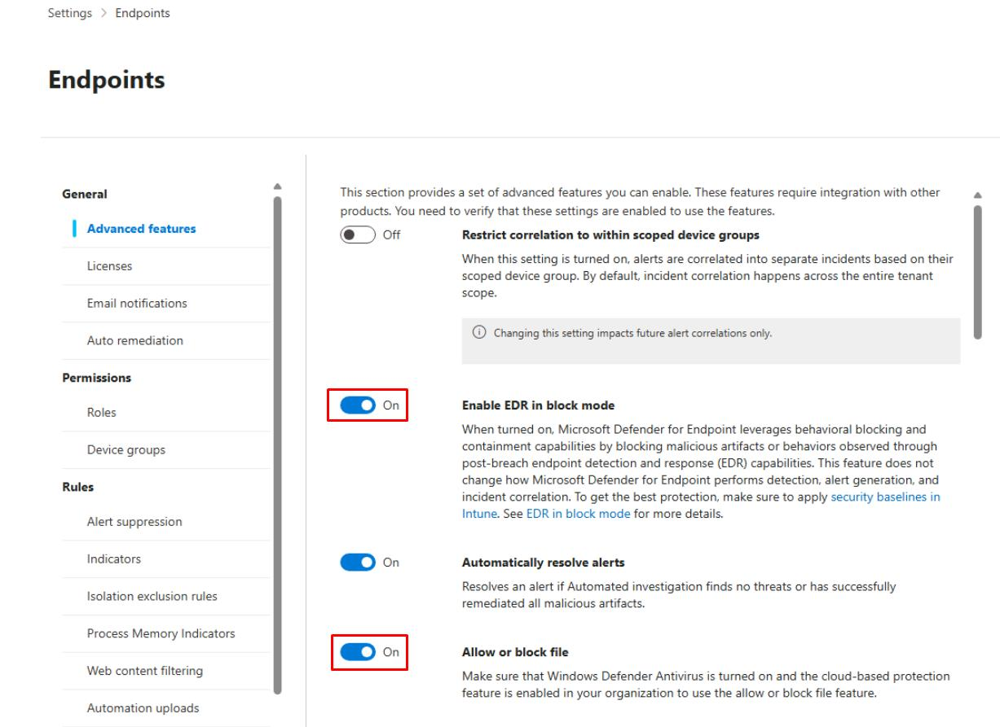
    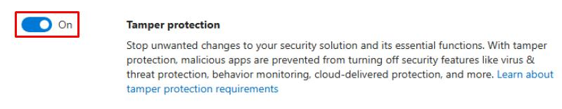
    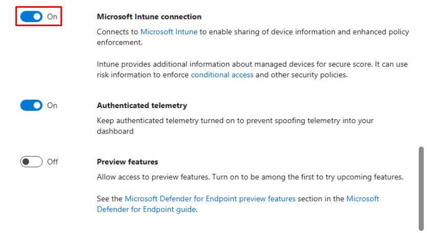

1. At the bottom of the pane, select **Save preferences**.

1. Under the **Endpoints** page menu, under **Configuration management**, select **Enforcement scope**.

    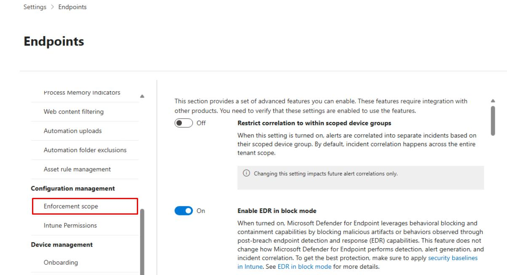

1. Turn on **Use MDE to enforce security configuration settings from Intune**.

    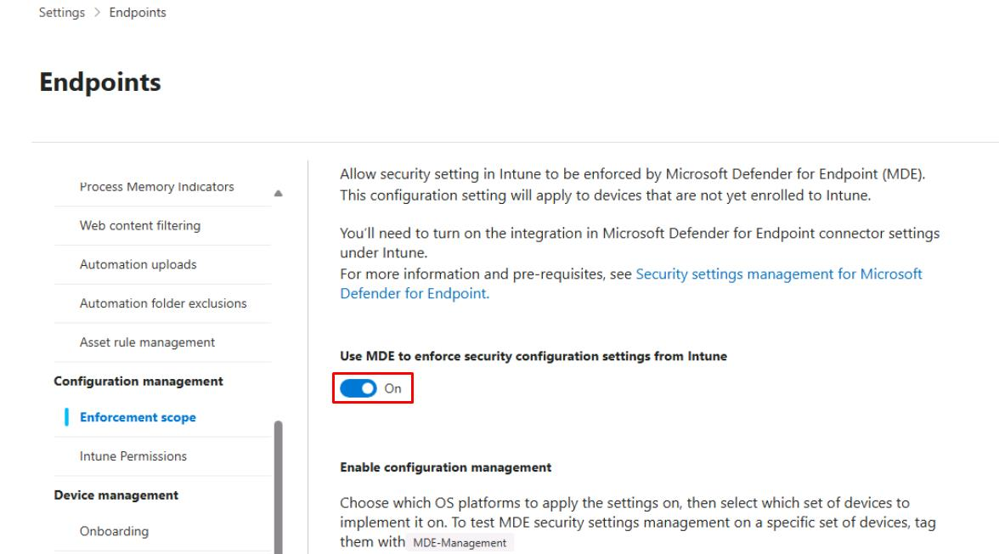

1. Under **Enable configuration management**, select **Windows Client devices** and **On all devices**.

1. Under the same section, select **Windows Server devices** and **On all devices**.

    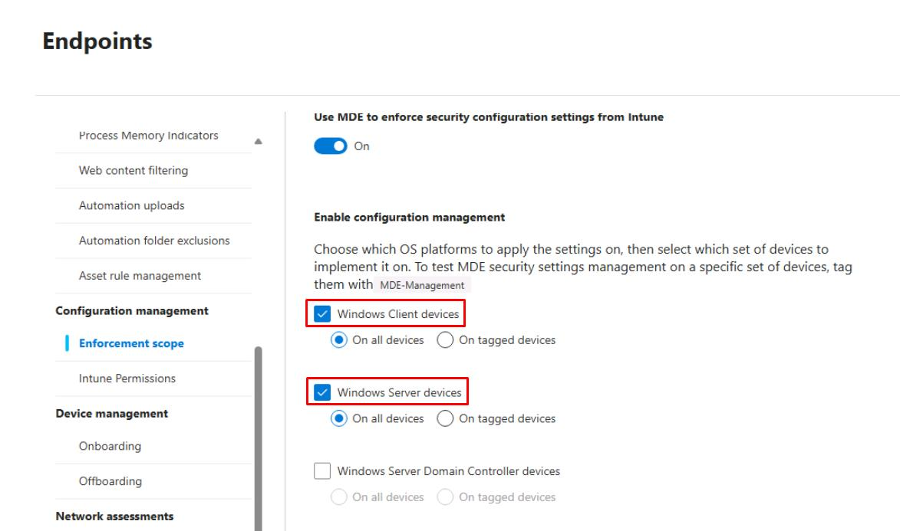

1. Move to the bottom of the page and select **Save**.

    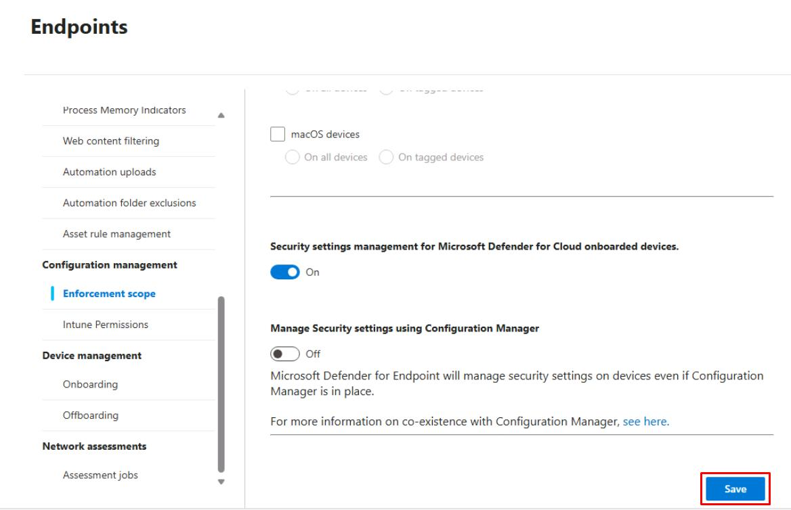

1. Select **Go to Intune**, or open a new tab and go to `intune.microsoft.com`.

1. In the leftmost pane, select **Tenant administration**.

1. In the **Tenant admin** page menu, select **Connectors and tokens**.

    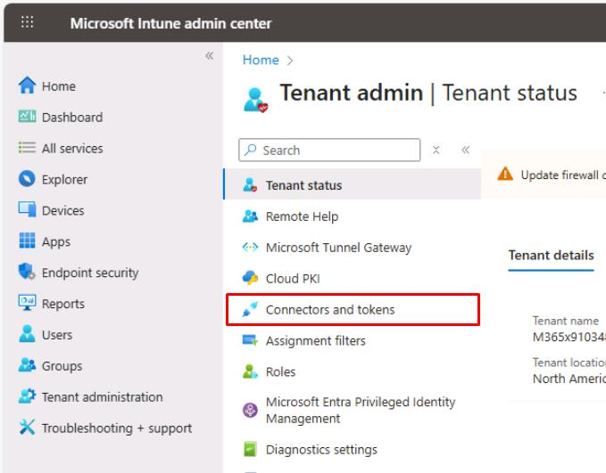

1. In the **Connectors and tokens** page menu, under **Cross platform**, select **Microsoft Defender for Endpoint**.

1. Turn on **Allow Microsoft Defender for Endpoint to enforce Endpoint Security Configurations**.

    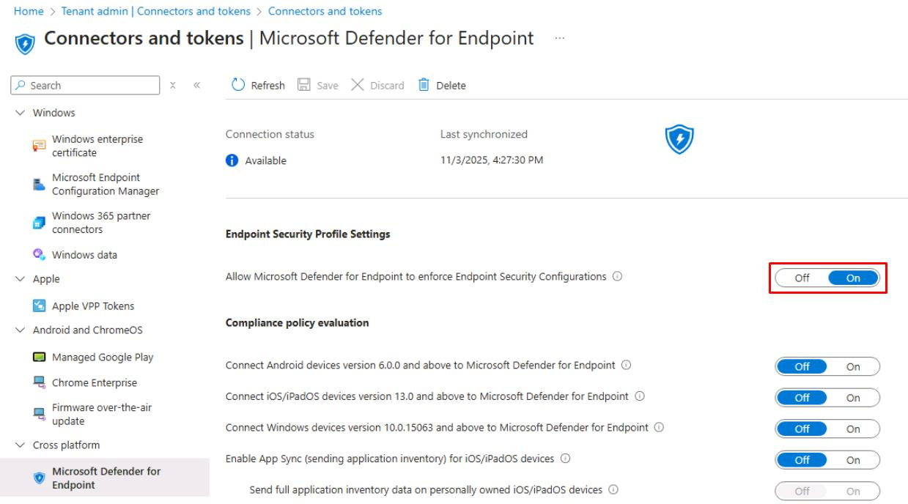

1. On the top bar, select **Save**.

    {: .warning }
    > Please wait 5-10 minutes for the connection to be established between MDE and Intune.

---

## Security Engineering and Administration  

1. In the leftmost pane, go to **Assets** > **Devices** to see devices in the tenant.

1. In File Explorer, go to `C:\LabFiles\E3`.

1. Right-click **ValidateMDEPilot** > **Show more options** > **Edit**.

1. On the top bar, select **Run Script**.

    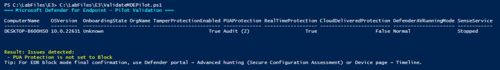

    {: .note }
    > This performs a local health check for Microsoft Defender for Endpoint (MDE). It gathers and displays the device's onboarding state, organization info, and security configuration (Tamper Protection, PUA protection, Real-time protection, running mode, and MDE services like Sense and WinDefend).

---

## SOC Analyst  

1. In the Defender XDR portal's leftmost pane, select **Assets** > **Devices**.

1. Select **winvm-mde**.

1. At the top of the page, review the **Timeline** and **Security recommendations** tabs to confirm features are active on the device.

    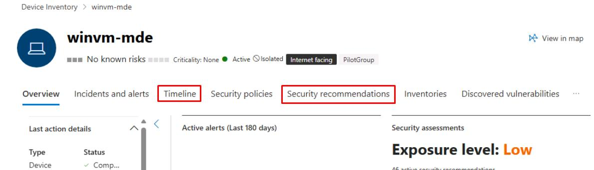
