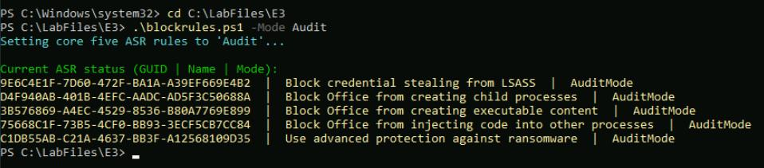
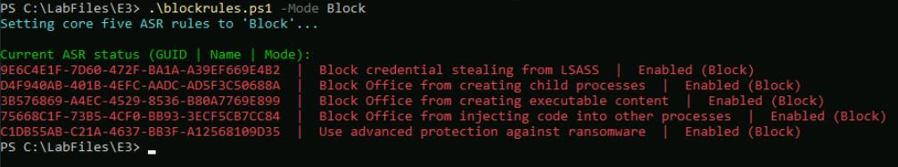
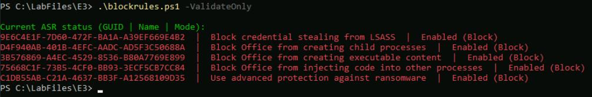
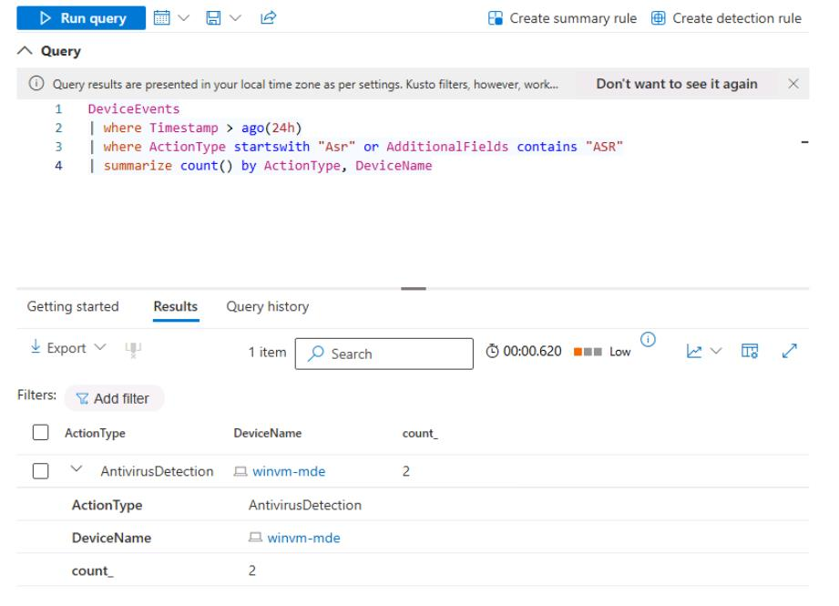

# Task 02: Pilot core ASR rules

---

## Security Architecture Team  

1. Document the rules list. Choose "core five" rules (start in Audit):

    - **Block all Office apps from creating child processes** 
    (GUID: d4f940ab-401b-4efc-aadc-ad5f3c50688a)
    - **Block Office apps from creating executable content** 
    (GUID: 3b576869-a4ec-4529-8536-b80a7769e899)
    - **Block Office apps from injecting code into other processes** 
    (GUID: 75668c1f-73b5-4cf0-bb93-3ecf5cb7cc84 (note: no "Warn" mode))
    - **Block credential stealing from LSASS** 
    (GUID: 9e6c4e1f-7d60-472f-ba1a-a39ef669e4b2)
    - **Use advanced protection against ransomware** 
    (GUID: c1db55ab-c21a-4637-bb3f-a12568109d35)

1. Validate OS support (Windows 10/11 and supported Server builds) in the official matrix before rollout.

---

## Security Engineering and Administration  

The following scripts require an elevated PowerShell session.

1. In the VM taskbar's search box, enter `Windows PowerShell`.

1. Right-click **Windows PowerShell** > **Run as administrator**.

    

1. In the **User Account Control** dialog, select **Yes**.

1. In the elevated PowerShell window, change directories:

    `cd C:\LabFiles\E3`

1. Run the following script with the **-Mode** parameter set to **Audit**:

    `.\blockrules.ps1 -Mode Audit`

    

    {: .note } Applies all five core Attack Surface Reduction (ASR) rules in Audit mode by running Set-MpPreference with the value AuditMode. This logs detections for visibility without blocking actions, allowing you to safely validate rule behavior.

1. Run the script with the **-Mode** parameter set to **Block**:

    `.\blockrules.ps1 -Mode Block`

    

    {: .note } Promotes those same five ASR rules to Block (Enabled) by setting the value **Enabled**. This actively enforces the protections (for example, stops Office child processes, LSASS credential theft, ransomware) across the pilot devices.

1. Run the script with the **-ValidateOnly** switch:

    `.\blockrules.ps1 -ValidateOnly`

    

    {: .note } Skips any configuration changes and simply reads and reports the current ASR status. It queries both the Windows Defender registry path and Get-MpPreference, displaying each rule's GUID, friendly name, and applied mode (Audit, Block, Warn, Disabled, or NotApplied).

---

## SOC Analyst  

1. In the leftmost pane, go to **Investigation & response** > **Hunting** > **Advanced hunting**.  

1. Run the following KQL to spot-check the audit events are arriving:

    ```kql3-1.txt
    DeviceEvents
    | where Timestamp > ago(24h)
    | where ActionType startswith "Asr" or AdditionalFields contains "ASR"
    | summarize count() by ActionType, DeviceName
    ```

    
