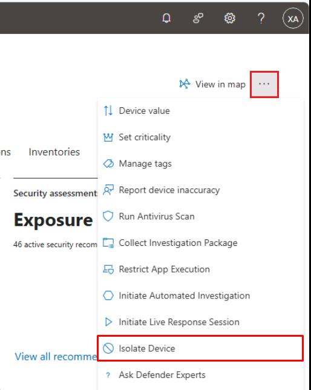
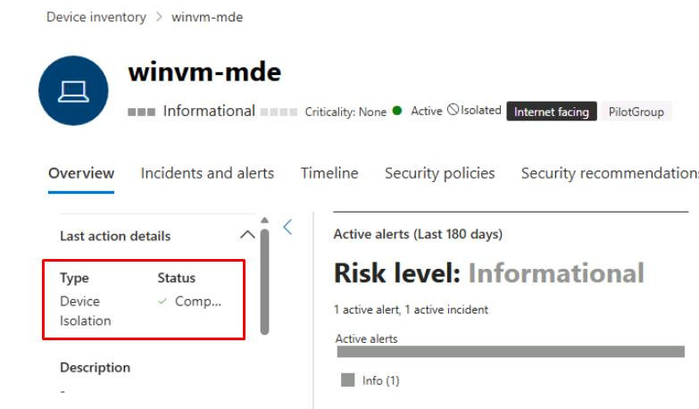
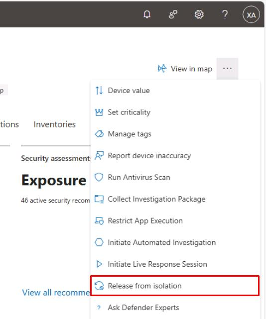
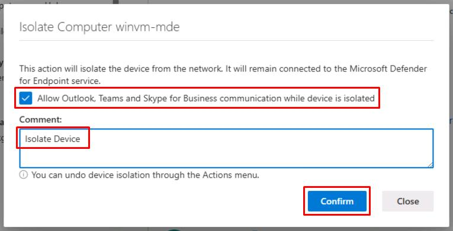
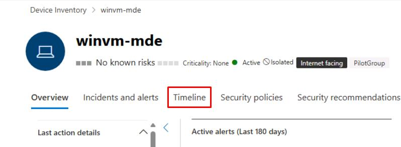
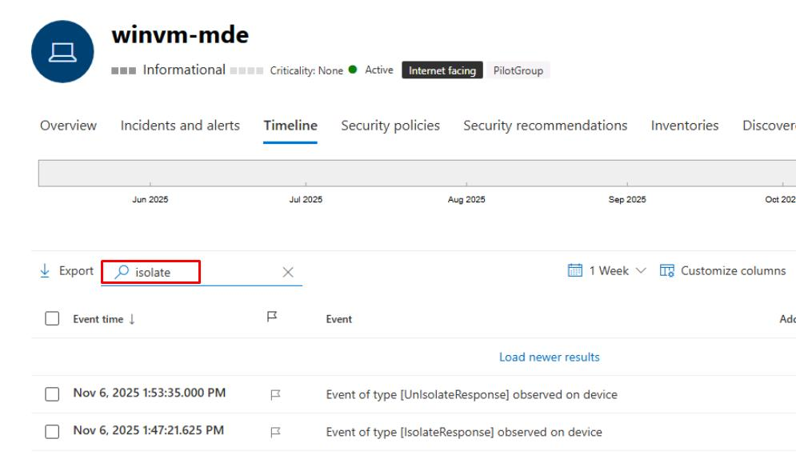

# Task 03: Isolate a test device, run Live Response commands, collect artifacts, then de-isolate

---

## Security Architecture Team  

1. Establish when to use full isolation (for example, signs of lateral movement, credential theft, or ransomware spread) versus selective isolation (controlled drills or low-risk investigations).

1. Identify essential business apps (like Teams, Outlook, or service desk tools) that remain functional during selective isolation and add them to the allowed-services list for continuity.

1. Capture isolation criteria, exception rationale, and fallback plans in your security runbook or incident response policy to ensure repeatability and auditor-ready traceability.

--- 

## Security Engineering and Administration  

1. In the Defender XDR portal's leftmost pane, select **Assets** > **Devices**.

1. Select **winvm-mde**.

1. In the upper-right corner of the page, select the ellipsis > **Isolate Device**.

    

1. In the dialog, select the checkbox for **Allow Outlook, Teams and Skype...**.

1. Under **Comment**, enter `Isolate Device`, then select **Confirm**.

1. Close the flyout pane.

1. Refresh the page, and under the **Last action details** section you should see:

    | Item | Value |
    |:---------|:---------|
    | Type   | **Device isolation** |
    | Status  | **Completed**  |

    

    {: .warning }
    > It may take a few minutes to complete.
    >
    > If you shut down **winvm-mde**, it will need to be started for this to complete.

1. In the upper-right corner of the page, select the ellipsis > **Release from isolation**.

    

1. In the dialog's text box, enter `Release from Isolation`, then select **Confirm**.

    

1. Close the flyout pane.

---

## SOC Analyst  

1. In the leftmost pane, select **Assets** > **Devices**.

1. Select **winvm-mde**.

1. At the top of the page, select the **Timeline** tab.

    

1. In the search box above the table, enter `isolate`.

1. Confirm you see the **[IsolateResponse]** and **[UnIsolateResponse]** events.

    
