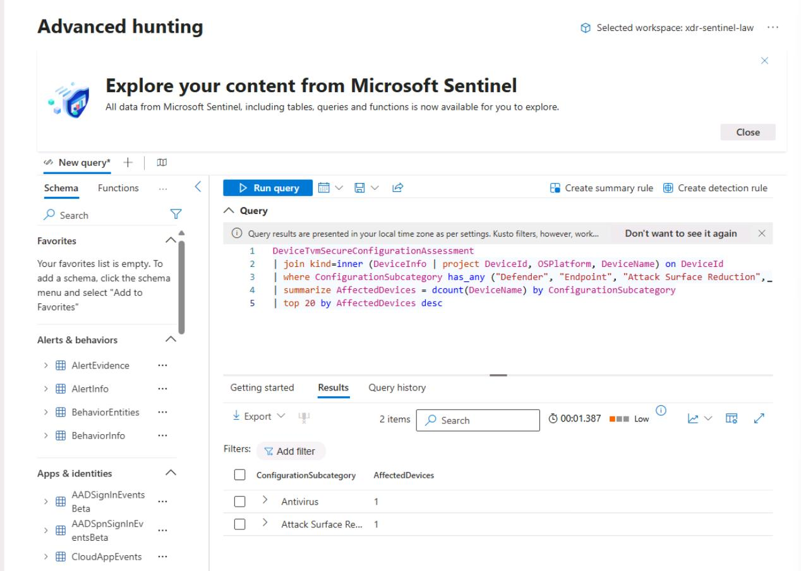

# Task 04: Check recommendations and Secure Score, run quick KQL validation, and log outcomes

---

## Security Architecture Team  

1. Go back to your Defender XDR portal tab.

1. In the leftmost pane, go to **Exposure management** > **Secure score**.  

1. Note the overall **Secure score**.

1. Near the top of the page, select and review the **History** tab.

1. Near the top of the page, select the **Recommended actions** tab.

1. In the upper-right corner of the table, select **Filter**.

    

1. In the flyout pane, under the **Product** section, select **Defender for Endpoint**, then select **Apply**.

1. Note the **Status** column.
  
---

## Security Engineering and Administration  

1. Refresh the **winvm-mde** device page.

1. At this point, you would check whether **Exposure level**/**Security recommendations** have improved.

1. You should keep a record of ASR events moving from **Audit** to **Block** post-promotion based on the PowerShell output.

---

## SOC Analyst  

1. In the leftmost pane, go to **Investigation & response** > **Hunting** > **Advanced hunting**.  

1. Run the following KQL for a blast-radius sanity check:  

    ```kql3-2.txt
    DeviceTvmSecureConfigurationAssessment
    | join kind=inner (DeviceInfo | project DeviceId, OSPlatform, DeviceName) on DeviceId
    | where ConfigurationSubcategory has_any ("Defender", "Endpoint", "Attack Surface Reduction", "Antivirus")
    | summarize AffectedDevices = dcount(DeviceName) by ConfigurationSubcategory
    | top 20 by AffectedDevices desc
    ```

    