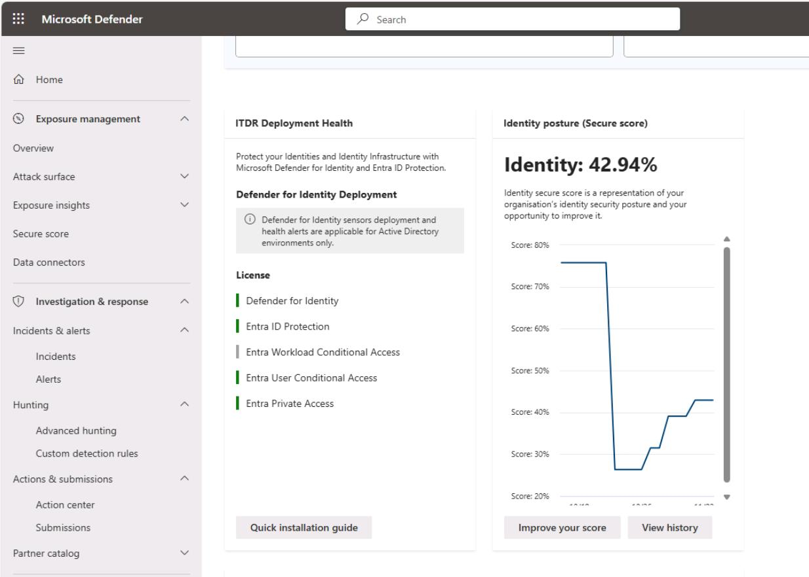
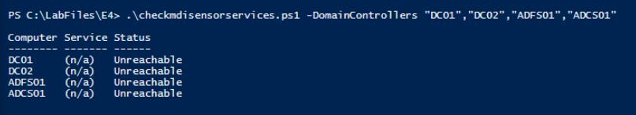
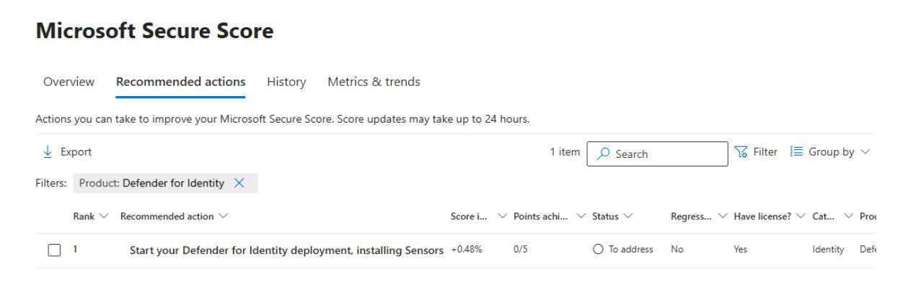
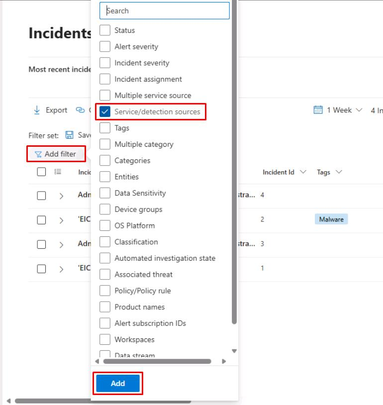
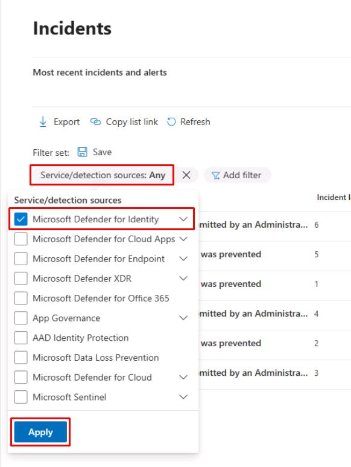
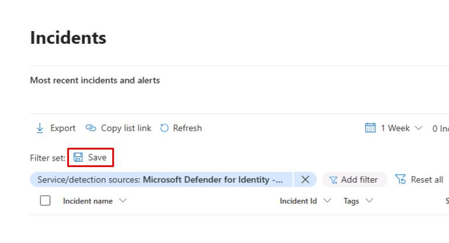

# Task 01: Verify sensor coverage and health

:::Architecture(team=Architecture)
## Security Architecture Team  

1. In the Defender XDR portal's leftmost pane, go to **Identities** > **Dashboard**.  

1. Review the **Identity posture (Secure score)** and note and screenshot the baseline score for reporting.

    

1. Validate the populated tiles:

    - **ITDR Deployment Health** 
    - **Highly privileged identities**
    - **Active users at risk**

1. DCs were not deployed in this environment. Typically, if you've provisioned DCs and deployed sensors, you can monitor the sensors by going to: 

    1. In the leftmost menu, go to **System** > **Settings**.
    1. Select **Identities**.
    1. You could find the following information on this page:

        - DCs (Windows Server)
        - Classic sensors (for example, ADFS, AD CS, Entra Connect Servers)
        - Note any Unhealthy/Not reporting
        - Document gaps (servers lacking sensors, unhealthy services), propose owners & ETA

:::

:::Engineering(team=Engineering)
## Security Engineering and Administration  

{: .note } **Optional Task**: At this point, the Engineering team could check the status of the MDI sensors by running a script.

1. Open your PowerShell ISE window.

1. Run the following to change directories:

    `cd C:\LabFiles\E4`

1. Run the following:  

    `.\checkmdisensorservices.ps1 -DomainControllers "DC01","DC02","ADFS01","ADCS01"`  

    

    {: .note } Checks each domain controller for MDI sensor and updater services, reporting reachability and service status.
    >
    >Expect **NotFound**/**Unreachable** today (no DCs deployed), which is your documented gap. When you do deploy, **Running** is the healthy target. Service names: **AATPSensor** (sensor) and **AATPSensorUpdater** (updater).

:::

:::SOC(team=SOC)
## SOC Analyst  

1. In the Defender XDR portal's leftmost pane, go to **Identities** > **Dashboard**.

1. Under **Identity posture (Secure score)**, select **Improve your score**.

    

1. In the upper-right corner of the table, select **Filter**.

    

1. In the flyout pane, under the **Product** section, select **Defender for Identity**, then select **Apply** at the bottom.

1. Take a screenshot of the **Recommended actions** for your package.

    

1. In the leftmost pane, go to **Investigation & response** > **Incidents & alerts** > **Incidents**.

1. At the top of the table, select **Add filter**, select **Service/detection sources**, then select **Add**.

    

1. Select the **Service/detection sources** filter, select **Microsoft Defender for Identity** filter, then select **Apply**.

    

    {: .warning }If you do not see the filter, you can proceed. If you do, you still may not see any results at the moment. 

1. Above the table, select **Save** to save the filter view for later.

    

1. For the filter name, enter `Service/detection: Microsoft Defender for Identity`, then select **Save**.

---

#### MDI alerts

1. In the leftmost pane, go to **Investigation & response** > **Hunting** > **Advanced hunting**.  

1. Run the following KQL query:  

    ```kql4-1.txt
    // 1) Any MDI identity alerts?
    AlertInfo
    | where ServiceSource == "Microsoft Defender for Identity"
    | summarize count() by Title
    ```

    {: .note } Expect zero rows until sensors exist for this and the following two queries.

1. Run the following KQL query:

    ```kql4-2.txt
    // 2) Logons captured by MDI (on-prem AD + related signals)
    IdentityLogonEvents
    | summarize count() by LogonType
    ```

1. Run the following KQL query:

    ```kql4-3.txt
    // 3) Directory changes seen by MDI
    IdentityDirectoryEvents
    | summarize count() by ActionType
    ```

    {: .warning }If you see an error, the table has not been provisioned yet. You can proceed.