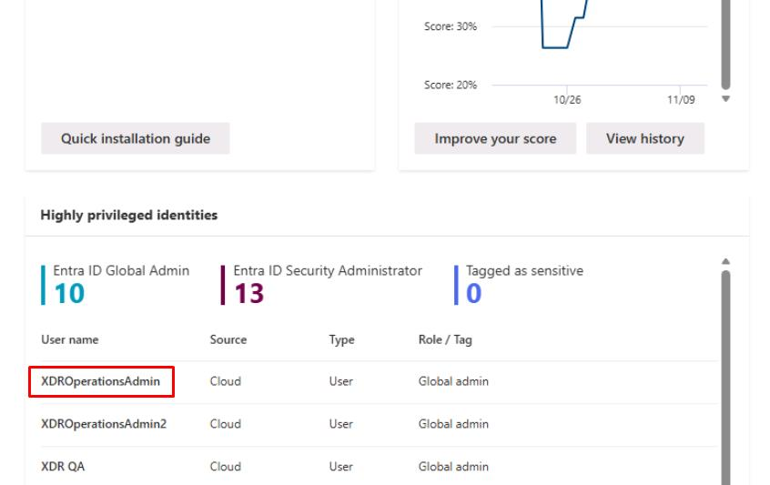
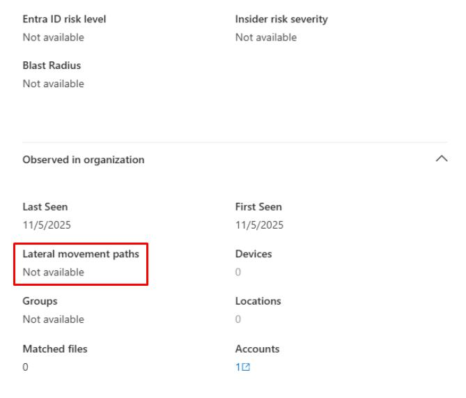
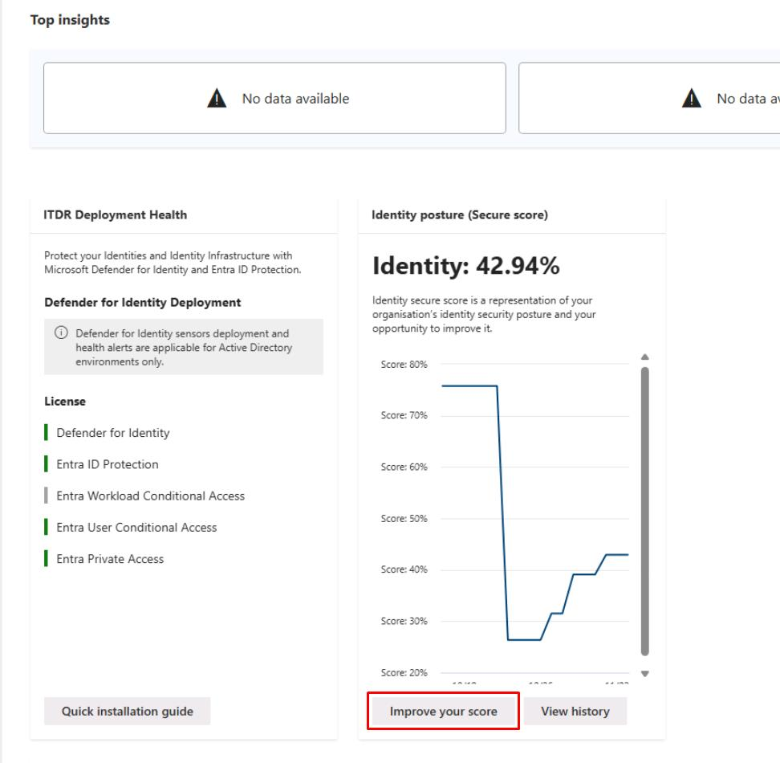
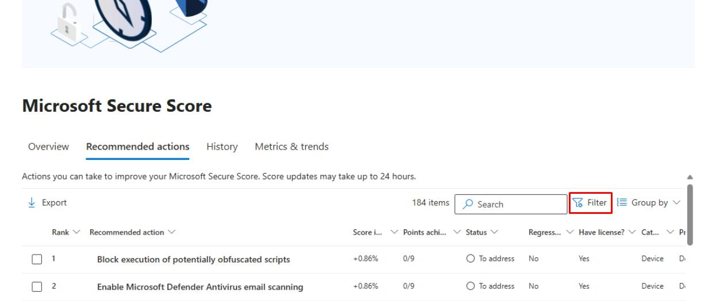
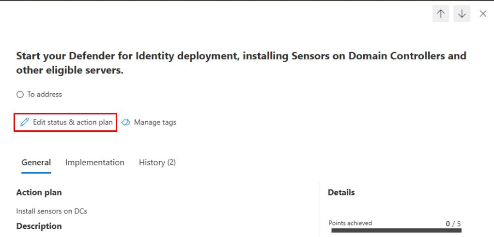

# Task 02: Map risky lateral movement paths and improve Identity Secure Score  

---

## Security Architecture Team  

{: .warning }
> **Deprecated**: Lateral Movement Paths were deprecated when SAM-R enumeration was removed. UI elements may still appear, but this feature no longer works. Defender XDR unified attack path exploration is its replacement.

1. In the leftmost pane, go back to **Identities** > **Dashboard**.

1. Move through the page to the **Highly privileged identities** section, then select **any user** on the table.

    

1. Move through the flyout pane to observe the **Lateral movement paths**.

    

    {: .important }
    > In a real-world scenario with DCs deployed, you'd normally see a list of sensitive entities with path counts.

1. Close the flyout pane.

1. Under the **Identity posture (Secure score)** section, select **Improve your score**.

    

1. In the upper-right corner of the table, select **Filter**.

    

1. In the flyout pane, under the **Product** section, select **Defender for Identity**, then select **Apply** at the bottom.

1. In the table, select **Start your Defender for Identity...**

1. At the top of the flyout pane, select **Edit status & action plan**.

    

1. Select **To address**, then under the **Action plan**, enter `Install sensors on DCs`, then select **Save and close**.

    {: .important }
    > Assign the work to the Security Engineering and Administration team with this note.
 
---

## Security Engineering and Administration  

- In PowerShell ISE's bottom pane, enter:

    ```
    .\unconstraineddelegation.ps1
    ```

    {: .note }
    > This script:
    > - Automatically detects if the Active Directory PowerShell module is installed, runs live AD queries when available or switches to a Simulation Mode that generates realistic mock data when AD/DCs are absent.
    > - Creates CSV reports (UD-Computers.csv, UD-Users.csv) and a readable summary file (UD-Summary.txt) listing accounts with unconstrained delegation and showing example remediation commands.
    > - Enables learners to practice identity-risk analysis and understand unconstrained-delegation remediation workflows, even in a standalone Azure VM without domain connectivity.

---

## SOC Analyst  

{: .important }
> Informational. SOC Analysts could do the following.
>
> - Continuously monitoring the Identities Dashboard and Incidents & Alerts in the Defender XDR portal, filtering for alerts raised by Microsoft Defender for Identity (MDI) including suspicious Kerberos activities, credential theft indicators, and lateral movement attempts.
> - For each alert, examine related entities (users, devices, IPs) and pivot into Attack Story or Entity timelines to trace potential credential misuse, Pass-the-Ticket, or DCSync patterns. Identify compromised accounts or privileged assets targeted.
- Periodically check the Identity Secure Score and ensure previously assigned recommendations (for example, deploy sensors, harden high-privilege accounts) show measurable > improvement after Engineering implements fixes.
