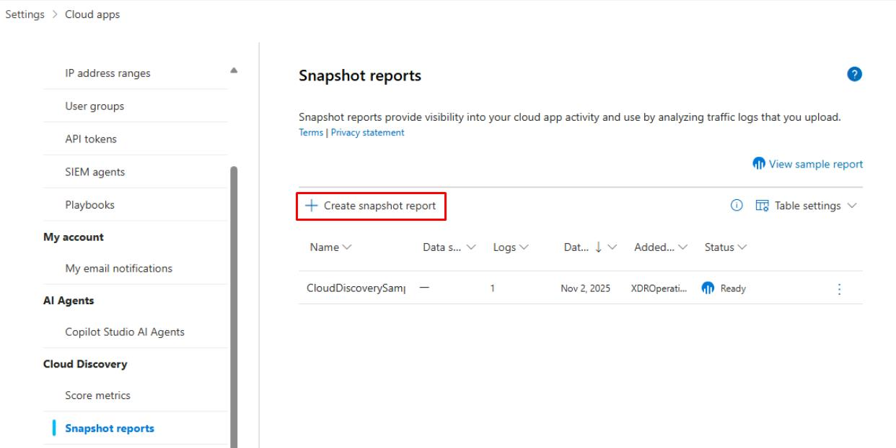
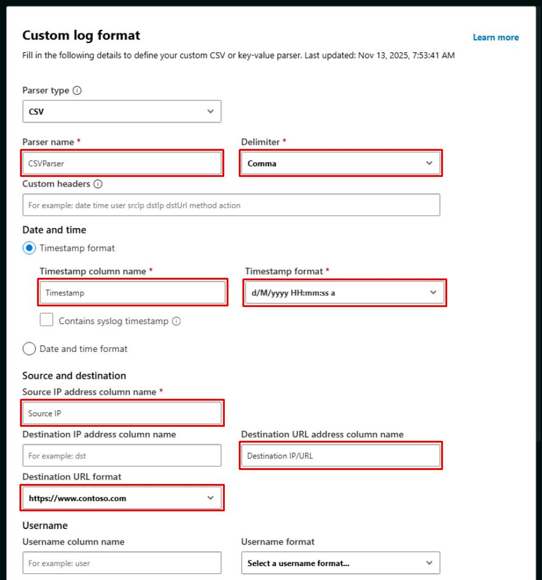
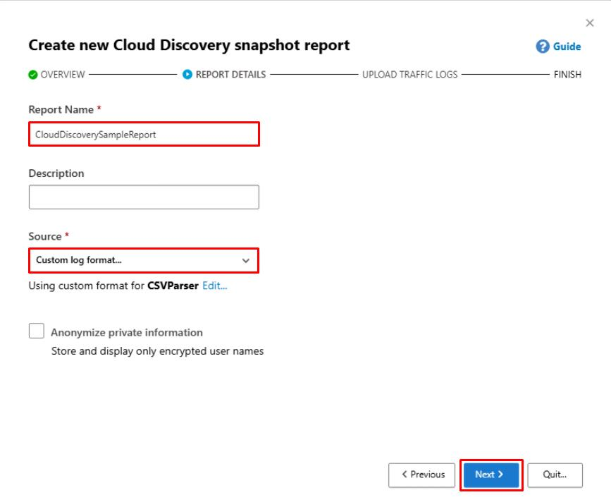
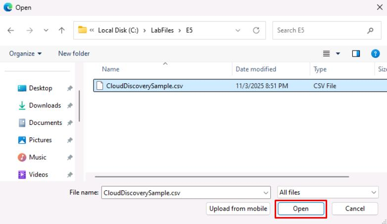
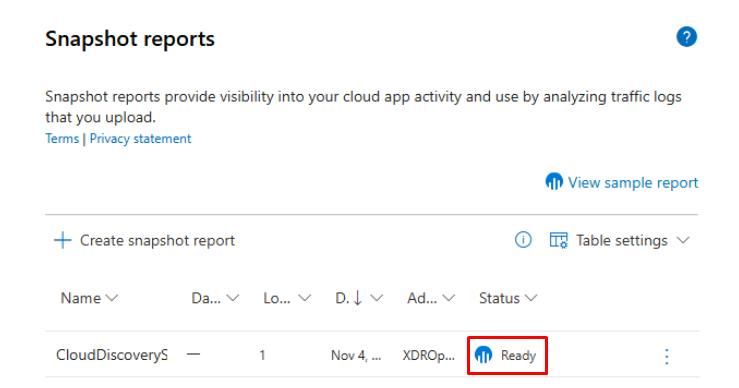
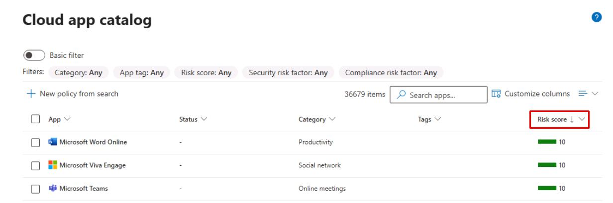
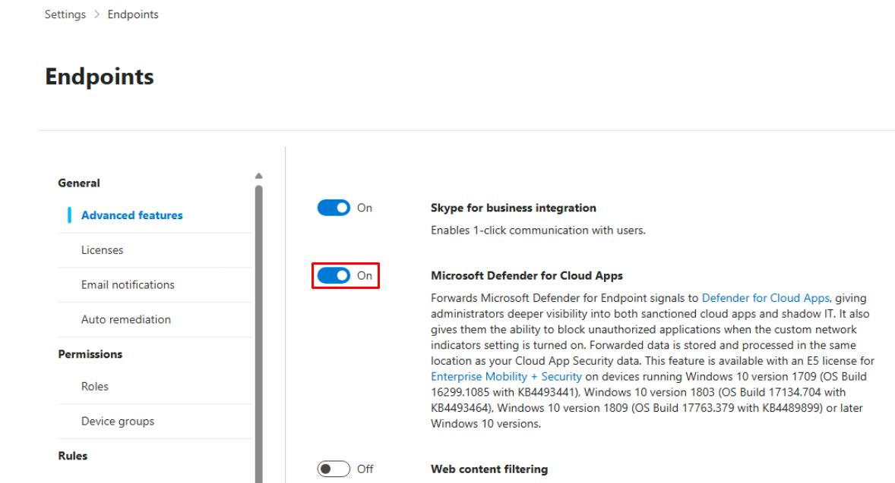
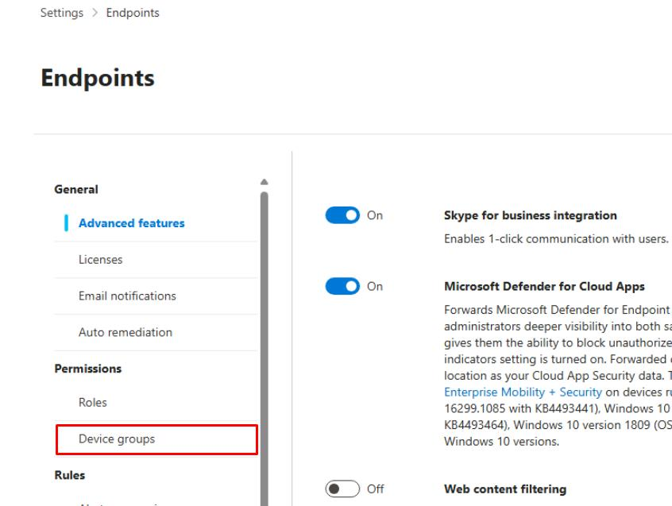
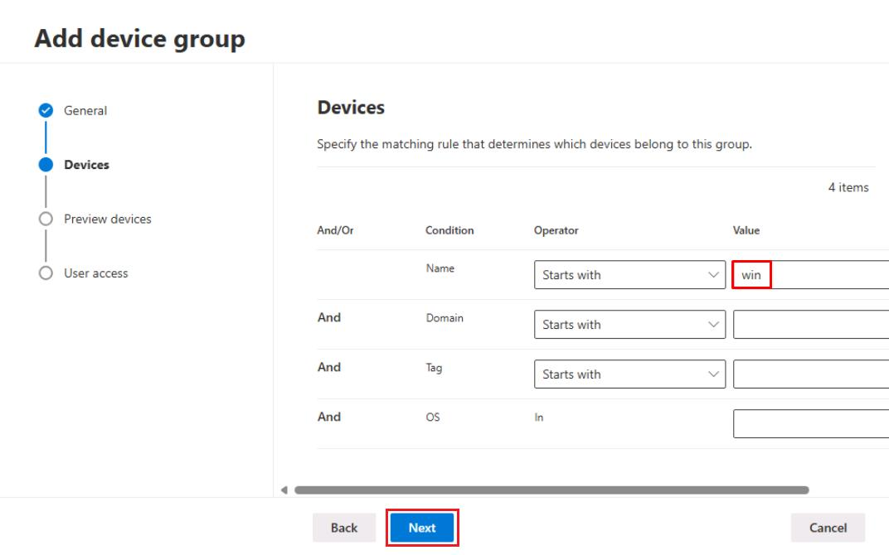
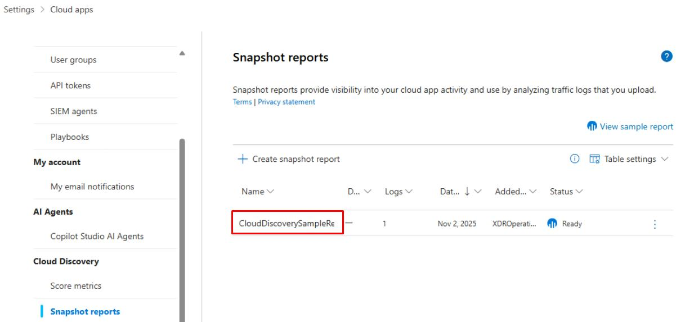

# Task 01: Turn on Cloud Discovery and seed data

---

## Security Architecture Team

1. In the Defender XDR portal's leftmost pane, go to **System** > **Settings**.

1. Select **Cloud Apps**.

1. Under the **Cloud Discovery** section, select **Snapshot reports**.

1. At the top of the page, select **Create snapshot report**.

    

1. In the dialog, select **Next**.

1. On the **REPORT DETAILS** step, enter the following:

    | Item | Value |
    |:---------|:---------|
    | Report Name   | `CloudDiscoverySampleReport`  |
    | Source  | **Custom log format...**  |

1. In the **Custom log format** dialog, if it's not filled in by default, enter the following:

    | Item | Value |
    |:---------|:---------|
    | Parser name   | `CSVParser`  |
    | Delimiter  | **Comma**  |
    | Timestamp column name  | `Timestamp format`  |
    | Timestamp format  | **d/M/yyyy HH:mm:ss a**  |
    | Source IP address column name  | `Source IP`  |
    | Destination URL address column name  | `Destination IP/URL`  |
    | Destination URL format  | **https://www.contoso.com**  |

    

1. At the bottom of the dialog, select **Save**.

1. Select **Next**.

    

1. Under **Upload traffic logs**, select **Browse**.

1. Go to `C:\LabFiles\E5`.

1. Select **CloudDiscoverySample.csv**, then select **Open**.

    

1. Select **Upload logs**.

1. Once finished, select **Close**.

1. On the table, wait until **Status** shows **Ready**.

    

    {: .warning }
    > Processing usually happens within 10 minutes. Periodically refresh the page. 

1. Once **Ready**, select the report.

1. In the leftmost pane, go to **Cloud apps** > **Cloud app catalog**. 

1. Sort the table by descending **Risk score** and note the top risky applications.

    

---

## Security Engineering and Administration  

1. In the Defender XDR portal's leftmost pane, go to **System** > **Settings**.  

1. Select **Endpoints**.

1. Ensure **Microsoft Defender for Cloud Apps** is set to **On** (if using MDE).

    

1. If this was just enabled, select **Save preferences** at the bottom.

1. On the **Endpoints** page menu, under **Permissions**, select **Device groups**.

    

1. At the top of the page, select **Add device group**.

1. Enter the following, then select **Next**:

    | Item | Value |
    |:---------|:---------|
    | Device group name   | `PilotDeviceGroup`  |
    | Remediation level  | **No automated response**  |

1. On the **Devices** step, set **Name**, **Starts with**, `win`, then select **Next**.

    

1. Select **Next** through the remaining steps, then select **Submit**.

1. In the dialog for **No user groups selected**, select **Continue**.

---

## SOC Analyst  

1. In the Defender XDR portal's leftmost pane, go to **System** > **Settings**.  

1. Select **Cloud Apps**.

1. Under the **Cloud Discovery** section, select **Snapshot reports**.

1. Select **CloudDiscoverySampleReport**.

    

    {: .note }
    > Created by the Architect in Task 01 of this Exercise.

1. Explore the various tabs to see what's being reported.
