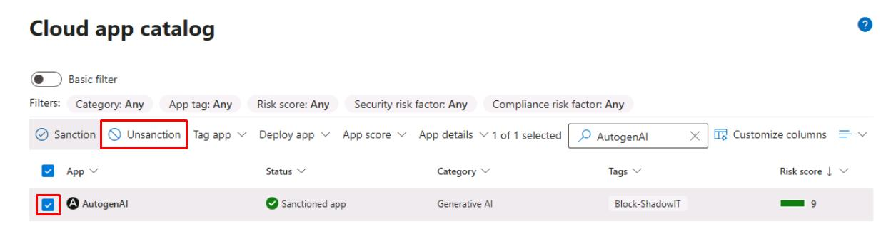
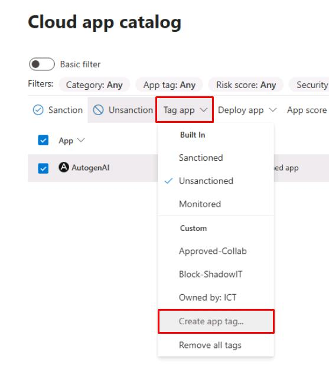
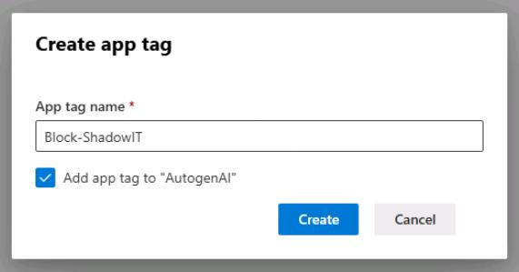
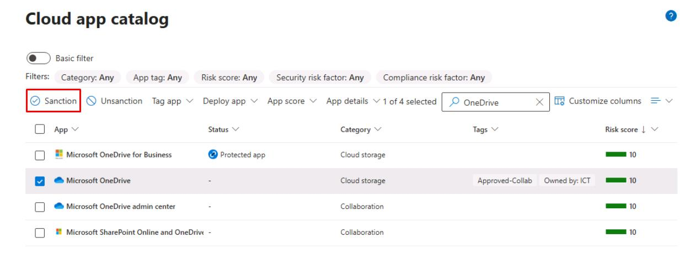
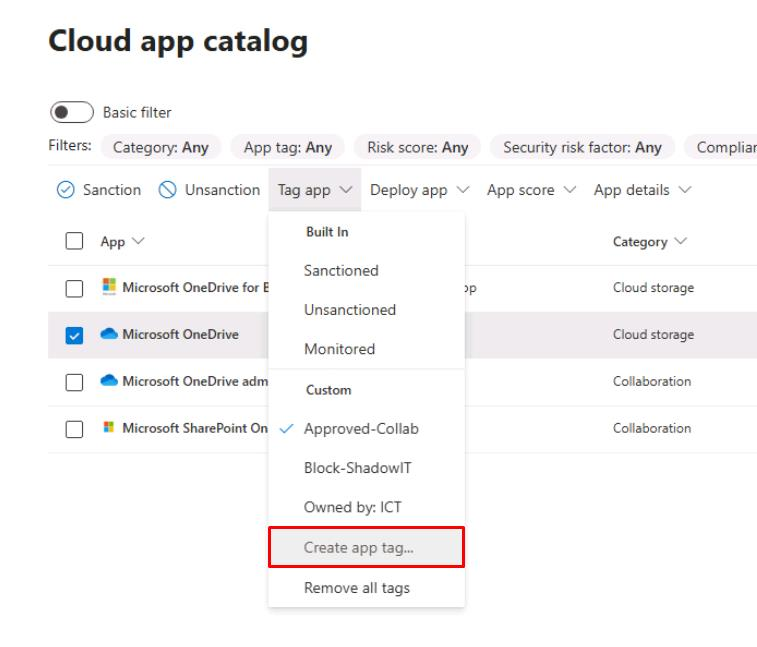
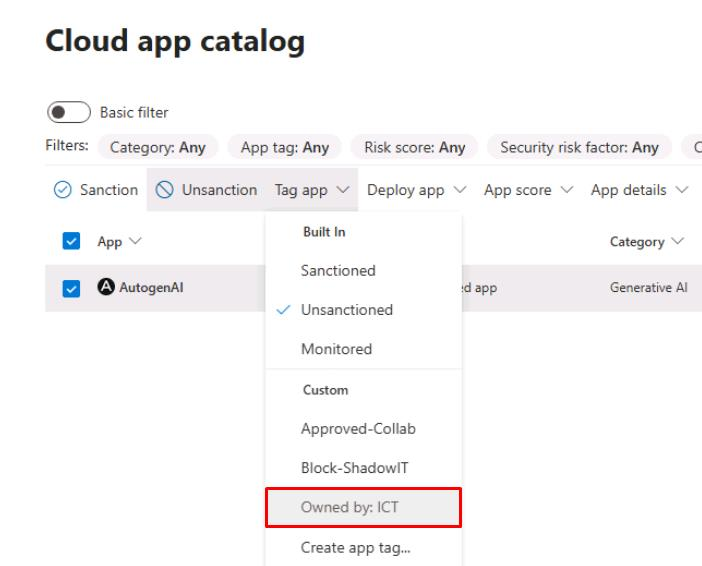
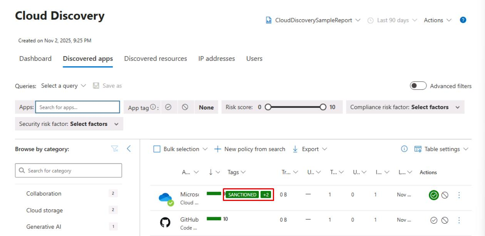
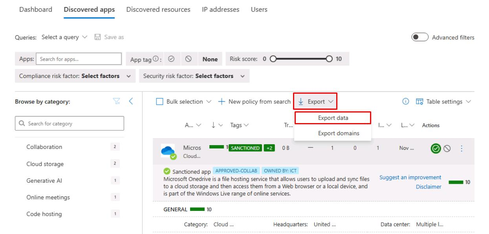

# Task 02: Classify apps as sanctioned, unsanctioned, and assign owners  

:::Architecture(team=Architecture)
#### Security Architecture Team  

1. On the same **Cloud app catalog** page, tag a risky app as **Unsanctioned**:  
 
    1. In the upper-right corner of the table's search box, enter `AutogenAI`.

    1. Select the checkbox for **AutogenAI**, then select **Unsanction** on the top bar.  

        

    1. With **AutogenAI** still selected, select **Tag app**, then select **Create app tag...**

        
    
    1. For **App tag name**, enter `Block-ShadowIT`, check **Add app tag to "AutogenAI"**, then select **Create**.  

        

1. Tag a business app as **Sanctioned**:  

    1. In the upper-right corner of the table's search box, enter `OneDrive`.
   
    1. Select the checkbox for **Microsoft OneDrive**, then select **Sanction** on the top bar. 

        

    1. With **Microsoft OneDrive** still selected, select **Tag app**, then select **Create app tag...**
    
    1. For **App tage name**, enter `Approved-Collab`, check **Add app tag to "Microsoft OneDrive"**, then select **Create**.  

:::

:::Engineering(team=Engineering)
#### Security Engineering and Administration  

Maintain the App owners list.

1. In the leftmost pane, go to **Cloud apps** > **Cloud app catalog**. 

1. In the upper-right corner of the table's search box, enter `OneDrive`.

1. Select the checkbox for **Microsoft OneDrive**.

1. On the top bar select **Tag app**, then select **Create app tag...**

    

1. For **App tage name**, enter `Owned by: ICT`, check **Add app tag to "Microsoft OneDrive"**, then select **Create**.  

1. In the upper-right corner of the table's search box, enter `AutogenAI`.

1. Select the checkbox for **AutogenAI**.

1. On the top bar select **Tag app**, then select **Owned by: ICT**.

    

:::

:::SOC(team=SOC)
#### SOC Analyst  

1. Near the top of the page, select the **Discovered apps** tab.

1. Review the list and verify the tag details for **Microsoft OneDrive**. 

    

1. Select any empty space on the line for **Microsoft OneDrive** to expand its details.

1. At the top of the pane, select **Export** > **Export data**, to share it with the CISO and Architecture team, when requested.  

    