# Task 03: Enforce risk using Conditional Access App Control and real-time session policies  

---

## Security Architecture Team  

1. In the leftmost pane, go to **System** > **Settings**.  

1. Select **Cloud Apps**.

1. Under the **Connected apps** section, select **App Connectors**.

1. Ensure **Microsoft 365** is connected.  

    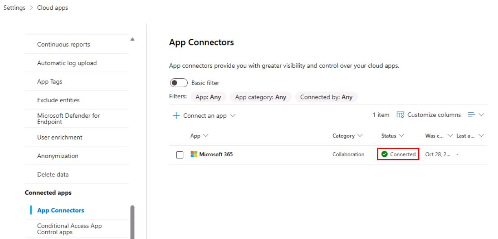

    {: .note }
    > This activates the Cloud Apps engine. 

---

## Security Engineering and Administration  

### 01: Create a Conditional Access policy in Entra  

1. In a new browser tab, go to `entra.microsoft.com`.

1. In the leftmost menu, go to **Entra ID** > **Conditional Access**.

1. On the **Conditional Access** page's menu, select **Policies**.

    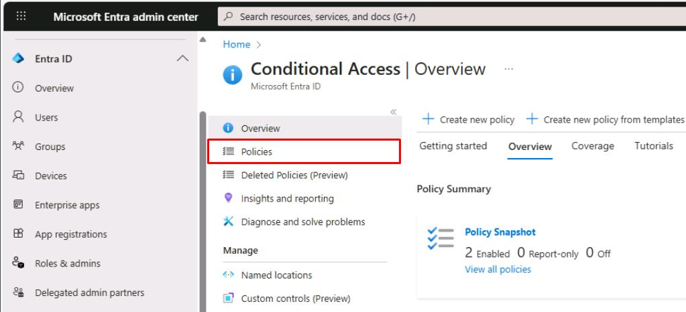

1. On the top bar, select **New policy**.

1. For **Name**, enter `CA-UseAppControl-LabPolicy`.

1. Under **Users**, select **0 users and groups selected**.

    1. Under the **Include** tab, select **Select users and groups** > **Users and groups**.

        

    1. In the flyout pane, search for and select `XDR-Pilot-Group`.

    1. At the bottom of the pane, select **Select**.

1. Under **Target resources**, select **No target resources selected**.

    1. Under the **Include** tab, select **Select resources**.

    1. Under **Select specific resources**, select **None**.

        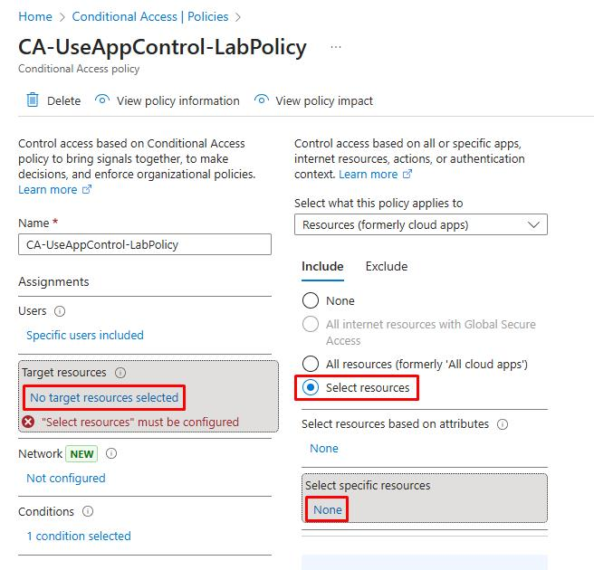

    1. In the flyout pane, search for and select `Office 365`.

    1. At the bottom of the flyout pane, select **Select**.

1. Under **Conditions**, select **0 conditions selected**.

    1. Under **Device platforms**, select **Not configured**.

    1. In the flyout pane, under **Configure**, select **Yes**.

    1. Select the **Exclude** tab.

    1. Select the following checkboxes:

        - **Android**
        - **iOS**
        - **macOS**
        - **Linux**

    1. At the bottom of the flyout pane, select **Done**.

        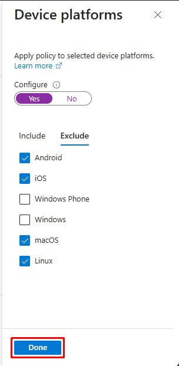

1. Under **Session**, select **0 controls selected**.

    - In the flyout pane, select **Use Conditional Access App Control**, then select **Select** at the bottom.

        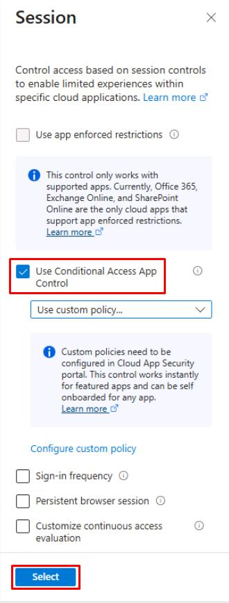

1. Under **Enable policy,** select **On**.

    {: .important }
    > In production, you should always test policies in **Report-only** first.

1. Select **Create**.

    {: .warning }
    > Please wait 5 minutes for the policy to propagate before proceeding.

1. In the upper-right corner of Microsoft Edge, select the ellipsis, then select **New InPrivate window**.

    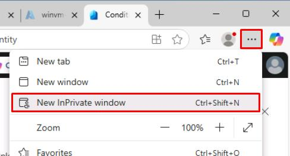

1. Go to `outlook.office.com`.

1. Sign in with **Lab User One**:

    | Item | Value |
    |:---------|:---------|
    | Username   | `user1@@lab.Variable(userDomain)`  |
    | Password  | `P@ssw0rd!2025`  |

    {: .note }
    > This is to test the new policy, which will pick up **Lab User One**'s sign in.

1. Once signed in, you can close the InPrivate window.

---

### 02: Create a session policy in Defender XDR 

1. In your regular Microsoft Edge window, go back to the Defender XDR portal tab.

1. In the leftmost pane, go to **Cloud apps** > **Policies** > **Policy management**.

1. Near the top of the page, select the **Conditional access** tab.

    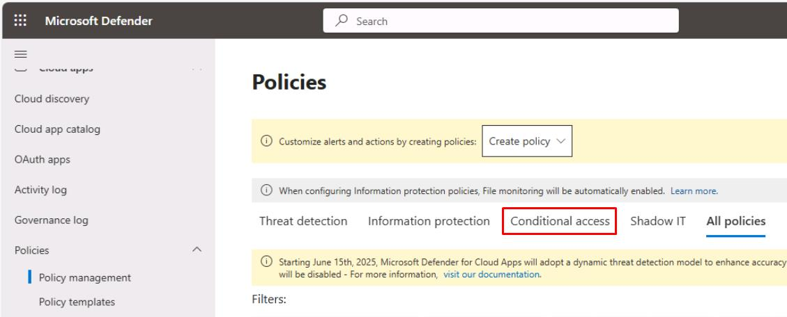

1. Below the tabs and **Filters**, select **Create policy** > **Session policy**.

    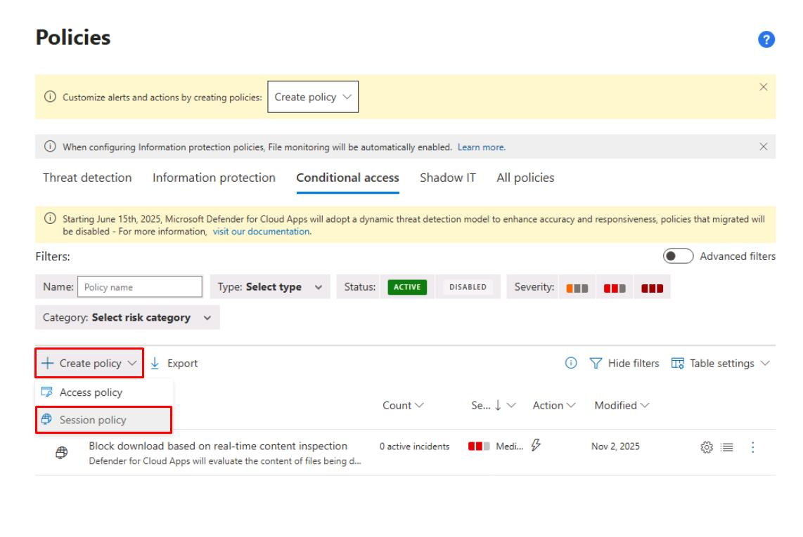

    {: .note }
    > If you see an error at the top saying **Conditional Access not found**, but the fields are not grayed out, you can proceed. 

    {: .warning }
    > If the fields are grayed out, wait a minute and try again. It should pick up your sign in with **Lab User One** to Outlook fairly quickly.

1. Enter the following:

    | Item | Value |
    |:---------|:---------|
    | Policy name   | `Block download based on real-time content inspection`    |
    | Category  | **DLP**  |
    | Session control type  | **Control file download (with inspection) **  |

    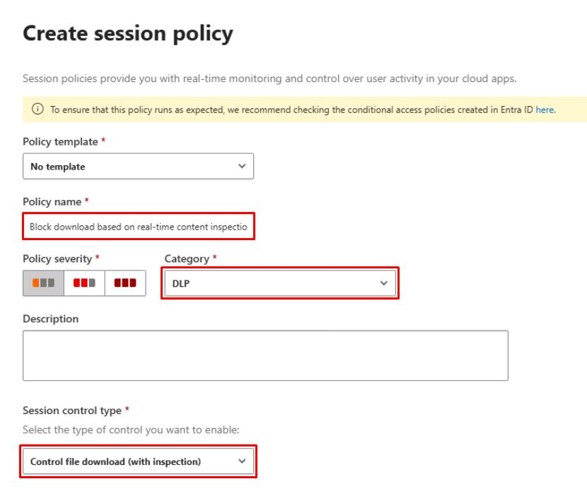

1. Under **Activities matching all of the following**, select :

    - **Device**, **Tag**, **equals**, **Intune compliant**

1. Select the **X** to the left of the row of any other default filter.

    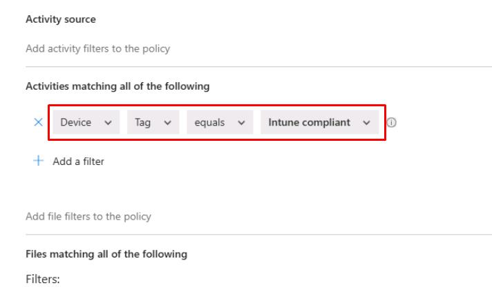

1. Select the **Inspection Method** dropdown menu > **Data Classification Service**.

    1. Select the **Choose inspection type** dropdown menu > **Sensitive information type**.

    1. Search for and select the checkbox for:

        - `Credit Card Number`
        - `IBAN`

        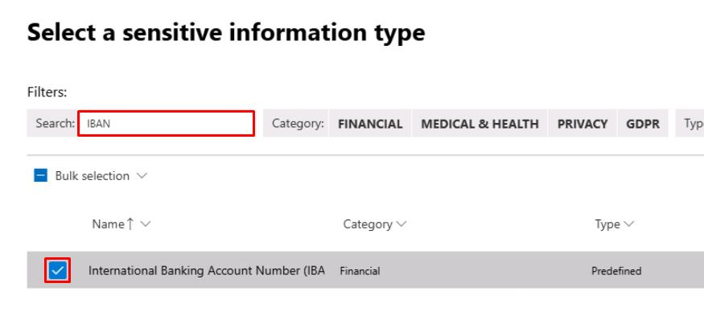

    1. In the upper-right corner of the dialog, select **Done**.

1. Under **Actions**, select **Block**.

    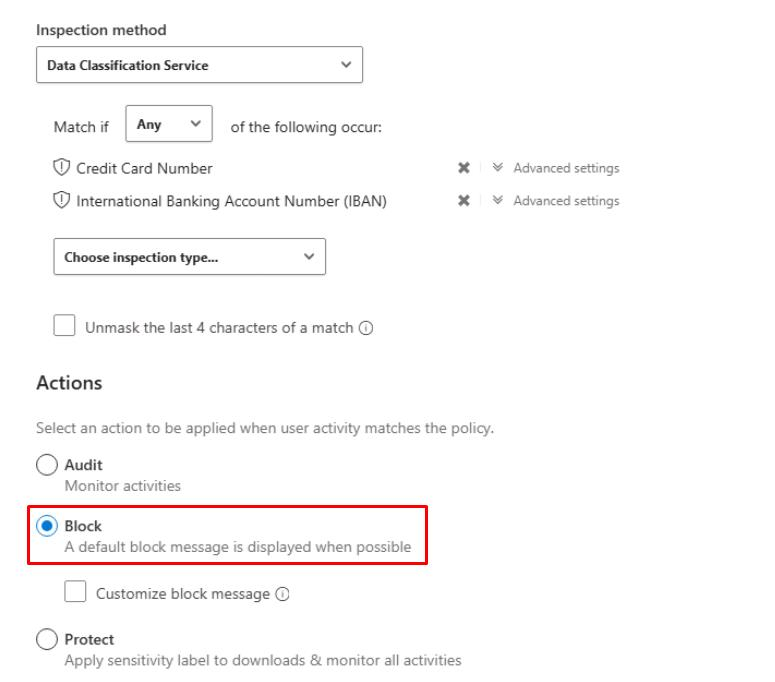

1. At the bottom of the page, select **Create**.

    {: .important }
    > Session policies in Cloud Apps are enforced by the reverse proxy behind **Conditional Access App Control**.  

---

## SOC Analyst  

1. In the leftmost pane, go to **Investigation & response** > **Hunting** > **Advanced hunting**.  

1. Run the following KQL query:

    ```kql5-1.txt
    CloudAppEvents
    | where Timestamp >= ago(24h)
    | where AuditSource in ("Defender for Cloud Apps session control", "Defender for Cloud Apps access control")
    | project Timestamp, AccountId, Application, ActivityType,
            SessionId = tostring(SessionData.InLineSessionId),
            AuditSource, IPAddress, OSPlatform, UserAgent
    | order by Timestamp desc
    ```

    {: .important }
    > The query lists all user actions from the past 24 hours that passed through a Defender for Cloud Apps session or access controls, helping you confirm which sessions were governed by Conditional Access App Control.
    >
    > It outputs timestamp, user, app, activity type, session ID, source, and device information (IP, OS, browser), giving analysts visibility to who accessed which cloud app, from where, and under what session control context.