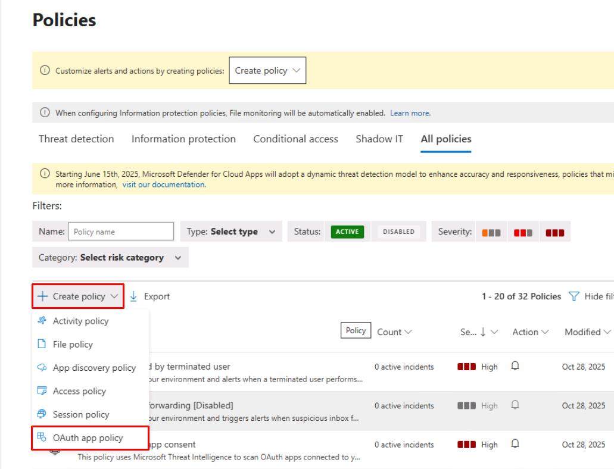
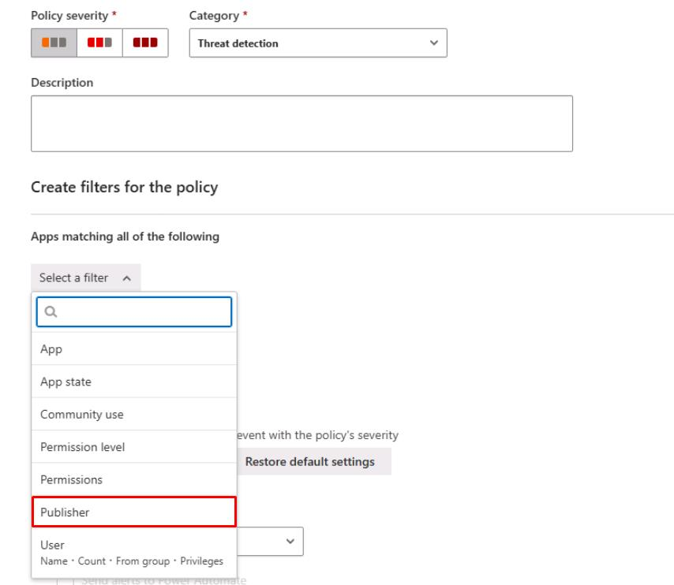
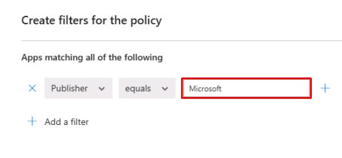
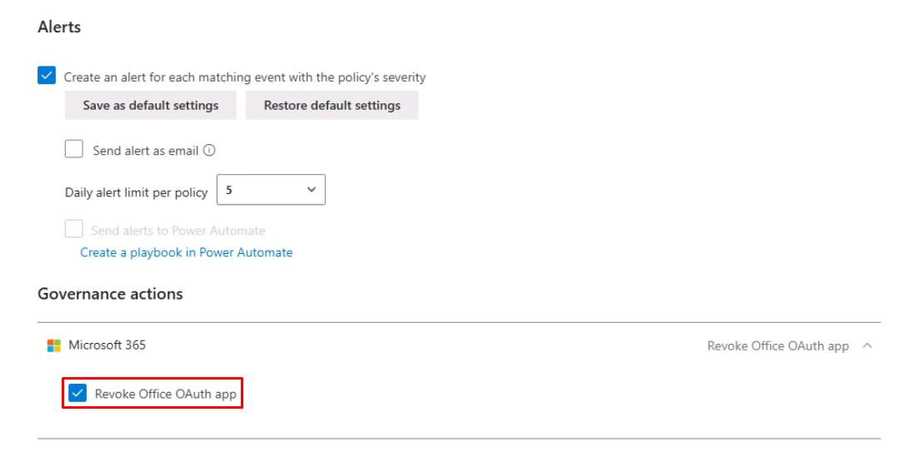
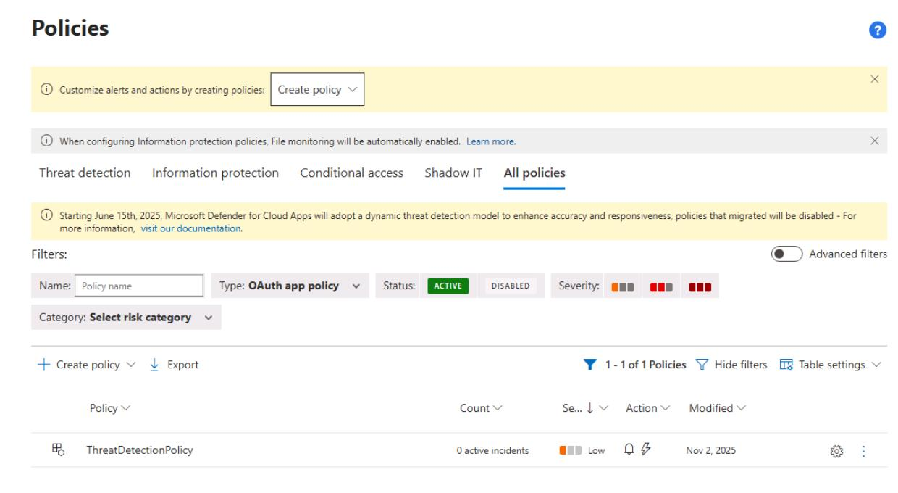
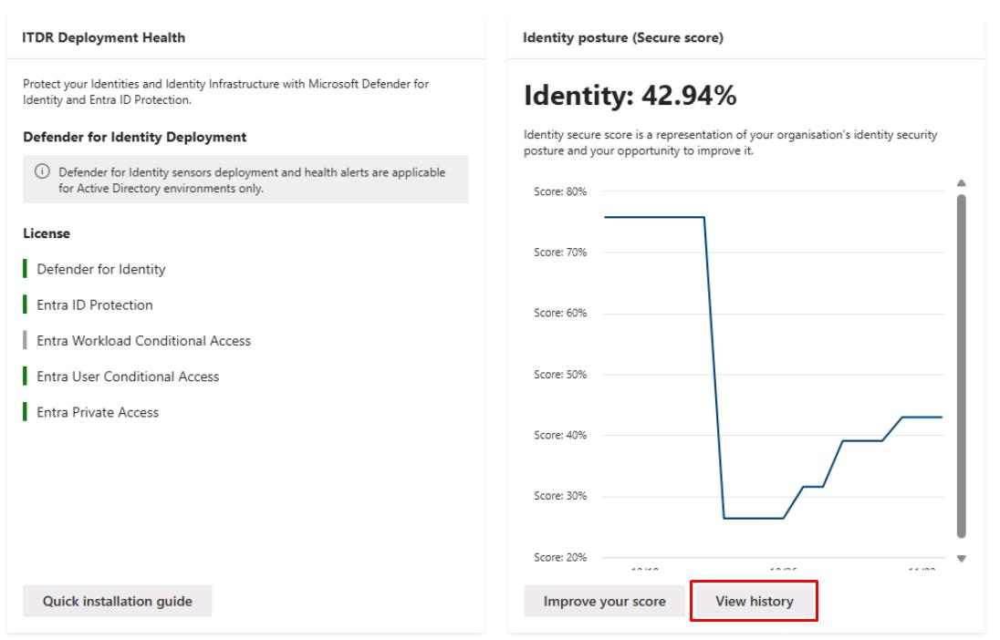
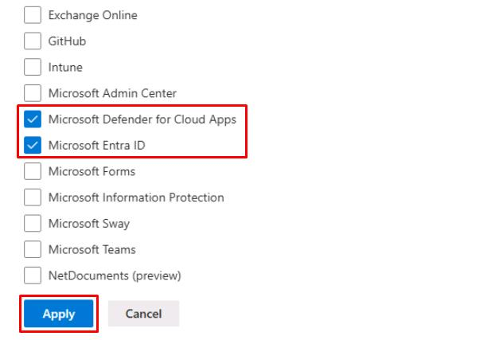
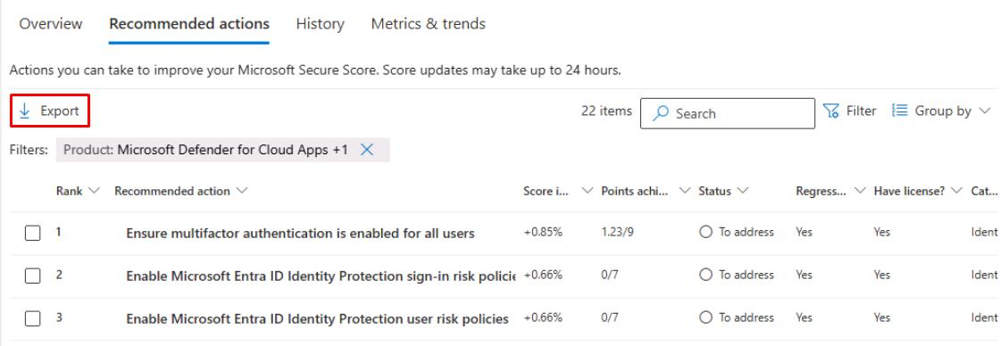

# Task 04: Detect risky behaviors - OAuth apps, impossible travel, and file governance

---

## Security Architecture Team  


#### 01: Create an OAuth app policy.

1. In the leftmost pane, go to **Cloud apps** > **Policies** > **Policy management**.

1. At the top of the table, select **Create policy** > **OAuth app policy**.

    

1. For **Policy name**, enter `ThreatDetectionPolicy`.

1. Under **Create filters for the policy**, select **Select a filter**, then select Publisher.

    

1. On the line for **Publisher equals**, enter `Microsoft`.

    

1. If the **Governance actions** section is available, expand **Microsoft 365**, then select **Revoke Office OAuth app**.

    

1. At the bottom of the page, select **Create**, then confirm it appears on the table.

    

---

#### 02: Verify built-in risk detections

1. In the leftmost pane, go to **Identities** > **Dashboard**.

1. Make note of the **Identity posture (Secure score)** for reporting.

---

## Security Engineering and Administration  

1. In the leftmost pane, go to **Identities** > **Dashboard**.

1. Under **Identity posture (Secure score)**, select **View history**.

    

1. Select the **Recommended actions** tab.

1. In the upper-right corner of the table, select **Filter**.

1. Under the **Product** section, select the following, then select **Apply**:

    - **Microsoft Defender for Cloud Apps**
    - **Microsoft Entra ID**

    

1. In the upper-left corner of the table, select **Export** to download the recommended actions for remediation.

    

---

## SOC Analyst  

1. Run the following KQL query to check for new Cloud App alerts in the last 24 hours:

    ```kql5-2.txt
    // 1) All new Cloud Apps alerts (last 24h)
    AlertInfo
    | where Timestamp >= ago(24h) and ServiceSource has "Defender for Cloud Apps"
    | project Timestamp, Title, Severity, Category, AlertId, ServiceSource, DetectionSource
    ```

    {: .note }
    > If there are no results, no new Cloud App policy alerts were triggered in the last 24 hours.

1. Run the following KQL query to check for impossible travel sign-ins:

    ```kql5-3.txt
    // 2) Impossible travel sign-ins context
    IdentityLogonEvents
    | where Timestamp >= ago(24h)
    | summarize Countries = makeset(Location) by AccountUpn
    | where array_length(Countries) > 1
    ```

    {: .note }
    > If there are no results, then no users signed in from multiple countries in a short window, so no impossible travel scenarios were detected.

1. Run the following KQL query to check for public file sharing or permission changes via Cloud Apps: 

    ```kql5-4.txt
    // 3) Public sharing/permission changes via Cloud Apps
    CloudAppEvents
    | where Timestamp >= ago(24h)
    | where Application in ("SharePoint","OneDrive")
    | where ActivityType has_any ("Public link created","Anonymous link created","Sharing policy changed","Remove external sharing")
    | project Timestamp, AccountId, ActivityType, ObjectName, IPAddress
    ```

    {: .note }
    > If there are no results, then no new files were shared publicly, or no sharing policy changes occurred in the last 24 hours.