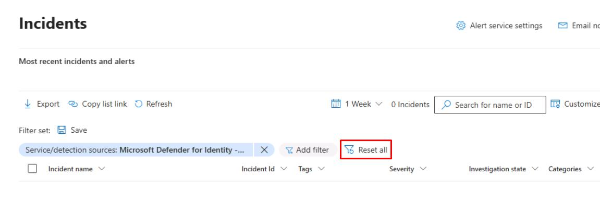
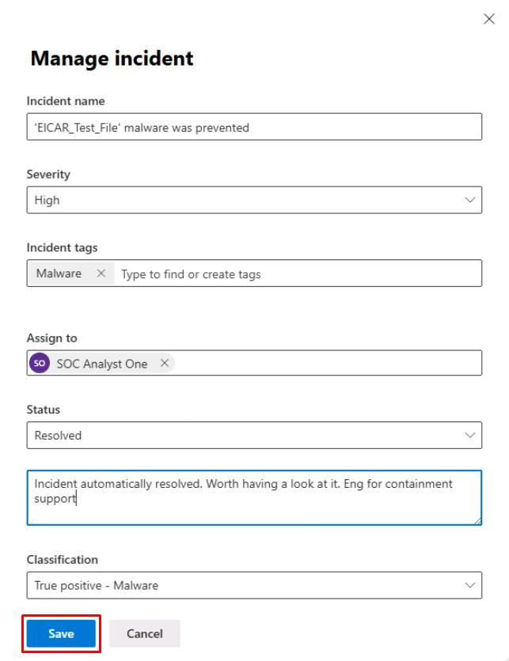
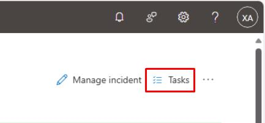
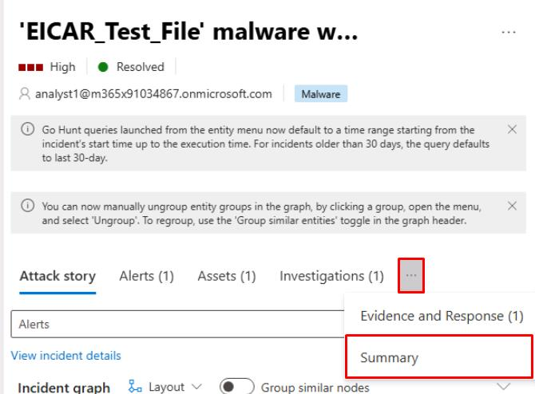
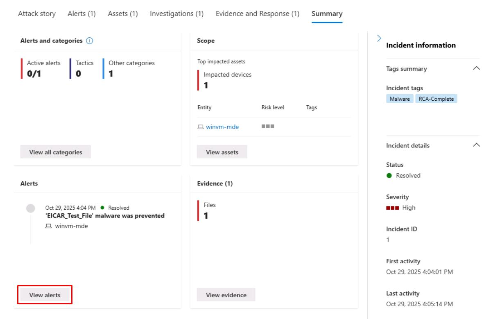
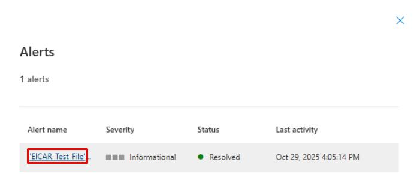
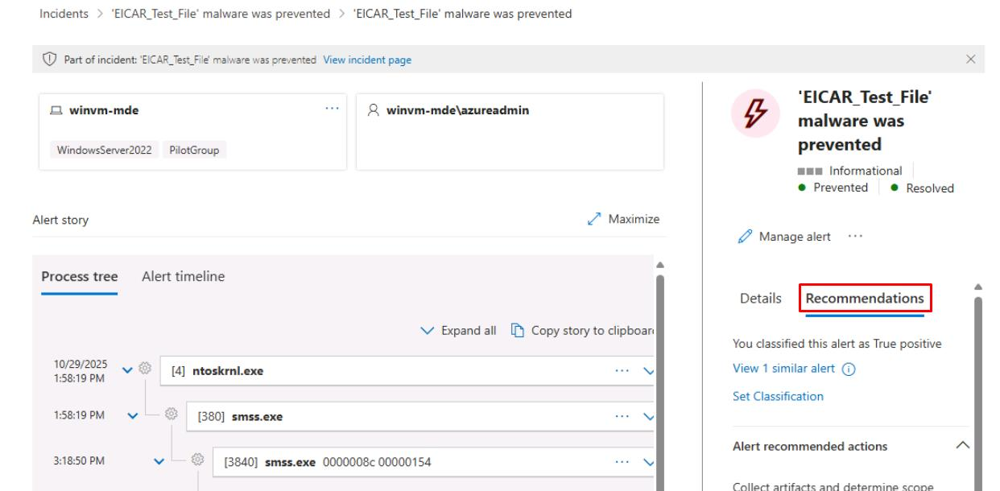
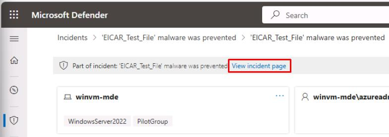

# Task 01: Incident triage and assignment

---

## Security Architecture Team  

1. In the Defender XDR portal's leftmost pane, go to **Investigation & response** > **Incidents & alerts** > **Incidents**.  

1. At the top of the table, select **Reset all** to clear any filters.

    

1. Select any empty space on the line for **'EICAR_Test_File' malware was prevented**.

    {: .note }
    > This will open a flyout pane.

1. At the top of the flyout pane, select **Manage incident**.

1. Update the following details:

    | Item | Value |
    |:---------|:---------|
    | Severity |  **High**   |
    | Incident tags |  `Malware` **(Create new)**   |
    | Assign to  | `analyst1@@lab.Variable(userDomain)` |
    | Classification  | **True positive - Malware** |
    | Status  | **Resolved** |

1. In the text box below **Resolved**, enter:

    ```
    Incident automatically resolved. Worth having a look at it. Eng for containment support
    ```

1. Select **Save**.

    <!--  -->

    

---

## Security Engineering and Administration  

1. In the Defender XDR portal's leftmost pane, go to **Investigation & response** > **Incidents & alerts** > **Incidents**.  

1. At the top of the table, select **Reset all** to clear any filters.

    

1. In the table, select the text for **'EICAR_Test_File' malware was prevented**.

    

    {: .note }
    > This will open its incident page and display the **Attack story**.

1. Review impacted assets, entities, and all active alerts related to the incident.  

1. Select the **Evidence and Response** tab to review remediation evidence.  

1. In the upper-right corner of the page, you can select **Tasks** to add a task for the SOC Analyst to perform additional investigation.  

    

---

## SOC Analyst  

1. In the Defender XDR portal's leftmost pane, go to **Investigation & response** > **Incidents & alerts** > **Incidents**.  

1. At the top of the table, select **Reset all** to clear any filters.

    

1. In the table, select the text for **'EICAR_Test_File' malware was prevented**.

    

    {: .note }
    > This will open its incident page and display the **Attack story**.

1. Near the top of the page, select the **Summary** tab.

    {: .note }
    > Depending on window size, you may need to select the ellipsis to see the option.
    >
    > 

1. Under the **Alerts** tile, select **View alerts**.

    

1. In the flyout pane, select the name of the alert.

    

    {: .note }
    > This will open a new page.

1. In the rightmost pane, select the **Recommendations** tab and review the contents.

    

1. Near the upper-left corner of the page, select **View incident page** to go back.

    