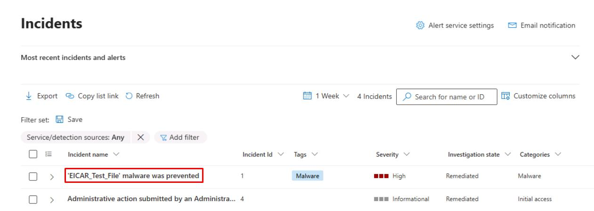
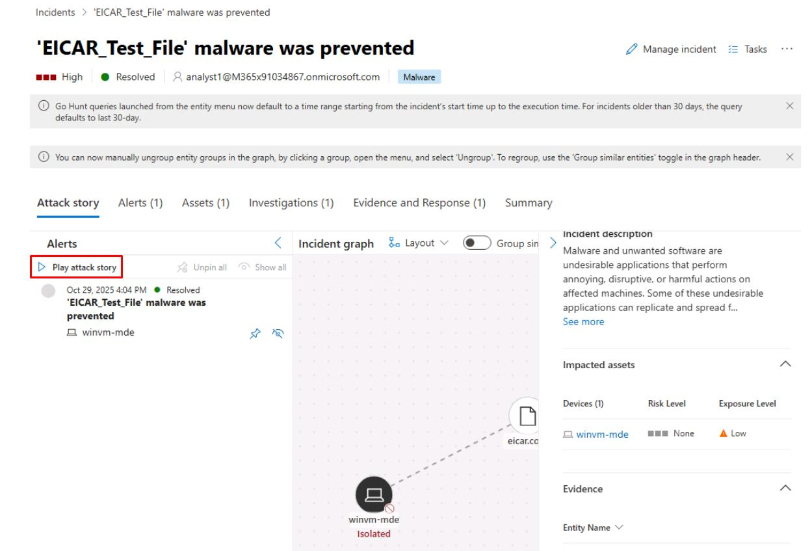
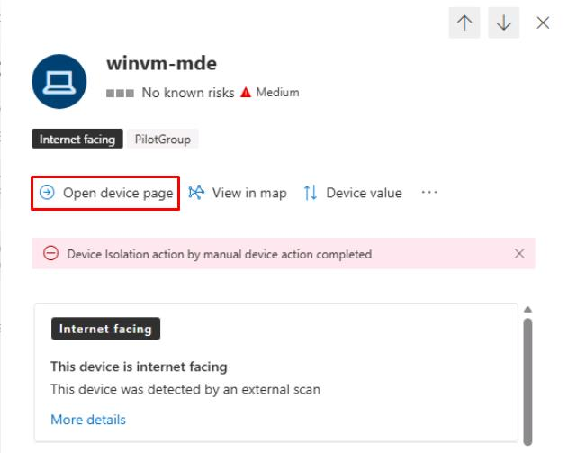
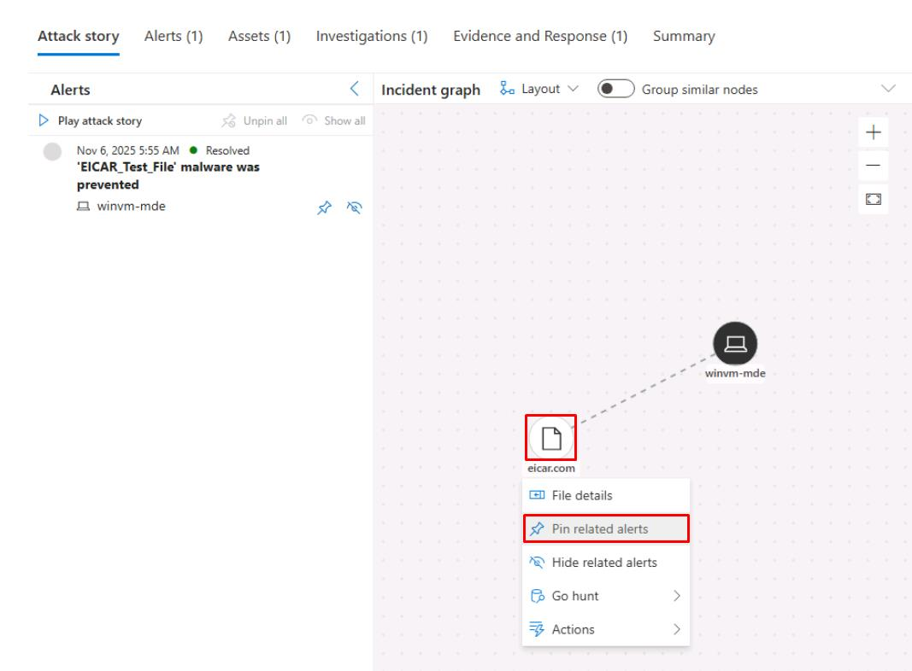
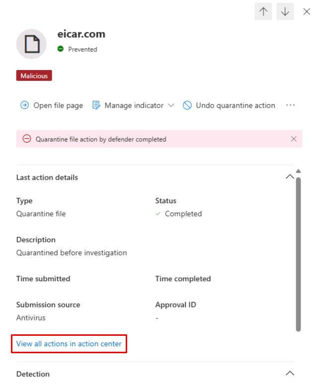

# Task 02: Rebuild the kill chain (Attack story and entity timelines)

---

## Security Architecture Team  

1. In the table, select the text for **'EICAR_Test_File' malware was prevented**.

    

    {: .note }
    > This will open its incident page and display the **Attack story**.

1. Under the default **Attack story** tab's **Alerts** section, select **Play attack story**.

    

    {: .note }
    > Depending on your screen resolution, you may need to close or collapse panes for the **Incident graph** to appear.

    {: .important }
    > This animates events in chronological order and helps you see initial email > user > device > lateral edges. Note the nodes (device, user, email, mailbox, app).

1. Select individual nodes under the **Incident graph** to open the **Device details** or **File details**.

1. You can record timestamps, alert titles, or related artifacts for your investigation, then add comments on the incidents to record any gaps.  

---

## Security Engineering and Administration  

1. In the same incident, select the **Assets** tab.

1. Select **winvm-mde**.

1. At the top of the flyout pane, select **Open device page**, then review the device details.

    

1. At the top of the page, select the **Security recommendations** tab.

1. In the upper-left corner of the table, select **Export** to export them for future remediation.

---

## SOC Analyst  

1. Under the **Incident graph**, select any node, then select **Pin related alerts** to identify any related alerts found.

    

1. Near the top of the page, select the **Evidence and Response** tab.  

1. Select the line for **eicar.com** from the table.

1. In the flyout pane, under the **Last action details** section, select **View all actions in action center**.  

    

1. Observe what's found on the **Action Center** page, then close the tab to return to the incident.

    {: .important }
    > You could use **Tasks** or **Assign** to create follow-up remediation tickets. For example, isolating a device or resetting a user's password.
    >
    > You could also use **Advanced hunting** tables such as **DeviceEvents**, **AuditLogs**, **EmailEvents**, and **IdentityLogonEvents**.  