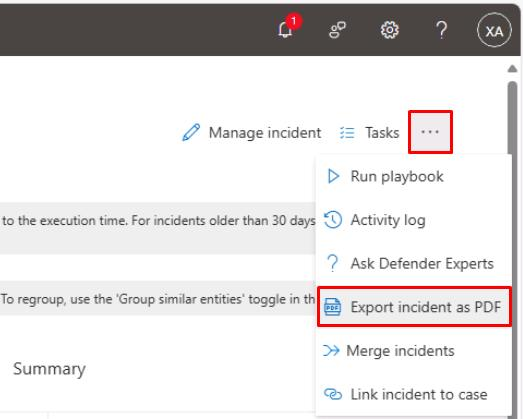
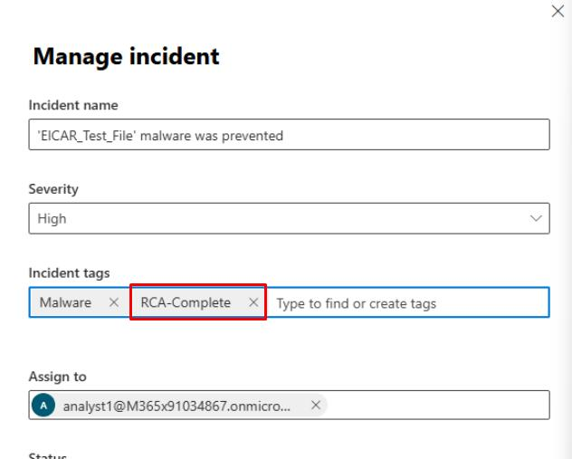

# Task 05: Root cause analysis and evidence

---

## Security Architecture Team  

1. In the leftmost pane, go to **Investigate & response** > **Incidents & alerts** > **Incidents**.

1. In the table, select the text for **'EICAR_Test_File' malware was prevented**.

    

1. In the upper-right corner of the page, select the ellipsis, then select **Export incident as PDF**.

    

1. In the dialog, select **Export PDF**, then select **Download**.

    {: .note }
    > Feel free to proceed with saving to the machine.

1. In the same incident, review the **Evidence and Response** tab.  

1. In the upper-right corner of the page, you can select **Manage incident** to document your findings and Root Cause Analysis (RCA) notes.

---

## Security Engineering and Administration  

1. In the leftmost pane, go to **Investigate & response** > **Actions & submissions** > **Action center**.

1. At the top of the page, select the **History** tab.

1. Select **Export**.

    {: .important }
    > The SOC Analyst could then export the CSV results of the three KQL queries they executed, and attach the evidence files to the incident record.  

---

## SOC Analyst  

1. In the leftmost pane, go to **Investigation & response** > **Incidents & alerts** > **Incidents**.  

1. Select any empty space on the line for **'EICAR_Test_File' malware was prevented**.

    {: .note }
    > This will open a flyout pane.

1. At the top of the flyout pane, select **Manage incident** and verify all the details are filled in. 

    {: .note }
    > This is filled out by the Security Architecture team in their task.

1. In the text box below **Resolved**, you could add a new line for your Root Cause Analysis (RCA) comments including:  

    - Initial vector  
    - Propagation pattern  
    - Controls that failed or succeeded  
    - Time to first action  
    - Time to contain  

1. Under **Incident tag**, enter and select `RCA-Complete` **(Create new)**.  

    

1. Select **Save**.