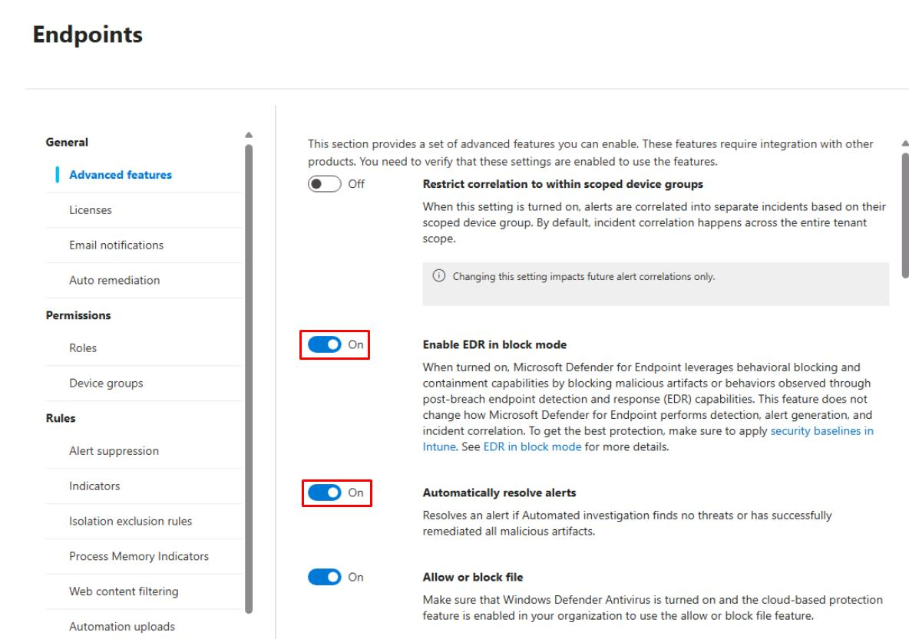
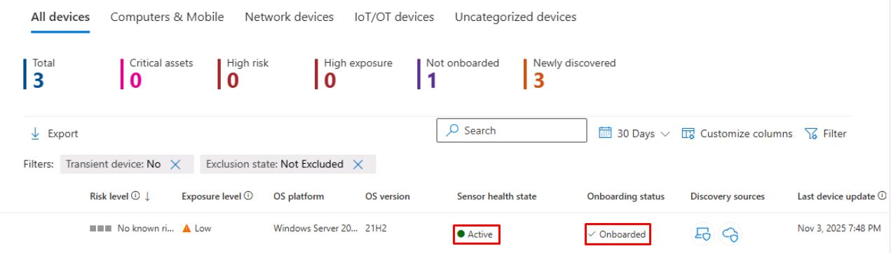

# Task 01: Verify prerequisites and enable Automatic Attack Disruption for a pilot group

:::Architecture(team=Architecture)

#### Security Architecture Team  

---

#### 01: Pilot scope

1. **Define pilot scope**: 1 Windows devices (MDE onboarded), 1-2 test users.  

1. **Guardrails**: Device isolation and user containment are allowed.  

1. **Record success metrics**: MTTR, number of auto-containments, and Secure Score deltas.  

---

#### 02: Capture baselines

1. Take screenshots of the **Secure score** and **Incidents** page.  

1. Take screenshots of **Identity** and **Endpoints** dashboards.

:::

:::Engineering(team=Engineering)
#### Security Engineering and Administration  

Turn on required Defender for Endpoint features.

1. In the Defender XDR portal's leftmost pane, go to **System** > **Settings**.

1. Select **Endpoints**.  

1. Ensure the following are both **On**: 

    - **Enable EDR in block mode**
    - **Automatically resolve alerts**

    

    {: .note } Select **Save preferences**, if you made a change.

    {: .important } **Enable EDR in block mode** is required for richer containment/remediation behavior.

:::

:::SOC(team=SOC)
#### SOC Analyst  

1. In the Defender XDR portal's leftmost pane, go to **Assets** > **Devices**.

1. Confirm **winvm-mde** has the following set:

    | Item | Value |
    |:---------|:---------|
    | Onboarding status   | **Onboarded**  |
    | Sensor health state  | **Active**  |

    

    {: .note } The columns are likely off-screen to the right.