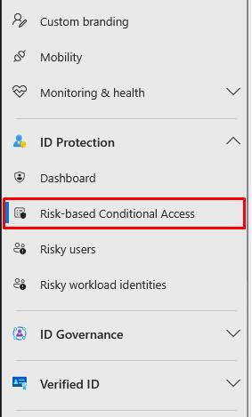
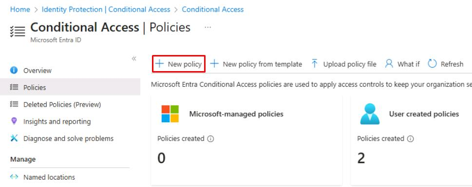
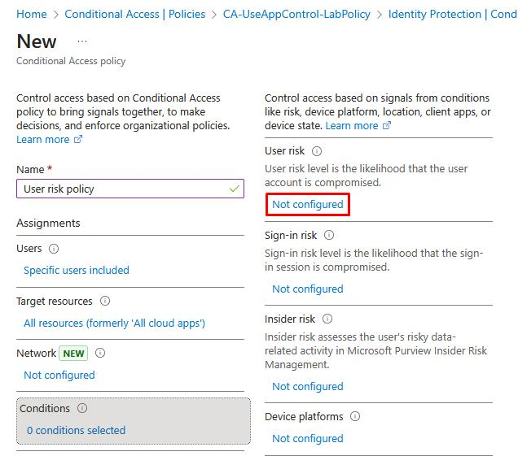
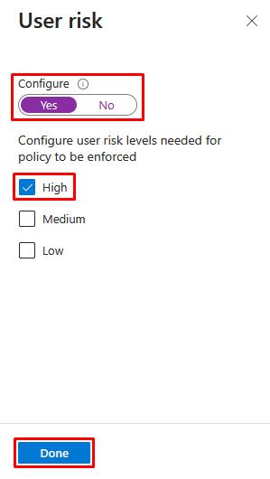
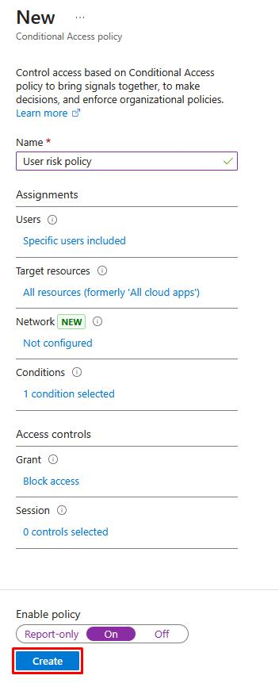
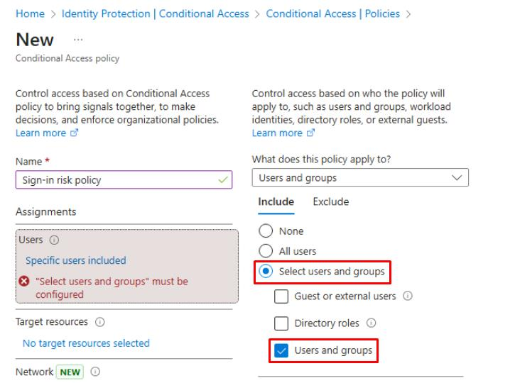
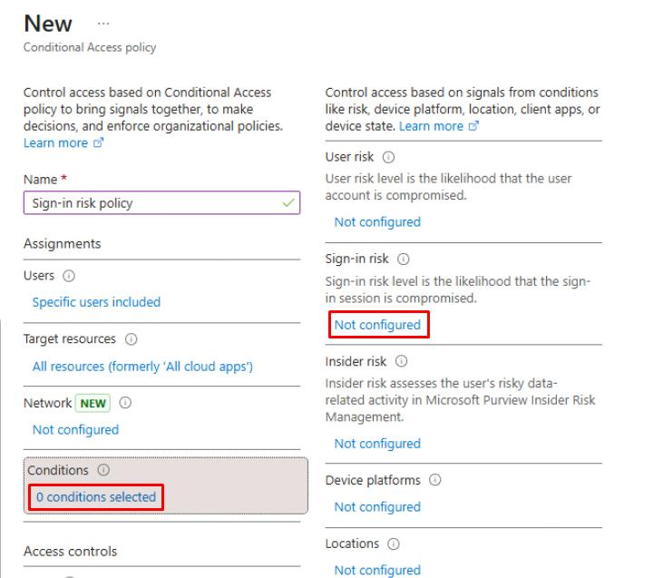
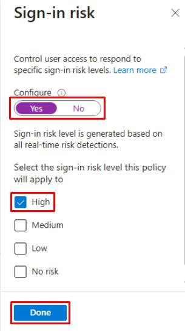
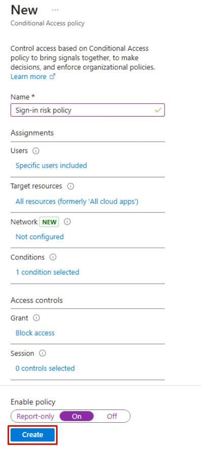

# Task 02: Create a high sign-in risk policy

---

## Security Architecture Team  

1. Have the team enable a **User risk policy** to automatically require users with detected high-risk accounts to securely reset their passwords and re-authenticate.  

1. Enable **Sign-in risk policy** to block or challenge sign-ins identified as **high-risk** based on suspicious or anomalous login behavior.  

---

## Security Engineering and Administration  

---

### 01: Set up user risk policy  

1. In a new browser tab, go to `entra.microsoft.com`.

1. In the leftmost pane, go to **ID Protection** > **Risk-based Conditional Access**.

    

1. On the top bar, select **New policy**.

    

1. For **Name**, enter `User risk policy`.

1. Under **Users**, select **0 users and groups selected**.

    1. Under the **Include** tab, select **Select users and groups** > **Users and groups**.

        

    1. In **Select users and groups**, search for and select `XDR-Pilot-Group`.

    1. At the bottom of the pane, select **Select**.

1. Under **Target resources**, select **No target resources selected**.

    - Under the **Include** tab, select **All resources**.

1. Under **Conditions**, select **0 conditions selected**.

    1. Under **User risk**, select **Not configured**.

        

    1. In the flyout pane, select **Yes**, select **High**, then select **Done**.

        

1. Under **Grant**, select **0 controls selected**.

    - In the flyout pane, select **Block access**, then select **Select**.

1. Under **Enable policy,** select **On**.

    {: .important }
    > In production, you should always test policies in **Report-only** first.

1. Select **Create**.

    

### 02: Set up sign-in risk policy

1. On the top bar, select **New policy** again.

    

1. For **Name**, enter `Sign-in risk policy`.

1. Under **Users**, select **0 users and groups selected**.

    1. Under the **Include** tab, select **Select users and groups** > **Users and groups**.

        

    1. In **Select users and groups**, search for and select `XDR-Pilot-Group`.

    1. At the bottom of the pane, select **Select**.

1. Under **Target resources**, select **No target resources selected**.

    - Under the **Include** tab, select **All resources**.

1. Under **Conditions**, select **0 conditions selected**.

    1. Under **Sign-in risk**, select **Not configured**.

        

    1. In the flyout pane, select **Yes**, select **High**, then select **Done**.

        

1. Under **Grant**, select **0 controls selected**.

    - In the flyout pane, select **Block access**, then select **Select**.

1. Under **Enable policy,** select **On**.

    {: .important }
    > In production, you should always test policies in **Report-only** first.

1. Select **Create**.

    

    {: .important }
    > Policies may take 5-10 minutes to propagate.

---

## SOC Analyst  

1. In a new browser tab, go to `entra.microsoft.com`.

1. In the leftmost pane, go to **ID Protection** > **Dashboard**.

1. On the **Identity Protection** page's menu, under **Report**, select **Risky users**.

1. On the **Identity Protection** page's menu, under **Report**, select **Risky sign-ins**.

    {: .important }
    > if any risky users or sign-ins are found, confirm the **Risk state** column shows access was **Blocked** or **Remediation required**.