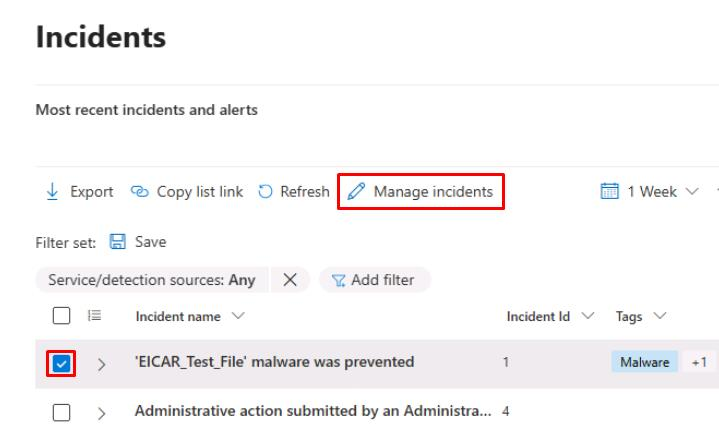

# Task 01: Define incident classification, severity, and SLA metrics

:::Architecture(team=Architecture)
#### Security Architecture Team  

1. Go to your Defender XDR portal tab at `security.microsoft.com`.

1. In the leftmost pane, go to **Investigate & response** > **Incidents & alerts** > **Incidents**.

1. Review the incident list and note columns such as **Severity**, **Last activity**, **Status**, **Assigned to**, and **Creation time**.  

1. Write a classification matrix in your runbook, such as:  

    - **High severity**: Incidents involving confirmed lateral movement or credential compromise.  
    - **Medium severity**: Malware contained on a device; user clicked suspicious link but contained.  
    - **Low severity**: Suspicious but benign activity or false positive.  

1. Define SLAs, such as:  

    - **High**: First action ≤ 30 mins; MTTD ≤ 60 mins; MTTR ≤ 3 hrs
    - **Medium**: First action ≤ 1 hrs; MTTR ≤ 8 hrs 
    - **Low**: First action ≤ 4 hrs  

1. Record roles and responsibilities:  

    - **SOC Analyst** owns first action.  
    - **Security Engineering** owns rule tuning.  
    - **Architecture** owns SLA review.  

:::

:::Engineering(team=Engineering)
#### Security Engineering and Administration  

1. In the Defender XDR portal, in the leftmost pane, go to **System** > **Permissions**.

1. In a real-world environment, you'd ensure **SOC Analysts** have permission to **Manage incidents**.  

1. Export a sample of incidents: on the **Incidents** page, select **Export** to download CSV for the last 7 days.  

    {: .important } At this point, you could open the CSV in Excel and report any missing or null fields to the Architecture team.  

:::

:::SOC(team=SOC)
#### SOC Analyst  

1. In the Defender XDR portal, in the leftmost pane, go to **Investigate & response** > **Incidents & alerts** > **Incidents**.

1. Select the checkbox for any incident, then on the top bar, select **Manage incidents**.

    

1. In the flyout pane, update the following values:

    | Item | Value |
    |:---------|:---------|
    | Severity   | **Informational**  |
    | Assign to  | **Assign to me**  |
    | Classification  | **Not set** |

1. Select **Save**.  

    {: .important } Keep a personal log of first-action times and whether SLA targets were met.  