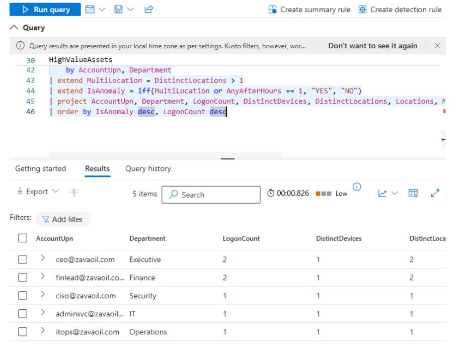
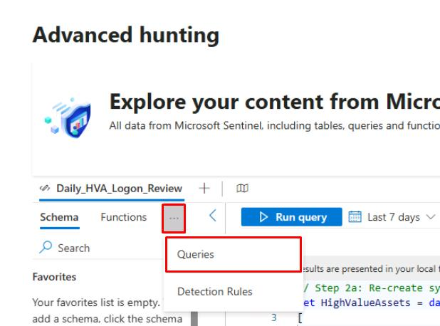
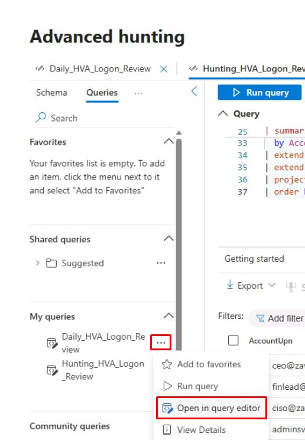
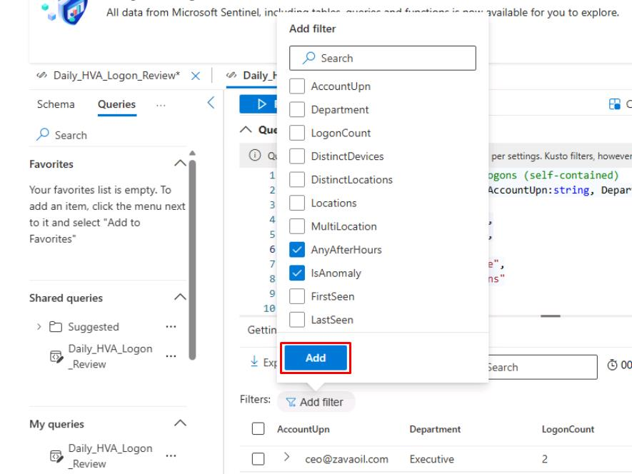
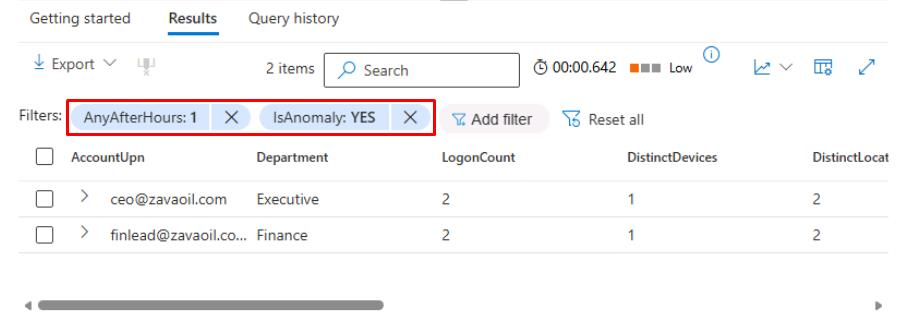

# Task 03: Create and maintain watchlists

---

## Security Architecture Team  

1. Identify high-value assets (HVAs) such as executive accounts, privileged admins, or critical devices.  

1. Approve identifiers to use:  

    - Users: **AccountUpn** or **AccountName**.  
    - Devices: **DeviceName**.  

1. Define a naming/versioning convention. For example, **HighValueAssets_v1**.  

1. Set a review cadence, such as the first of every month. 

---

## Security Engineering and Administration  

1. Go back to your `security.microsoft.com` tab.

1. In the leftmost pane, go to **Investigate & response** > **Hunting** > **Advanced hunting**.

1. Run the following query, which is fully simulated with data table definitions and join/aggregation:  

    ```kql
    // Simulated HVA list and demo logons (self-contained)
    let HighValueAssets = datatable(AccountUpn:string, Department:string)
    [
        "ceo@zavaoil.com", "Executive",
        "ciso@zavaoil.com", "Security",
        "adminsvc@zavaoil.com", "IT",
        "finlead@zavaoil.com", "Finance",
        "itops@zavaoil.com", "Operations"
    ];
    let SimulatedDeviceLogons = datatable(
        AccountUpn:string,
        DeviceName:string,
        LogonTime:datetime,
        Location:string,
        LogonType:string,
        ReportId:string,
        DeviceId:string
    )
    [
        "ceo@zavaoil.com", "CEO-LAPTOP", datetime(2025-11-02T08:05:00Z), "Wellington", "RemoteInteractive", "rpt-001", "dev-001",
        "ciso@zavaoil.com", "CISO-LAPTOP", datetime(2025-11-02T08:10:00Z), "Wellington", "RemoteInteractive", "rpt-002", "dev-002",
        "adminsvc@zavaoil.com", "SRV-AD01", datetime(2025-11-02T09:00:00Z), "Auckland", "ServiceLogon", "rpt-003", "dev-003",
        "finlead@zavaoil.com", "FIN-LAPTOP01", datetime(2025-11-02T09:05:00Z), "Sydney", "RemoteInteractive", "rpt-004", "dev-004",
        "itops@zavaoil.com", "IT-LAPTOP01", datetime(2025-11-02T09:10:00Z), "Wellington", "Interactive", "rpt-005", "dev-005",
        "ceo@zavaoil.com", "CEO-LAPTOP", datetime(2025-11-02T23:45:00Z), "Singapore", "RemoteInteractive", "rpt-006", "dev-001",
        "finlead@zavaoil.com", "FIN-LAPTOP01", datetime(2025-11-02T23:50:00Z), "Singapore", "RemoteInteractive", "rpt-007", "dev-004"
    ];
    HighValueAssets
    | join kind=inner (SimulatedDeviceLogons) on AccountUpn
    | extend HourOfDay = datetime_part("hour", LogonTime)
    | extend AfterHours = iff(HourOfDay < 6 or HourOfDay > 20, 1, 0)
    | summarize
        LogonCount = count(),
        DistinctDevices = dcount(DeviceName),
        DistinctLocations = dcount(Location),
        Locations = make_set(Location, 5),
        FirstSeen = min(LogonTime),
        LastSeen = max(LogonTime),
        AnyAfterHours = max(AfterHours)
        by AccountUpn, Department
    | extend MultiLocation = DistinctLocations > 1
    | extend IsAnomaly = iff(MultiLocation or AnyAfterHours == 1, "YES", "NO")
    | project AccountUpn, Department, LogonCount, DistinctDevices, DistinctLocations, Locations, MultiLocation, AnyAfterHours, IsAnomaly, FirstSeen, LastSeen
    | order by IsAnomaly desc, LogonCount desc
    ```

    

1. Save the query: 

    1. At the top of the Query pane, select the **Save** icon, and select **Save as**.

        
    
    1. In the flyout pane, for **Name**, enter 
    
    ```
    Daily_HVA_Logon_Review
    ```  

    1. Keep the default **Location**, then select **Save**.

---

## SOC Analyst  

1. In the leftmost pane, go to **Investigate & response** > **Hunting** > **Advanced hunting**.

1. In **Advanced hunting**, at the top of the left pane, select the ellipsis, then select **Queries**.

    

1. On the line for **Daily_HVA_Logon_Review**, select the ellipsis, then select **Open in query editor**.

    

1. At the top of the **Query** pane, select **Run query**.

1. To focus on likely anomalies:

    1. Above the **Results** table, select **Add filter**, then select the following:
        
        - **AnyAfterHours**
        - **IsAnomaly**

    1. Select **Add**.

        

    1. Select the **AnyAfterHours** filter, select **1**, then select **Apply**.

        

    1. Select the **IsAnomaly** filter, select **YES**, then select **Apply**.

    1. Review the returned columns and rows.

        

1. In the upper-left corner of the table, select **Export** > **Download to CSV**.

1. In your triage workflow: 

    1. Check for expected travel/maintenance (calendar, device owner). 

    1. If confirmed malicious/unexpected, create/attach to an incident: Go to **Investigations & response** > **Incidents & alerts** > Create/attach . 

        1. Add a note: First action time and triage decision. 

        1. If false positive, close with reason and document in the runbook for tuning. 

    1. Suggested columns to verify in exported CSV: 

        - **AccountUpn**
        - **Location** (if simulated) or **RemoteIP**
        - **AnyAfterHours**
        - **IsAnomaly**
        - **FirstSeen**
        - **LastSeen**

    1. Discuss mitigation steps during the SOC huddle.
