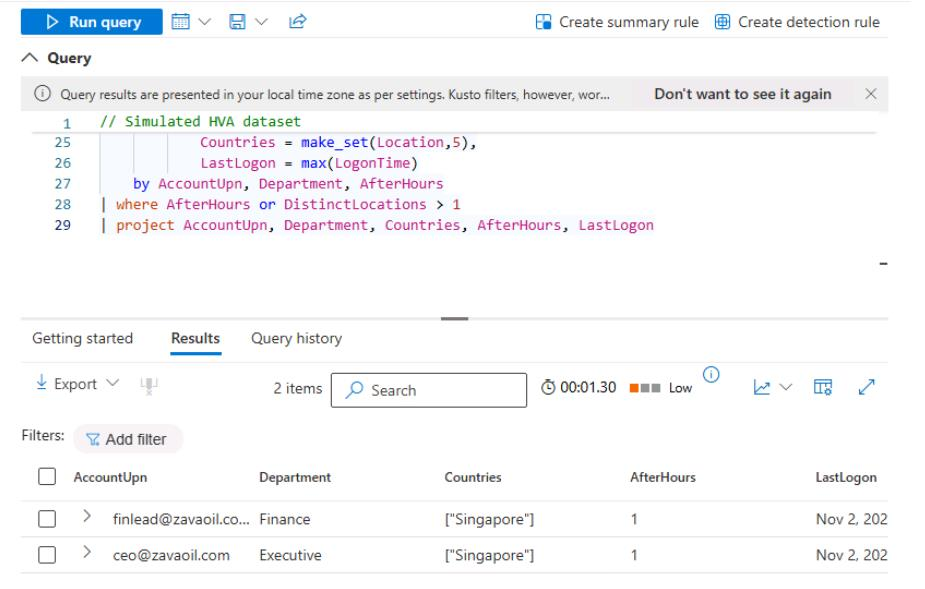
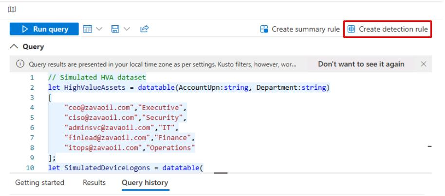
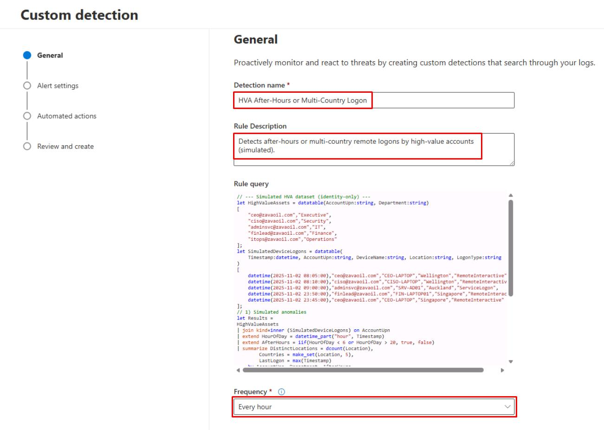
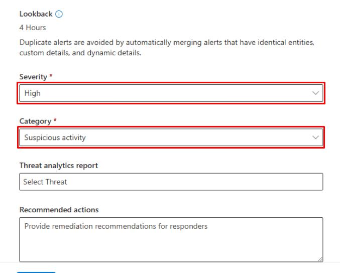
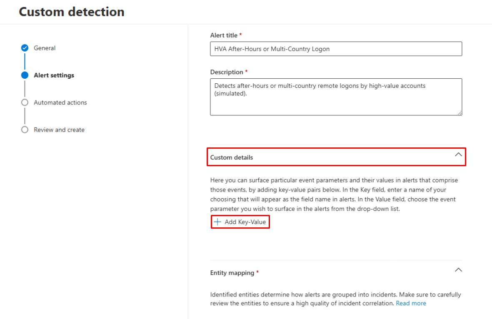
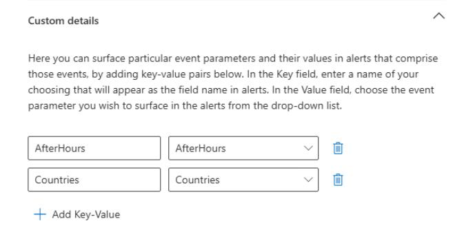
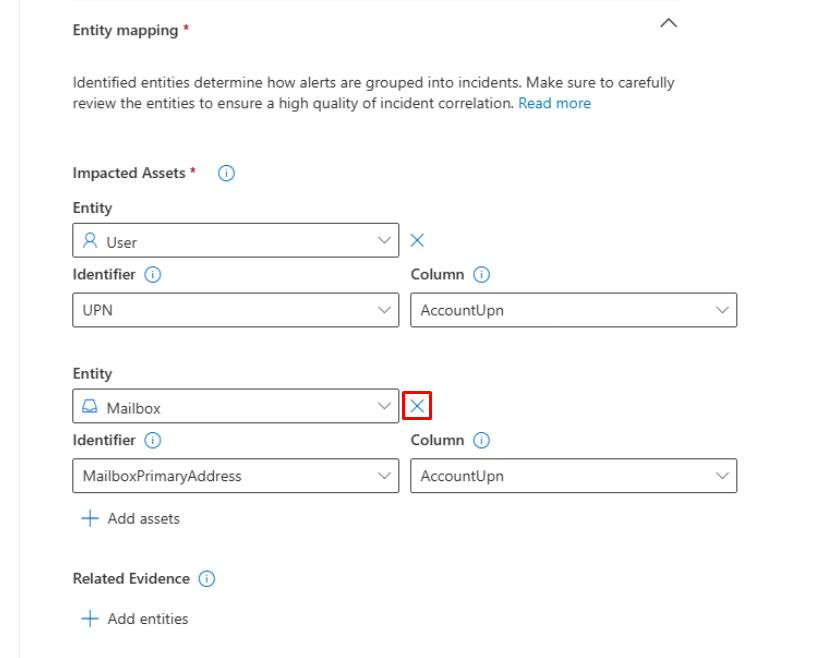
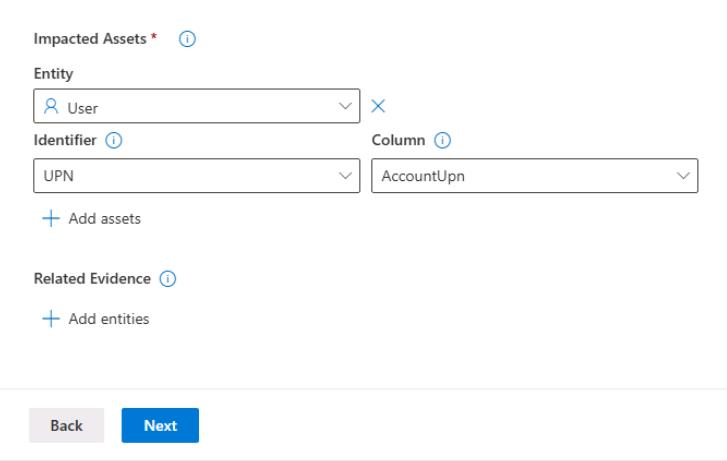
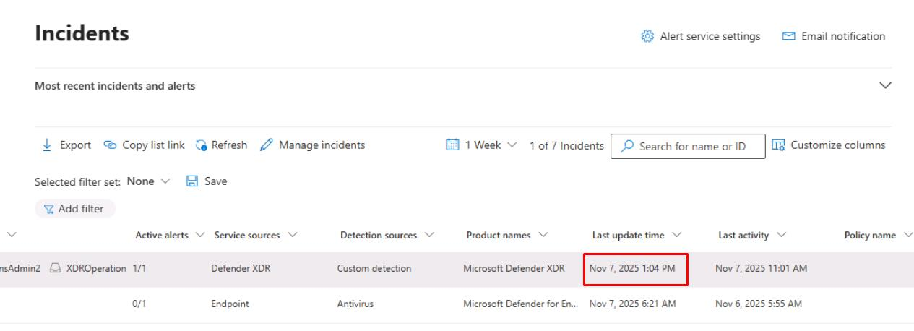

# Task 04: Create custom detection rules

:::Architecture(team=Architecture)
#### Security Architecture Team  

- Define detection use case:  

    - **Name**: 'HVA After-Hours or Multi-Country Remote Logon'
    - **Purpose**: Catch logon anomalies from executive or privileged accounts.  
    - **Severity**: High  
    - **MITRE ATT&CK tactics**:  
        - TA0001 - Initial Access  
        - TA0008 - Lateral Movement
    - **Entity types**: Account, Device  
    - **Detection criteria**:  
        - LogonType == "RemoteInteractive" 
        - MultiCountry == True OR AfterHours == True

:::

:::Engineering(team=Engineering)
#### Security Engineering and Administration  

----

#### 01: Run a simulated detection KQL query

- Run the following query:

    ```kql
    // --- Simulated HVA dataset (identity-only) ---
    let HighValueAssets = datatable(AccountUpn:string, Department:string)
    [
        "ceo@zavaoil.com","Executive",
        "ciso@zavaoil.com","Security",
        "adminsvc@zavaoil.com","IT",
        "finlead@zavaoil.com","Finance",
        "itops@zavaoil.com","Operations"
    ];
    let SimulatedDeviceLogons = datatable(
        Timestamp:datetime, AccountUpn:string, DeviceName:string, Location:string, LogonType:string
    )
    [
        datetime(2025-11-02 08:05:00),"ceo@zavaoil.com","CEO-LAPTOP","Wellington","RemoteInteractive",
        datetime(2025-11-02 08:10:00),"ciso@zavaoil.com","CISO-LAPTOP","Wellington","RemoteInteractive",
        datetime(2025-11-02 09:00:00),"adminsvc@zavaoil.com","SRV-AD01","Auckland","ServiceLogon",
        datetime(2025-11-02 23:50:00),"finlead@zavaoil.com","FIN-LAPTOP01","Singapore","RemoteInteractive",
        datetime(2025-11-02 23:45:00),"ceo@zavaoil.com","CEO-LAPTOP","Singapore","RemoteInteractive"
    ];
    // 1) Simulated anomalies
    let Results =
    HighValueAssets
    | join kind=inner (SimulatedDeviceLogons) on AccountUpn
    | extend HourOfDay = datetime_part("hour", Timestamp)
    | extend AfterHours = iif(HourOfDay < 6 or HourOfDay > 20, true, false)
    | summarize DistinctLocations = dcount(Location),
            Countries = make_set(Location, 5),
            LastLogon = max(Timestamp)
        by AccountUpn, Department, AfterHours
    | where AfterHours or DistinctLocations > 1
    | project AccountUpn, Department, Countries, AfterHours, LastLogon;
    // 2) Single real AAD sign-in anchor (guarantees real provider identifiers)
    let Anchor =
    AADSignInEventsBeta
    | where Timestamp > ago(30d)
    | top 1 by Timestamp desc
    | project AnchorTs = Timestamp, AnchorReportId = tostring(ReportId);
    // 3) Cross-join every simulated row with the real anchor, then output required columns
    Results
    | extend _k = 1
    | join kind=inner (Anchor | extend _k = 1) on _k
    | project
        Timestamp = AnchorTs,              // REAL provider event time
        AccountUpn,                        // map as User → UPN
        ReportId  = AnchorReportId,        // REAL provider event id (string is fine)
        Department, Countries, AfterHours, SimulatedLastLogon = LastLogon
    ```

    

    {: .note } You'll see the **CEO** and **Finance Lead** flagged. 

---

#### 02: Create a detection rule

1. In the upper-right corner of the **Query** pane, select **Create detection rule**.

    

1. In the Custom detection wizard, enter the following:

    | Item | Value |
    |:---------|:---------|
    | Detection name   | `HVA After-Hours or Multi-Country Logon`  |
    | Rule description  | `Detects after-hours or multi-country remote logons by high-value accounts (simulated).`  |
    | Frequency  | **Every hour** |
    | Severity  | **High** |
    | Category  | **Suspicious activity** |

    
    

1. At the bottom of the page, select **Next**.

1. On the **Alert settings** step, enter the following:

    | Item | Value |
    |:---------|:---------|
    | Alert title   | `HVA After-Hours / Multi-Location Logon Detected (Simulated)`  |
    | Description  | `Detects after-hours or multi-country logons by high-value accounts based on simulated dataset in Advanced Hunting.`  |

1. Expand the **Custom details** section.

    1. Select **Add Key-Value**.

        

    1. For the **Key-Value**, enter:

        | Item | Value |
        |:---------|:---------|
        | Key   | `AfterHours`  |
        | Parameter   | **AfterHours**  |

    1. Select **Add Key-Value**.

    1. For the **Key-Value**, enter:

        | Item | Value |
        |:---------|:---------|
        | Key   | `Countries`  |
        | Parameter   | **Countries**  |

        

1. Under the **Impacted Assets** section:

    1. Keep the **User** entity.

    1. Delete the **Mailbox** entity by selecting the **X** to the right of the **Entity** dropdown menu.

        
        

1. At the bottom of the page, select **Next** until you reach the **Review and create** step.

1. Select **Submit** to save the rule.

:::

:::SOC(team=SOC)
#### SOC Analyst  

1. Go to **Investigation & response** > **Incidents & alerts** > **Incidents**.  

1. Select any empty space on the line for **HVA After-Hours or Multi-Country Logon**.

1. At the top of the flyout pane, select **Manage incident**.

1. Enter the following:

    | Item | Value |
    |:---------|:---------|
    | Severity  | **High** |
    | Assign to  | **Assign to me** |
    | Status  | **Resolved** |
    | Resolved Notes | `First action taken at [time] - validated false positive/confirmed anomaly.`  |
    | Classification  | **False Positive - Not malicious** |

1. Select **Save**, then close the flyout pane.

1. On the table, verify the **Last update time** column for the incident, which will be used for MTTR metrics.

    