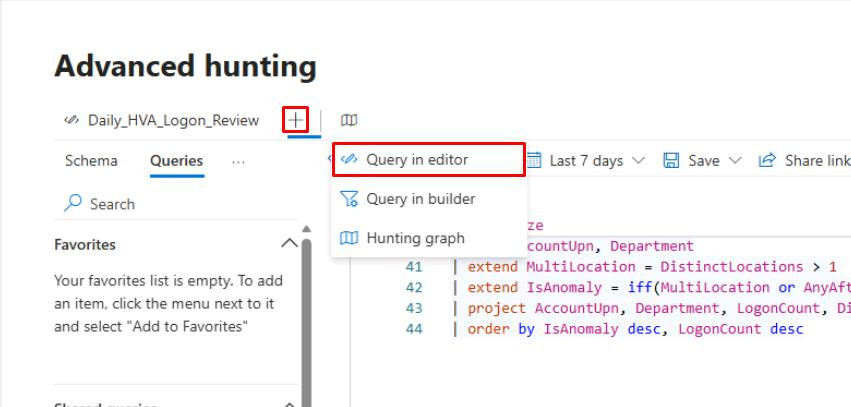
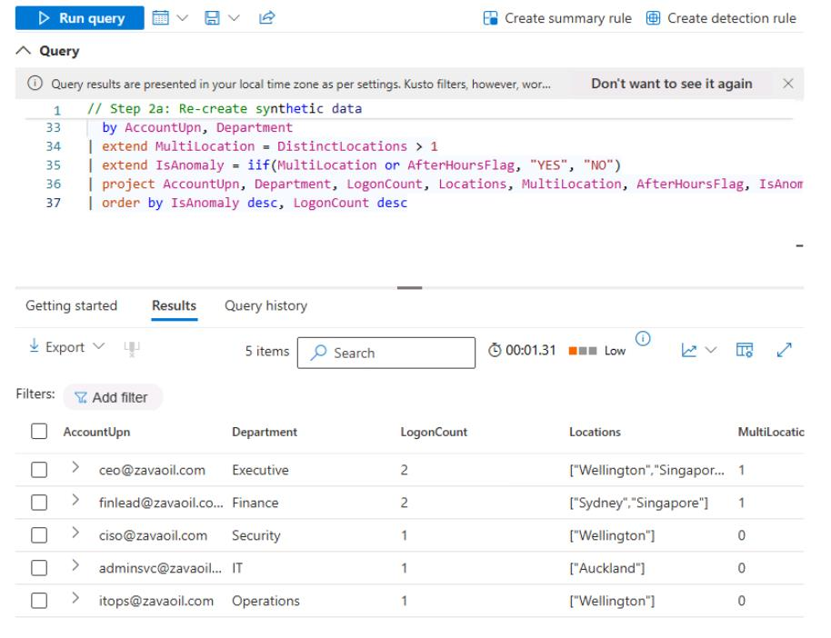
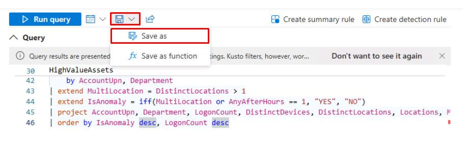
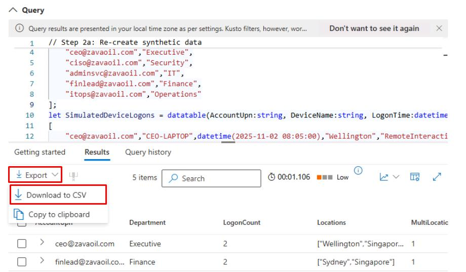

# Task 05: Daily hunting review (simulated dataset)

---

## Security Architecture Team  

1. Define review scope:  

    - **Time window**: past 24 hours of logons.  
    - **Focus**: RemoteInteractive  logons, multi-location use, after-hours access. 
    - **Deliverables**:  
        - Daily hunting query results (CSV).  
        - Summary of anomalies and actions.  
    - **Schedule**: 09:00am daily.  
    - **Owner**: SOC Duty Analyst.  

1. Update the runbook accordingly.  

---

## Security Engineering and Administration  

1. On the bar above the query pane, select the **+**, then select **Query in editor** to create a new query.

    

1. Run the following baseline query:  

    ```kql
    // Step 2a: Re-create synthetic data
    let HighValueAssets = datatable(AccountUpn:string, Department:string)
    [
        "ceo@zavaoil.com","Executive",
        "ciso@zavaoil.com","Security",
        "adminsvc@zavaoil.com","IT",
        "finlead@zavaoil.com","Finance",
        "itops@zavaoil.com","Operations"
    ];
    let SimulatedDeviceLogons = datatable(AccountUpn:string, DeviceName:string, LogonTime:datetime, Location:string, LogonType:string)
    [
        "ceo@zavaoil.com","CEO-LAPTOP",datetime(2025-11-02 08:05:00),"Wellington","RemoteInteractive",
        "ciso@zavaoil.com","CISO-LAPTOP",datetime(2025-11-02 08:10:00),"Wellington","RemoteInteractive",
        "adminsvc@zavaoil.com","SRV-AD01",datetime(2025-11-02 09:00:00),"Auckland","ServiceLogon",
        "finlead@zavaoil.com","FIN-LAPTOP01",datetime(2025-11-02 09:05:00),"Sydney","RemoteInteractive",
        "itops@zavaoil.com","IT-LAPTOP01",datetime(2025-11-02 09:10:00),"Wellington","Interactive",
        "ceo@zavaoil.com","CEO-LAPTOP",datetime(2025-11-02 23:45:00),"Singapore","RemoteInteractive",
        "finlead@zavaoil.com","FIN-LAPTOP01",datetime(2025-11-02 23:50:00),"Singapore","RemoteInteractive"
    ];
    // Step 2b: Aggregate and flag anomalies
    HighValueAssets
    | join kind=inner (SimulatedDeviceLogons) on AccountUpn
    | extend HourOfDay = datetime_part("hour", LogonTime)
    | extend AfterHours = iif(HourOfDay < 6 or HourOfDay > 20, true, false)
    | summarize
        LogonCount = count(),
        DistinctDevices = dcount(DeviceName),
        DistinctLocations = dcount(Location),
        Locations = make_set(Location,5),
        FirstSeen = min(LogonTime),
        LastSeen  = max(LogonTime),
        AfterHoursFlag = any(AfterHours)
      by AccountUpn, Department
    | extend MultiLocation = DistinctLocations > 1
    | extend IsAnomaly = iif(MultiLocation or AfterHoursFlag, "YES", "NO")
    | project AccountUpn, Department, LogonCount, Locations, MultiLocation, AfterHoursFlag, IsAnomaly, FirstSeen, LastSeen
    | order by IsAnomaly desc, LogonCount desc
    ```

    

1. Save the query: 

    1. At the top of the Query pane, select the **Save** icon, then select **Save as**.

        
    
    1. In the flyout pane, for **Name**, enter `Hunting_HVA_Logon_Review`.  

    1. Keep the default **Location**, then select **Save**.

    {: .important }
    > You can do something to automate this through the Advanced Hunting API to query daily at 09:00am, then export a CSV to a location, like *SOC/Hunting/Daily*.
    >
    > Alternatively, schedule a Power Automate flow to trigger a query and post a summary to Teams. 
    >
    > Tag exports by date (*HVA_Hunting_YYYYMMDD.csv*). 

---

## SOC Analyst  

1. In the leftmost pane, go to **Investigate & response** > **Hunting** > **Advanced hunting**.

1. The **Daily_HVA_Logon_Review** query should still be loaded. Select **Run query**.  

1. In the upper-left corner of the **Results**, select **Export** > **Download to CSV**.

    

1. From here, you could: 

    - In Excel or Power BI, create visualizations:
        - Bar chart of **LogonCount** by **AccountUpn**. 
        - Pie chart of **IsAnomaly**. 
    - Document each **YES** case: 
        - Add a note to the incident in the portal (*"Observed after-hours logon in Singapore"*). 
        - Verify against expected travel schedules or remote policies. 
    - Present summary in daily SOC meeting: 
        - *"2 HVAs showed after-hours remote logons from Singapore - verified as expected travel."*
