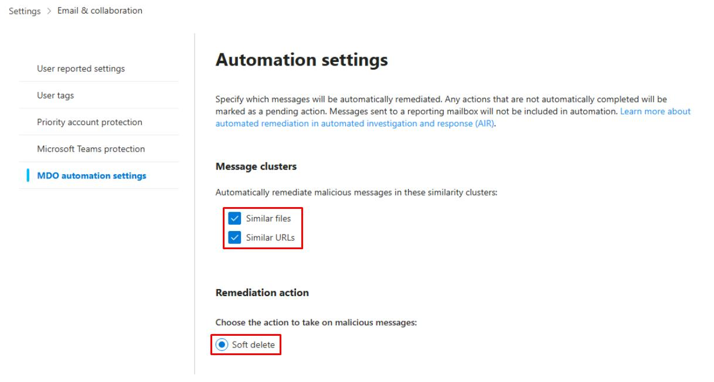
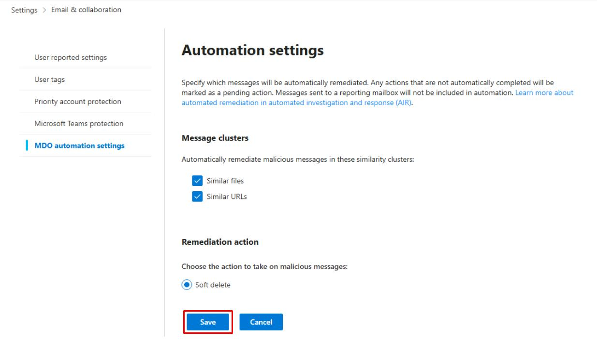
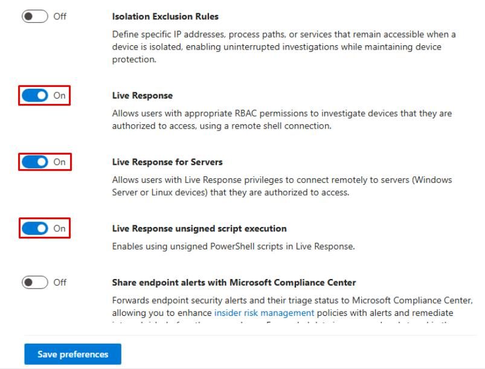
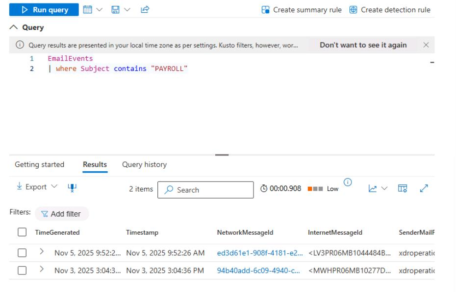

# Task 01: Turn on native automations (AIR) with approvals

:::Architecture(team=Architecture)
#### Security Architecture Team  

1. Go back to your Defender XDR portal tab.

1. In the leftmost pane, go to **System** > **Settings**.

1. Select **Email & collaboration**.

1. In the menu, select **MDO automation settings**.

1. Under Message clusters, select the following:

    - Similar files
    - Similar URLs

    {: .note } Automatically remediates malicious messages in these similarity clusters.

1. Ensure **Remediation action** is set to **Soft delete**.

    

1. Select **Save**.

    

1. In the leftmost pane, go to **System** > **Settings**.

1. Select **Endpoints**.

1. Turn on the following:  

    - **Live Response**  
    - **Live Response for Servers**  
    - **Live Response unsigned script execution** 

     

1. Select **Save preferences**.  

1. In the **Endpoints** page menu, under **Permissions**, select **Device groups**, then observe the results.

:::

:::Engineering(team=Engineering)
#### Security Engineering and Administration  

1. Open your PowerShell ISE window.

1. Select **File** > **New**.

1. In the top pane, enter the following script, then replace the value of **$SenderUPN** with your **licensed** global admin account. 

    ```powershell
    <#
    .EXAMPLE
    This sends an HTML test-phish email from sec-eng to the pilot mailbox.
    #>

    # 1) Connect and request Mail.Send scope (interactive)
    Disconnect-MgGraph -ErrorAction SilentlyContinue
    Connect-MgGraph -Scopes "Mail.Send"

    # 2) Script variables - edit these
    $SenderUPN   = "REPLACE WITH YOUR LICENSED GLOBAL ADMIN ACCOUNT"      # account you sign in with
    $PilotUPN    = "user1@@lab.Variable(userDomain)"     # target pilot mailbox
    $Subject     = "PAYROLL UPDATE - ACTION REQUIRED"
    $BodyHtml    = @"
    <p>Hello <b>Pilot User</b>,</p>
    <p>Payroll system requires confirmation of your details. Please <a href='https://example.com/benign-info'>review payroll</a> to avoid delay.</p>
    <p><i>This is a benign test message for SOC training only.</i></p>
    <p>- Security Team</p>
    "@

    # 3) Build message hashtable expected by Send-MgUserMail
    $message = @{
        Subject = $Subject
        Body = @{
            ContentType = "HTML"
            Content     = $BodyHtml
        }
        ToRecipients = @(
            @{ EmailAddress = @{ Address = $PilotUPN } }
        )
    }

    # 4) Send the email (sends from the signed-in user by default)
    Send-MgUserMail -UserId $SenderUPN -Message $message -SaveToSentItems:$true

    Write-Host "Test-phish sent from $SenderUPN to $PilotUPN (subject: $Subject)"
    ```

1. On the top bar, select **Run Script**.

    

    {: .warning }If stuck signing in. Try closing and reopening PowerShell ISE.

1. If prompted, on the **Permissions requested** dialog, select **Consent on behalf of your organization**, then select **Accept**.

    {: .note } The script seeds and sends a test phishing message from your global admin account to **Lab User One**.

:::

:::SOC(team=SOC)
#### SOC Analyst  

1. Go back to your Defender XDR portal tab.

1. In the leftmost pane, go to **Investigate & response** > **Hunting** > **Advanced hunting**.

1. Run the following query to find the test emails sent by Engineering:  

    ```kql
    EmailEvents
    | where Subject contains "PAYROLL"
    ```  

    
