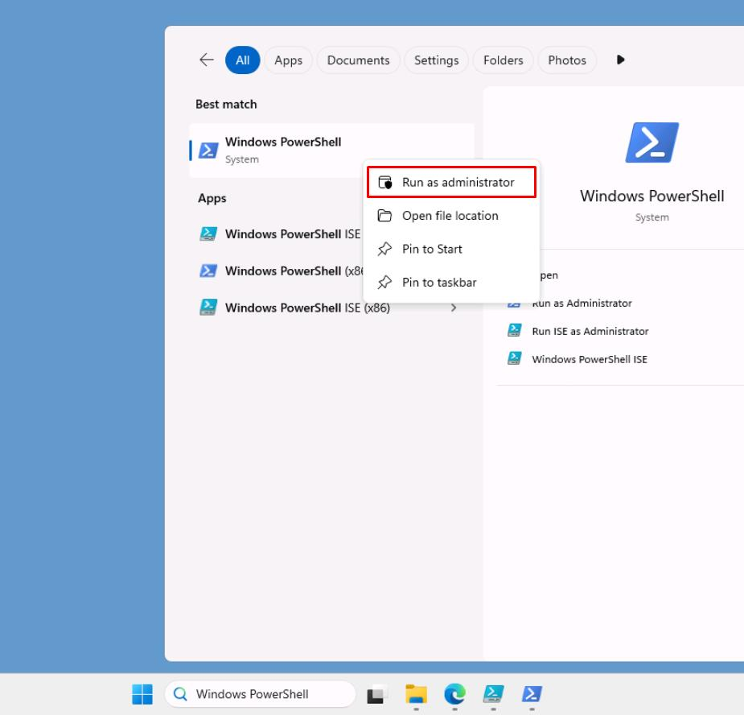
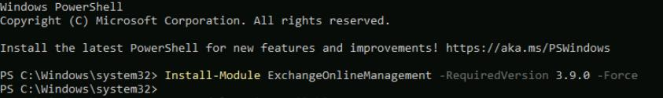
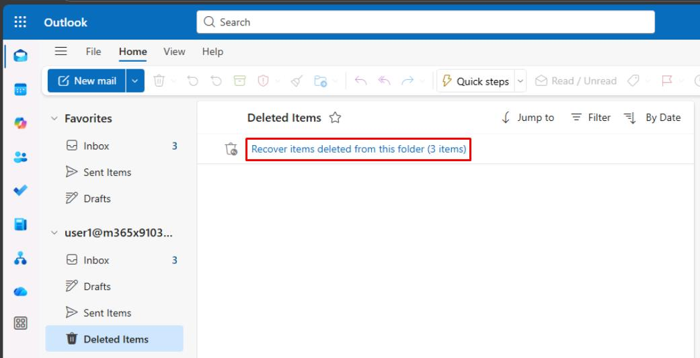
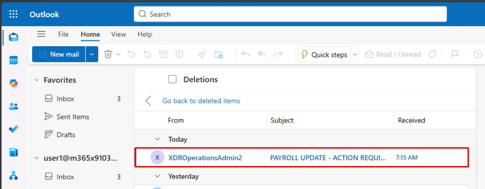

# Task 02: One-click mail purge runbook (native compliance search)


:::Architecture(team=Architecture)

#### Security Architecture Team  

- The Architect would approve purge criteria. For example:

    - **Subject contains:** '*PAYROLL UPDATE - ACTION REQUIRED*'
    - **Time window:** last 24 hours  

:::

:::Engineering(team=Engineering)
#### Security Engineering and Administration  

{: .important } The following script performs an approved purge of malicious or unwanted messages directly from Exchange Online mailboxes by leveraging the Compliance Search and Compliance Search Action cmdlets. These are part of Microsoft 365 Defender's eDiscovery / Purview Compliance layer.

1. Close your PowerShell ISE window without saving.

1. In the VM taskbar's search box, enter `Windows PowerShell`.

1. Right-click **Windows PowerShell** > **Run as administrator**.

    

1. In the **User Account Control** dialog, select **Yes**.

1. In the elevated PowerShell window, enter the following:

    `Install-Module ExchangeOnlineManagement -RequiredVersion 3.9.0 -Force`

    

    {: .note } Earlier usage of the module required an older version due to a current bug with authentication using **Connect-ExchangeOnline** in **3.9.0**.
    >
    >The following script requires **3.9.0** for the **Connect-IPPSSession** cmdlet.

1. Once installed, reopen PowerShell ISE.

1. In the top pane, enter the following, then replace the value of **$TenantUPN** with your global admin account. 

    ```
    <# ==================================================
        Compliance Search + Purge (SoftDelete/HardDelete)
        Tested with ExchangeOnlineManagement 3.9.x+
        ================================================== #>

    $ErrorActionPreference = 'Stop'

    # ---------------- CONFIG ----------------
    $TenantUPN = "REPLACE WITH YOUR LICENSED GLOBAL ADMIN ACCOUNT"
    $DelegatedOrganization = "@lab.Variable(userDomain)"
    $SearchName = "Purge_Test"
    $Mailbox = "user1@@lab.Variable(userDomain)"
    $SubjectToMatch = 'PAYROLL UPDATE - ACTION REQUIRED'  # exact subject text
    $TimeZoneId = "New Zealand Standard Time"         # Auckland
    $LookbackDays = 30                                  # change to 1 for last 24h
    $PurgeType = "SoftDelete"                        # or "HardDelete"
    $SearchTimeoutSec = 900                                 # 15 min
    $ActionTimeoutSec = 900                                 # 15 min
    $UseAllMailboxesFallback = $false                             # set $true if initial search returns 0
    # ---------------------------------------

    Write-Host "== Purge Workflow for '$SearchName' ==" -ForegroundColor Cyan

    function Ensure-EXOModule {
        $mod = Get-Module ExchangeOnlineManagement -ListAvailable | Sort-Object Version -Descending | Select-Object -First 1
        if (-not $mod -or $mod.Version -lt [version]'3.9.0') {
            Write-Host "Installing/Updating ExchangeOnlineManagement (need >= 3.9.0)..." -ForegroundColor Yellow
            Install-Module ExchangeOnlineManagement -Force
        }
        Import-Module ExchangeOnlineManagement -ErrorAction Stop
        $loaded = (Get-Module ExchangeOnlineManagement).Version
        Write-Host "ExchangeOnlineManagement loaded: $loaded" -ForegroundColor Green
    }

    function Connect-Compliance {
        Write-Host "Resetting any existing EXO/IPP sessions..." -ForegroundColor Yellow
        try { Disconnect-ExchangeOnline -Confirm:$false -Purge 2>$null } catch {}
        Get-PSSession | Remove-PSSession -ErrorAction SilentlyContinue

        Import-Module ExchangeOnlineManagement -ErrorAction Stop
        Write-Host "Connecting with Search-Only session to $DelegatedOrganization ..." -ForegroundColor Yellow

        Connect-IPPSSession -EnableSearchOnlySession `
            -UserPrincipalName $TenantUPN `
            -DelegatedOrganization $DelegatedOrganization `
            -DisableWAM `
            -ShowBanner:$false
        Write-Host "Connected to Microsoft Purview (Compliance PowerShell)." -ForegroundColor Green
    }

    function Get-LocalWindow {
        param([string]$TzId, [int]$Days)
        $tz = [System.TimeZoneInfo]::FindSystemTimeZoneById($TzId)
        $nowLocal = [System.TimeZoneInfo]::ConvertTime([DateTime]::UtcNow, $tz)
        $from = $nowLocal.AddDays(-1 * [Math]::Abs($Days)).Date.ToString("yyyy-MM-dd")
        $to = $nowLocal.Date.AddDays(1).ToString("yyyy-MM-dd")   # make 'to' exclusive next-day midnight
        return @{ From = $from; To = $to }
    }

    function Remove-OldSearch {
        param([string]$Name)
        $existing = Get-ComplianceSearch -Identity $Name -ErrorAction SilentlyContinue
        if ($existing) {
            Write-Host "Cleaning existing search '$Name'..." -ForegroundColor Yellow
            if ($existing.Status -in @('Starting', 'Running', 'Stopping')) {
                try { Stop-ComplianceSearch -Identity $Name -Confirm:$false -ErrorAction Stop } catch {}
                Start-Sleep 5
            }
            $actions = Get-ComplianceSearchAction -ErrorAction SilentlyContinue | Where-Object { $_.SearchName -eq $Name }
            foreach ($a in $actions) {
                try { Remove-ComplianceSearchAction -Identity $a.Identity -Confirm:$false -ErrorAction Stop } catch {}
            }
            try { Remove-ComplianceSearch -Identity $Name -Confirm:$false -ErrorAction Stop } catch {}
        }
    }

    function Wait-Search {
        param([string]$Name, [int]$TimeoutSeconds)
        $start = Get-Date
        while ($true) {
            $s = Get-ComplianceSearch -Identity $Name -ErrorAction Stop
            Write-Host ("Search Status: {0}  Items: {1}  {2}%" -f $s.Status, $s.Items, $s.PercentComplete)
            if ($s.Status -eq 'Completed') { return $true }
            if ($s.Status -in @('Failed', 'PartiallySucceeded')) {
                Write-Warning "Search finished with status: $($s.Status)"
                return $false
            }
            if ((Get-Date) - $start -gt [TimeSpan]::FromSeconds($TimeoutSeconds)) {
                throw "Timeout waiting for search '$Name' to finish."
            }
            Start-Sleep 5
        }
    }

    function Wait-Action {
        param([string]$Name, [int]$TimeoutSeconds)
        $start = Get-Date
        while ($true) {
            $a = Get-ComplianceSearchAction -ErrorAction SilentlyContinue |
            Where-Object { $_.SearchName -eq $Name } |
            Sort-Object CreationTime -Descending | Select-Object -First 1
            if ($a) {
                Write-Host ("Action: {0}  Status: {1}" -f $a.Action, $a.Status)
                if ($a.Status -in @('Completed', 'Failed', 'PartiallySucceeded')) { return $a }
            }
            if ((Get-Date) - $start -gt [TimeSpan]::FromSeconds($TimeoutSeconds)) {
                throw "Timeout waiting for purge action on '$Name'."
            }
            Start-Sleep 5
        }
    }

    function Invoke-PurgeAction {
        param([string]$Name, [string]$Type)
        $hasPurgeParam = (Get-Command New-ComplianceSearchAction -ErrorAction Stop).Parameters.ContainsKey('Purge')
        if ($hasPurgeParam) {
            Write-Host "Submitting purge using: -Purge -PurgeType $Type" -ForegroundColor Yellow
            New-ComplianceSearchAction -SearchName $Name -Purge -PurgeType $Type -Confirm:$false
        }
        else {
            Write-Host "Submitting purge using: -PurgeType $Type (session without -Purge switch)" -ForegroundColor Yellow
            New-ComplianceSearchAction -SearchName $Name -PurgeType $Type -Confirm:$false
        }
    }

    try {
        Ensure-EXOModule
        Connect-Compliance

        $win = Get-LocalWindow -TzId $TimeZoneId -Days $LookbackDays

        # Build a precise, index-friendly query:
        # - Exact subject phrase in quotes
        # - Limit to email items
        # - Received in local NZ window [From, To)
        $SubjectExact = '"' + $SubjectToMatch + '"'   # ensure quoted
        $DateClause = "(received>=" + $win.From + " AND received<" + $win.To + ")"
        $Query = "kind:email AND subject:$SubjectExact AND $DateClause"

        Write-Host "Query: $Query" -ForegroundColor Cyan

        # Clean slate
        Remove-OldSearch -Name $SearchName

        # Create & run search
        if ($UseAllMailboxesFallback) {
            New-ComplianceSearch -Name $SearchName -ExchangeLocation All -ContentMatchQuery $Query -ErrorAction Stop
        }
        else {
            New-ComplianceSearch -Name $SearchName -ExchangeLocation $Mailbox -ContentMatchQuery $Query -ErrorAction Stop
        }
        Start-ComplianceSearch -Identity $SearchName -ErrorAction Stop

        $ok = Wait-Search -Name $SearchName -TimeoutSeconds $SearchTimeoutSec
        if (-not $ok) { throw "Compliance search did not complete successfully." }

        # Show summary
        $sum = Get-ComplianceSearch -Identity $SearchName
        $sum | Format-List Name, Status, Items, PercentComplete, CreatedBy

        if ($sum.Items -eq 0 -and -not $UseAllMailboxesFallback) {
            Write-Warning "No items found in $Mailbox. Tip: set `$UseAllMailboxesFallback = `$true to sanity-check against All mailboxes."
            return
        }

        # Purge
        Invoke-PurgeAction -Name $SearchName -Type $PurgeType

        # Wait for action and print result
        $result = Wait-Action -Name $SearchName -TimeoutSeconds $ActionTimeoutSec
        $result | Format-List Identity, Action, Status, ResultItemsCount, CreationTime, Workload
    }
    catch {
        Write-Error $_.Exception.Message
    }
    ```

1. On the top bar, select **Run Script**.

    

    {: .note } Runs a full Compliance Search-and-Purge workflow that builds a precise subject/date query, executes the search, and then performs a **SoftDelete** or **HardDelete** purge on matching messages with safety checks and timeouts.

    {: .important } Observe the **$PurgeType** variable is set to **SoftDelete**. This is being used by the **New-ComplianceSearchAction** cmdlet and sends the emails to the **Deleted Items** folder. Items are recoverable by users until the deleted item retention period expires.
    >
    >By setting this to **HardDelete**, purged items are marked for permanent removal from the mailbox instead.

:::

:::SOC(team=SOC)
#### SOC Analyst  

This task shows what the end user would see, following a **SoftDelete** purge.

1. In the upper-right corner of Microsoft Edge, select the ellipsis, then select **New InPrivate window**.

    

1. Go to `outlook.office.com`.

1. Sign in with **Lab User One**:

    | Item | Value |
    |:---------|:---------|
    | Username   | `user1@@lab.Variable(userDomain)`  |
    | Password  | `P@ssw0rd!2025`  |

1. In the Outlook menu, select **Deleted Items**.

1. Select **Recover items deleted from this folder**.

    

1. Observe how the email was purged by Engineering for '**PAYROLL UPDATE - ACTION REQUIRED**', using the **SoftDelete** purge type.

    

1. Close the InPrivate window.