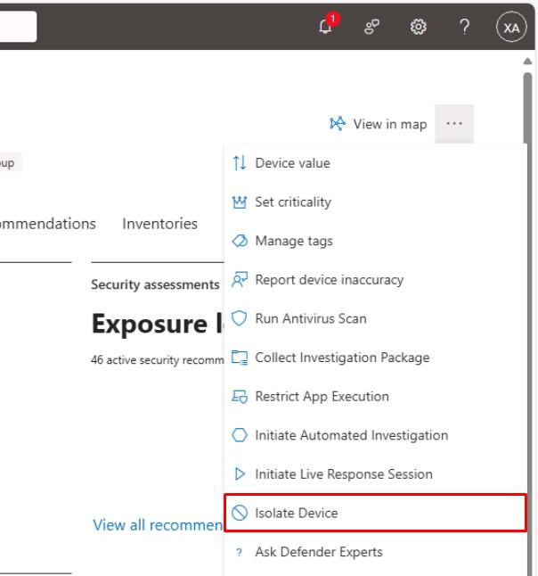

# Task 03: Endpoint isolate and collect triage bundle  

:::Architecture(team=Architecture)
#### Security Architecture Team  

1. Approve device isolation on the Windows VM.

    {: .important } Used when lateral movement or credential theft is suspected.

1. For lab purposes, the Engineer should limit isolation approval to the Windows VM only.  

    {: .important } In real-world scenarios, document the approval of the VMs list for isolation.  

:::

:::Engineering(team=Engineering)
#### Security Engineering and Administration  

1. Open Edge to your `security.microsoft.com` tab.

1. In the leftmost pane, go to **Assets** > **Devices**.

1. Select the text for **winvm-mde** to open the device page.

1. In the upper-right corner of the page, select the ellipsis, then select **Isolate Device**.

    

1. In the dialog, select the checkbox for **Allow Outlook, Teams and Skype...**.

1. Under **Comment**, enter `Isolate Device`, then select **Confirm**.

1. Close the flyout pane.

:::

:::SOC(team=SOC)
#### SOC Analyst  

1. In your regular Microsoft Edge window, go back to the Defender XDR portal tab.

1. In the leftmost pane, go to **Investigation & response** > **Actions & submissions** > **Action center**.

1. Select the **History** tab to see the **Isolate device** action type. 